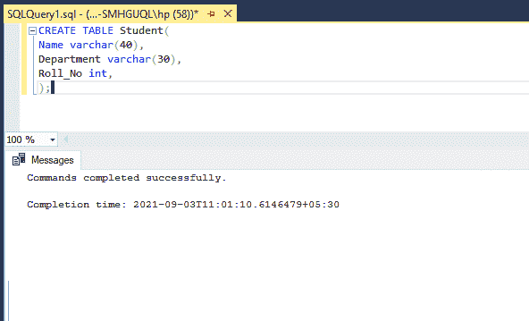
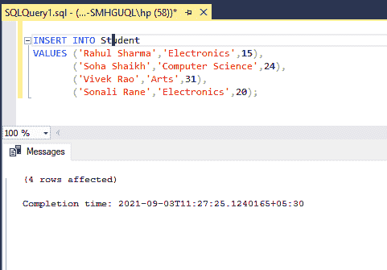
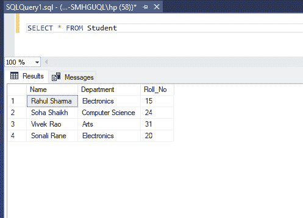
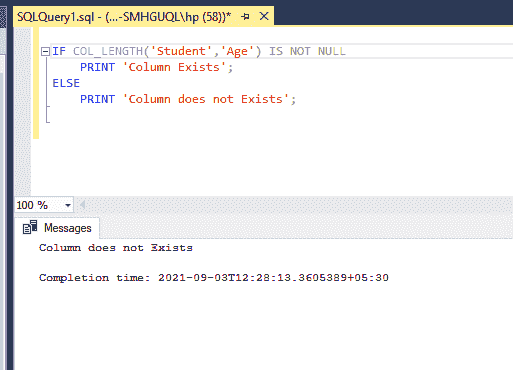
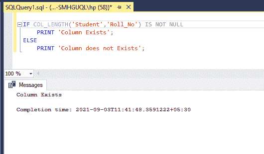

# 如何检查 SQL Server 表中是否存在列？

> 原文:[https://www . geesforgeks . org/如何检查 SQL server 表中是否存在列/](https://www.geeksforgeeks.org/how-to-check-if-a-column-exists-in-a-sql-server-table/)

在本文中，我们将了解如何检查数据库表中是否存在特定的列。为了检查列的存在，我们需要首先创建表。因此，让我们创建一个包含一些列和数据的表。

**创建表格:**

**语法:**

```sql
CREATE TABLE table_name (
    column1 datatype,
    column2 datatype,
    column3 datatype,
   ....);
```

使用上面的语法，我们将创建一个学生表。学生表将有三个字段“姓名”、“部门”和“学生人数”。要创建表，请使用下面的查询。

**查询:**

```sql
CREATE TABLE Student(Name varchar(40),
Department varchar(30),Roll_No int, );
```

**输出:**



该查询将输出显示为命令成功完成。这意味着在我们的数据库中创建了一个学生表。要在表中插入值，我们必须使用 insert 查询。

### 将数据插入表格:

#### 语法:

```sql
INSERT INTO table_name
VALUES (value1, value2, value3, ...);
```

使用上面的语法，我们将向表中添加学生数据。我们必须根据创建的列插入值。使用下面的查询插入数据。

**查询:**

```sql
INSERT INTO Student
VALUES ('Rahul Sharma','Electronics',15),
       ('Soha Shaikh','Computer Science',24),
       ('Vivek Rao','Arts',31),
       ('Sonali Rane','Electronics',20);
```

**输出:**



我们已将数据添加到我们的表中。我们可以使用下面的 SELECT 查询来验证或打印表中的数据。

### **查看表格数据:**

**查询:**

```sql
SELECT * FROM Student
```

**输出:**



### **检查是否存在**C**柱:**

为了检查是否存在，我们需要使用 COL_LENGTH()函数。

**语法:**

```sql
COL_LENGTH ( 'table' , 'column' )
```

*   COL_LENGTH()函数返回以字节为单位的列的定义长度。
*   我们必须传递两个参数——表名和列名
*   该函数可以与 IF ELSE 条件一起使用，以检查该列是否存在。

现在我们使用下面的查询来检查一个列的存在。

**查询:**

```sql
IF COL_LENGTH('table_name','column_name') IS NOT NULL
    PRINT 'Column Exists';
ELSE
    PRINT 'Column does not Exists';
```

上面的学生表有三列“姓名”、“部门”和“学号”。以下示例显示了如何检查数据库表中是否存在列。

**输出 1:**



**输出 2:**



使用 COL_LENGTH()函数，我们可以找出数据库表中是否存在列。