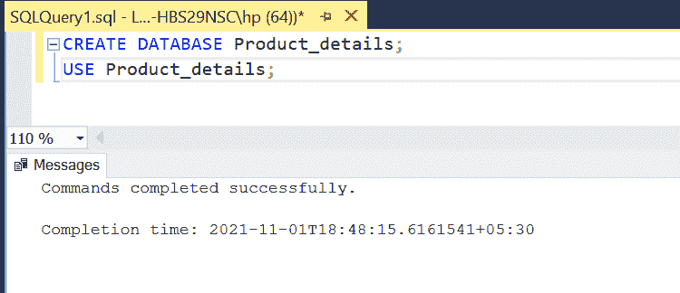
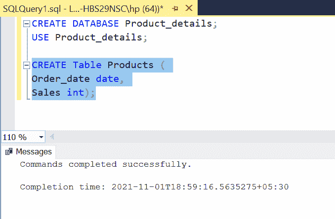
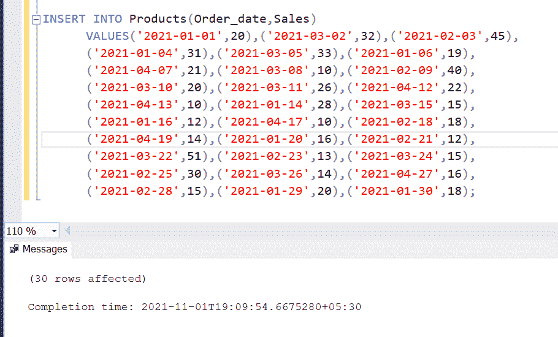
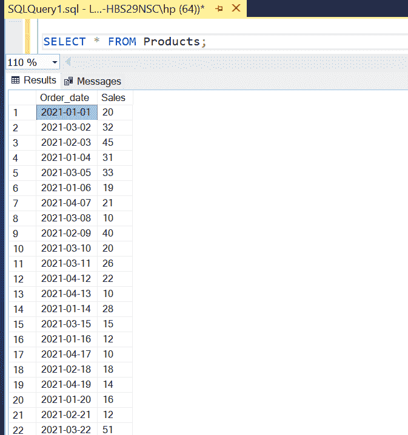
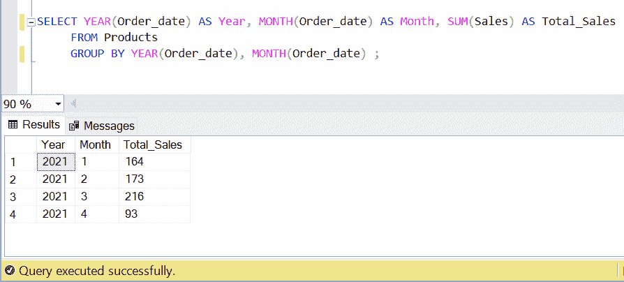
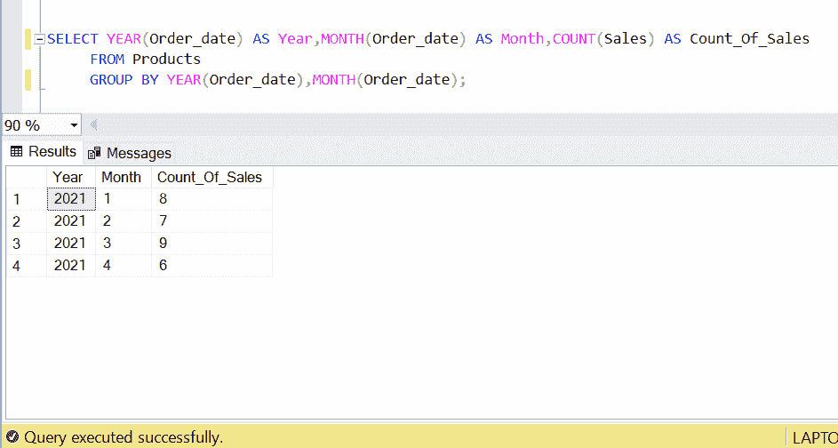
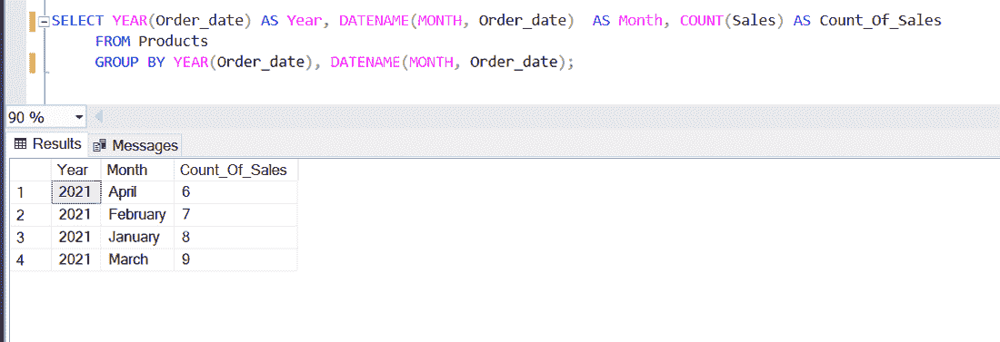
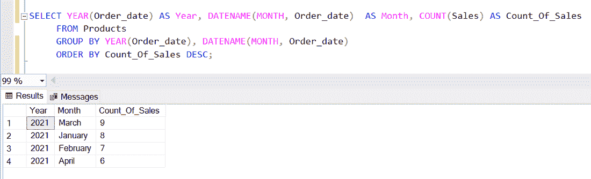

# 如何在 SQL 中按月比较产品销量？

> 原文:[https://www . geeksforgeeks . org/如何按月比较产品销售 sql/](https://www.geeksforgeeks.org/how-to-compare-product-sales-by-month-in-sql/)

每月销售报告代表公司每月的销售活动状态。它帮助销售团队朝着正确的方向前进。无论你是销售主管还是经理，衡量标准对于公司的成功都非常重要。如果您的数据存储在数据库中，您可以使用 SQL 计算每月销售报告。在本文中，我们将看到如何用 SQL 计算月销售额。

1.[分组依据条款](https://www.geeksforgeeks.org/sql-group-by/)

2.[聚合函数](https://www.geeksforgeeks.org/aggregate-functions-in-sql/)

让我们首先创建我们的演示数据库。

**步骤 1:** 创建数据库

创建一个名为 *Product_details* 的新数据库，然后使用它。

**查询:**

```sql
CREATE DATABASE Product_details; USE Product_details;
```

**输出:**



**步骤 2:** 定义表格

创建一个名为“产品”的表，并添加这两列订单日期和销售额。

**查询:**

```sql
CREATE Table Products ( Order_date date, Sales int); 
```

**输出:**



**步骤 3:** 在表格中插入行，并将这些行插入表格。

**查询:**

```sql
INSERT INTO Products(Order_date,Sales)    
VALUES('2021-01-01',20),('2021-03-02',32),('2021-02-03',45), 
('2021-01-04',31),('2021-03-05',33),('2021-01-06',19),
('2021-04-07',21),('2021-03-08',10),('2021-02-09',40), 
('2021-03-10',20),('2021-03-11',26),('2021-04-12',22),      
('2021-04-13',10),('2021-01-14',28),('2021-03-15',15), 
('2021-01-16',12),('2021-04-17',10),('2021-02-18',18),  
('2021-04-19',14),('2021-01-20',16),('2021-02-21',12),
('2021-03-22',51),('2021-02-23',13),('2021-03-24',15),
('2021-02-25',30),('2021-03-26',14),('2021-04-27',16), 
('2021-02-28',15),('2021-01-29',20),('2021-01-30',18); 
```

**输出:**



**步骤 4:** 查看插入的数据

**查询:**

```sql
SELECT * FROM Products; 
```

**输出:**



**第五步:**现在我们进行查询，按月对比产品销量。

SQL Server 提供了 MONTH 和 YEAR 函数，允许我们从给定的日期分别找出月份和年份。我们将使用这两个函数，GROUP BY 函数和 SUM 函数来计算总销售额。

**查询:**

```sql
SELECT YEAR(Order_date) AS Year, 
MONTH(Order_date) AS Month,SUM(Sales) 
AS Total_Sales FROM Products   
GROUP BY YEAR(Order_date), MONTH(Order_date) ; 
```

这里，我们简单地使用 **GROUP BY** 子句对月份和年份进行分组，然后使用 **SUM** 聚合函数获得总销售额。

**输出:**



在上面的查询中，我们使用了 SUM 函数来计算每个月的总销售额。你也可以找出每个月的销售总数。为此，将求和功能替换为**计数**功能。

**查询:**

```sql
SELECT YEAR(Order_date) AS Year,MONTH(Order_date) 
AS Month,COUNT(Sales) AS Count_Of_Sales     
FROM Products GROUP BY YEAR(Order_date),MONTH(Order_date); 
```

**输出:**



**查询:**

```sql
SELECT YEAR(Order_date) AS Year, DATENAME(MONTH, Order_date) 
 AS Month, COUNT(Sales) AS Count_Of_Sales FROM Products 
 GROUP BY YEAR(Order_date), DATENAME(MONTH, Order_date); 
```

**输出:**



**DATENAME()** 函数返回日期的特定部分。在这里，我们使用它来返回 Order_date 字符串的 MONTH 部分。

我们可以使用 **ORDER BY** 子句以降序显示该数据。

**查询:**

```sql
SELECT YEAR(Order_date) AS Year, DATENAME(MONTH, Order_date) 
AS Month, COUNT(Sales) AS Count_Of_Sales FROM Products GROUP
BY YEAR(Order_date), DATENAME(MONTH, Order_date) ORDER 
BY Count_Of_Sales DESC; 
```

**输出:**



从这份数据报告中，我们可以很容易地看出，3 月份的销售额是最高的。

现在，您可能想计算不同年份的月销售额。为此，您根本不需要更改任何内容，查询将保持完全相同。您也可以通过使用 **WHERE** 子句过滤掉一些数据或其他聚合函数来进行一些实验。