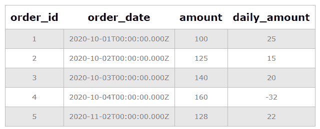
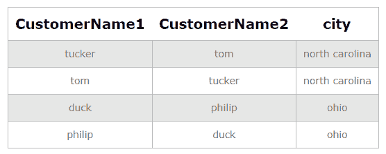
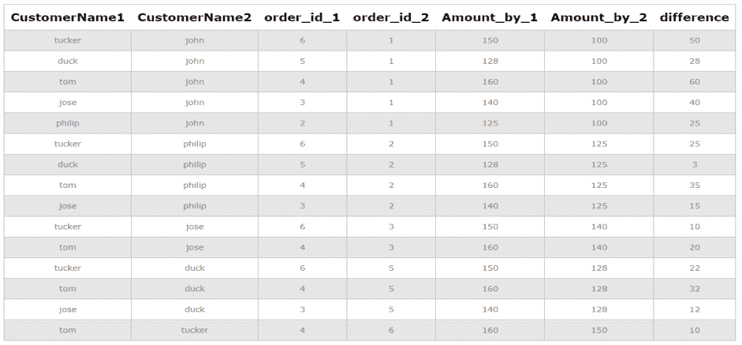

# 如何在 SQL 中比较同一个表的行和列

> 原文:[https://www . geesforgeks . org/如何比较 sql 中同一表的行和列/](https://www.geeksforgeeks.org/how-to-compare-rows-and-columns-in-the-same-table-in-sql/)

在本文中，我们将看到如何在 SQL 中比较同一表的行和列。我们将举几个例子来看看我们如何以不同的方式做到这一点。

要创建数据库，请执行以下操作:

```
Syntax :
CREATE database_name;
```

```
CREATE Shopping
```

要使用该数据库:

```
Syntax :
USE database_name;
```

```
USE Shopping
```

创建用于进行查询的表:

```
Syntax :
CREATE TABLE table_name(column1 TYPE, column2 TYPE ... );
```

```
CREATE TABLE orders(order_id INT AUTO_INCREMENT PRIMARY KEY,
order_date DATE, amount INT, customer VARCHAR(50), city VARCHAR(50));
```

在学生表中插入记录:

```
Syntax :
INSERT INTO table_name(column1, column2 ...) VALUES (value1, value2 ...);
```

```
INSERT INTO orders(order_date, amount, customer, city)
 VALUES
('2020-10-01',100, 'john', 'london'),
('2020-10-02',125,'philip', 'ohio'),
('2020-10-03',140,'jose', 'barkley'),
('2020-10-04',160, 'tom', 'north carolina');
('2020-11-02',128,'duck', 'ohio'),
('2020-09-04',150, 'tucker', 'north carolina');
```

**例 1:**

比较同一表的行。在该示例中，我们通过比较连续两天的金额来比较直接行，以计算一天的销售额。

```
Syntax for inner join :
SELECT column_name(s)
FROM table1 t1 INNER JOIN table1 t2 
on t1.column1 = t2.column1;
```

```
SELECT g1.order_id, g1.order_date,g1.amount, (g2.amount - g1.amount) AS daily_amount 
FROM orders g1 INNER JOIN orders g2 ON g2.order_id = g1.order_id + 1;
```

**输出:**



**例 2:**

在联接的帮助下，可以对同一表中的列进行比较。在这里，我们使用 SQL 中的自连接来比较同一城市的所有客户。自联接是一种常规联接，其中一个表是自己联接的。类似地，表可以用左连接、右连接、内部连接和完全连接来连接。

```
Syntax for self join :
SELECT column_name(s)
FROM table1 t1, table1 t2
WHERE condition1 and condition2 ... ;
```

```
SELECT A.customer AS CustomerName1, B.customer AS CustomerName2, A.city
FROM orders A, orders B
WHERE A.order_id <> B.order_id
AND A.city = B.city 
ORDER BY A.city;
```

**输出:**



**例 3:**

在本例中，我们比较了所有 order_id，其中第一个 order_id 的金额大于第二个 order_id 的金额。我们使用自连接来执行同一个表中的列的比较。

```
SELECT A.customer AS CustomerName1, B.customer AS CustomerName2, 
A.order_id AS order_id_1, B.order_id AS order_id_2, A.amount AS Amount_by_1, 
B.amount AS Amount_by_2, (A.amount - B.amount) AS difference
FROM orders A, orders B
WHERE A.order_id <> B.order_id
AND A.amount > B.amount;
```

**输出:**

