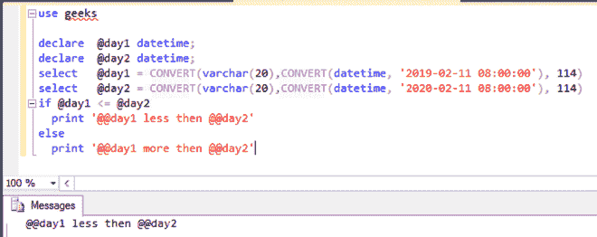
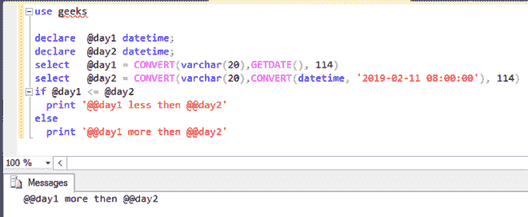

# 如何在 MS SQL Server 中比较时间？

> 原文:[https://www . geesforgeks . org/ms-SQL-server 中的时间比较方法/](https://www.geeksforgeeks.org/how-to-compare-time-in-ms-sql-server/)

在这里，我们将看到如何在 SQL Server 中比较时间。在本文中，我们将使用微软的 SQL Server 作为我们的数据库。

在这里，我们将首先创建一个名为“极客”的数据库。之后，我们将对该数据库执行查询。

### **创建数据库:**

```
CREATE DATABASE geeks;
```

### **使用该数据库:**

```
USE geeks;
```

在这里，我们可以创建两个需要比较的*日期时间*变量。

**语法:**

```
declare  @input1 datetime;
declare  @input2 datetime;
select   @input1 = CONVERT(varchar(20),CONVERT(datetime, 'date and time'), 114)
select   @input2 = CONVERT(varchar(20),CONVERT(datetime, 'date and time'), 114)

if @input1 <= @input2
  print '@input1 less then @input2'
else
  print '@input1 more then @input2'
```

### **1。使用预定义的日期和时间。**

在 MS SQL Server 中，查询可以被设计为仅使用“if”语句来比较两个或多个*日期时间*变量。

**示例:**

```
declare  @day1 datetime;
declare  @day2 datetime;
select   @day1 = CONVERT(varchar(20),CONVERT(datetime, '2019-02-11 08:00:00'), 114)
select   @day2 = CONVERT(varchar(20),CONVERT(datetime, '2020-02-11 08:00:00'), 114)
if @day1 <= @day2
 print '@@day1 less then @@day2'
else
 print '@@day1 more then @@day2'
```

**输出:**

```
@@day1 less then @@day2
```



### **2。使用 GETDATE()与当前日期和时间进行比较**

SQL 中的 GETDATE()函数也可以用来比较多个日期。

**示例:**

```
declare  @day1 datetime;
declare  @day2 datetime;
select   @day1 = CONVERT(varchar(20),GETDATE(), 114)
select   @day2 = CONVERT(varchar(20),CONVERT(datetime, '2019-02-11 08:00:00'), 114)
if @day1 <= @day2
 print '@@day1 less then @@day2'
else
 print '@@day1 more then @@day2'
```

**输出:**

```
@@day1 more then @@day2
```

