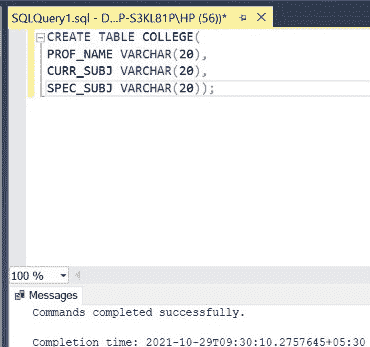
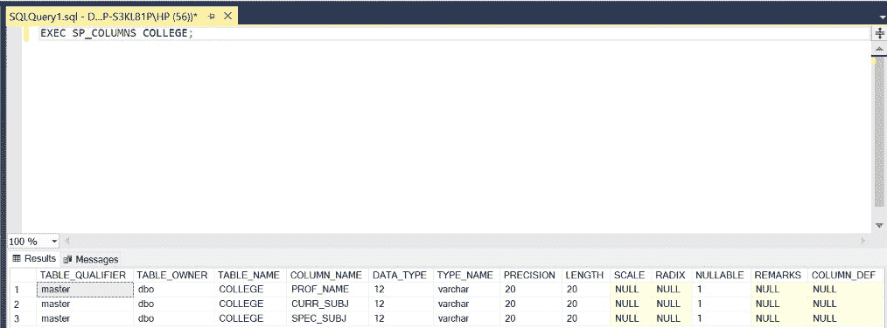
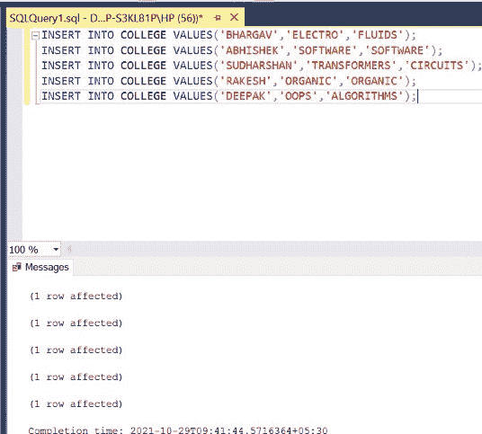
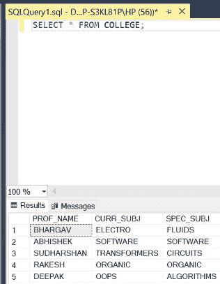
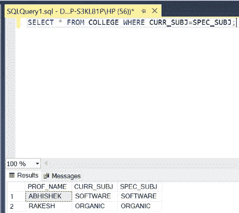

# 如何在 SQL Server 中比较两列是否相等？

> 原文:[https://www . geesforgeks . org/如何比较两列 SQL server 中的等式/](https://www.geeksforgeeks.org/how-to-compare-two-columns-for-equality-in-sql-server/)

在 SQL 中，问题要求我们比较两列是否相等，以获得某些期望的结果。这可以通过在要比较的两个列名之间使用=(等于)运算符来实现。在本文中，我们将使用微软的 SQL Server 作为我们的数据库。

**语法:**

```
SELECT * FROM TABLE_NAME WHERE COLUMN1_NAME=COLUMN2_NAME;
```

有一张桌子叫学院。该表由教授姓名、教授目前教授的学科和教授擅长的学科组成。然后学院院长决定将一些教授提升到院长的职位，但条件是他们目前的学科应与教授的专业学科相匹配。创建一个表并编写一个 SQL 查询来演示这一点。

**步骤 1:** 创建数据库。为此，使用下面的命令创建一个名为 GeeksForGeeks 的数据库。

**查询:**

```
CREATE DATABASE GeeksForGeeks
```

**输出:**


**步骤 2:** 使用 GeeksForGeeks 数据库。为此，请使用以下命令。

**查询:**

```
USE GeeksForGeeks
```

**输出:**


**步骤 3:** 在数据库 GeeksForGeeks 中创建一个 COLLEGE 表。该表有 3 栏，即教授名、课程名和课程名，包含教授姓名、他/她目前教授的科目和他/她擅长的科目。

**查询:**

```
CREATE TABLE COLLEGE(
PROF_NAME VARCHAR(20),
CURR_SUBJ VARCHAR(20),
SPEC_SUBJ VARCHAR(20));
```

**输出:**



**第 4 步:**显示 COLLEGE 表的结构。

**查询:**

```
EXEC SP_COLUMNS COLLEGE;
```

**输出:**



**第 5 步:**在 COLLEGE 表中插入 5 行。

**查询:**

```
INSERT INTO COLLEGE VALUES('BHARGAV','ELECTRO','FLUIDS');
INSERT INTO COLLEGE VALUES('ABHISHEK','SOFTWARE','SOFTWARE');
INSERT INTO COLLEGE VALUES('SUDHARSHAN','TRANSFORMERS','CIRCUITS');
INSERT INTO COLLEGE VALUES('RAKESH','ORGANIC','ORGANIC');
INSERT INTO COLLEGE VALUES('DEEPAK','OOPS','ALGORITHMS');
```

**输出:**



**第 6 步:**显示 COLLEGE 表的所有行。

**查询:**

```
SELECT * FROM COLLEGE;
```

**输出:**



**第七步:**显示可以晋升院长职位的教授的详细信息，即当前学科要与专业化学科相匹配。

**查询:**

```
SELECT * FROM COLLEGE WHERE CURR_SUBJ=SPEC_SUBJ;
```

**输出:**



因此，通过上述方式，我们可以根据需要比较 SQL 中任意两列的相等性。