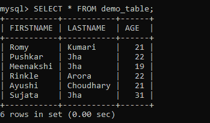

# 如何用 MySQL 中已有的列名将两列串联成一列？

> 原文:[https://www . geesforgeks . org/how-concat-two-columns-in-one-with-existing-column-name-in-MySQL/](https://www.geeksforgeeks.org/how-to-concat-two-columns-into-one-with-the-existing-column-name-in-mysql/)

在本文中，我们将看到一个使用现有列名将两列连接成一列的 SQL 查询。我们可以使用 CONCAT()函数执行上面的活动。

**CONCAT():** 它以列名作为参数，将传递给函数的列参数的所有值串联起来后，返回一个有值的列。有两种方法可以执行该活动:

*   而不用 CONCAT 函数替换现有的列。
*   通过用 CONCAT()函数替换 REPLACE()函数替换现有列。

**语法:**

```
CONCAT(column_name1, column_name2) AS column_name;
```

**步骤 1:** 创建数据库

我们可以使用以下命令创建一个名为 geeks 的数据库。

**查询:**

```
CREATE DATABASE geeks;
```


**第二步**:使用数据库

使用下面的 SQL 语句将数据库上下文切换到极客:

**查询:**

```
USE geeks;
```


**步骤 3:** 表格定义

我们的极客数据库中有演示表。

**查询:**

```
CREATE TABLE demo_table(
FIRSTNAME VARCHAR(20),
LASTNAME VARCHAR(20),
AGE INT);
```


**第 4 步**:将数据插入表格

**查询:**

```
INSERT INTO demo_table VALUES
('Romy', 'Kumari', 21),
('Pushkar', 'Jha', 22),
('Meenakshi', 'Jha', 19),
('Rinkle', 'Arora', 22),
('Ayushi', 'Choudhary', 21),
('Sujata', 'Jha', 31);
```


**第五步:**查看内容

执行以下查询查看表格的内容

**查询:**

```
SELECT * FROM demo_table;
```

**输出:**



**步骤 6:** 将两列串联成一列

**方法一:不替换** **现有栏目**

此方法不会对原始表进行更改。

为了演示，我们将连接名字和姓氏，并将列命名为名字。

**查询:**

```
SELECT  *, CONCAT(FIRSTNAME, LASTNAME) AS FIRSTNAME
FROM demo_table;
```

**输出:**


在这里，我们可以看到 FIRSTNAME 和 LASTNAME 是连接在一起的，但是它们之间没有空格，如果你想在 FIRSTNAME 和 LASTNAME 之间添加空格，那么就在 CONCAT()函数中添加空格(')。

**查询:**

```
SELECT  *, CONCAT(FIRSTNAME,' ', LASTNAME) as FIRSTNAME
FROM demo_table;
```

**输出:**


**方法二:替换** **现有栏目**

此方法将更改原始表。

为了演示，我们将使用“名字”和“姓氏”列的串联值替换“名字”。

**查询:**

```
UPDATE demo_table  
SET FIRSTNAME = REPLACE(FIRSTNAME,FIRSTNAME, CONCAT(FIRSTNAME,' ', LASTNAME));
```

**输出:**

