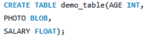
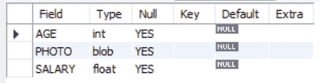
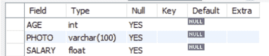
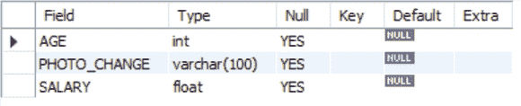

# 如何在 MySQL 中将 BLOB 转换成 VARCHAR？

> 原文:[https://www . geesforgeks . org/how-convert-blob-to-varchar-in-MySQL/](https://www.geeksforgeeks.org/how-to-convert-blob-into-varchar-in-mysql/)

在本文中，我们将学习一个将 BLOB 数据类型的列转换为 VARCHAR 数据类型的 SQL 查询。为了执行这个查询，我们需要修改表，然后修改列的定义。我们首先需要使用[](https://www.geeksforgeeks.org/sql-alter-add-drop-modify/)**命令来改变表格。**

****ALTER TABLE** : ALTER TABLE 是用于添加、删除或修改现有表中的列的命令。它还用于在现有表上添加和删除各种约束。我们有两个命令用于改变表格[修改](https://www.geeksforgeeks.org/sql-alter-add-drop-modify/)和[改变](https://www.geeksforgeeks.org/sql-alter-add-drop-modify/)T6。**

****步骤 1:** 创建数据库**

**使用以下查询创建数据库**

****查询:****

```
CREATE DATABASE geek;
```

****

****步骤 2:** 使用数据库**

**要使用数据库，请使用以下查询**

****查询:****

```
USE geek;
```

****

****步骤 3:** 创建表格**

**创建一个表，其中一列具有 BLOB 数据类型。**

****查询:****

```
CREATE TABLE demo_table(AGE INT,
PHOTO BLOB,
SALARY FLOAT);
```

****

****步骤 4:** 描述表格**

**使用此查询来描述表的属性。**

****查询:****

```
DESCRIBE demo_table;
```

****输出:****

****

****步骤 5:** 将列数据类型从 BLOB 更改为 VARCHAR(100)。我们将改变照片列，因为它是 BLOB 数据类型。**

****方法 1:** 使用修改**

**要更改列定义，请使用 MODIFY 和 ALTER 命令。**

****查询:****

```
ALTER TABLE demo_table
MODIFY PHOTO VARCHAR(100);
```

****方法 2:** 使用变更**

**使用 CHANGE，语法有点不同。在 CHANGE 关键字之后，命名要更改的列，然后指定新定义，其中包括新名称。**

****查询:****

```
ALTER TABLE demo_table CHANGE 
PHOTO PHOTO_CHANGE VARCHAR(100);
```

****第 6 步:**描述你的表格，看看变化**

```
DESCRIBE demo_table;
```

****输出:**使用 MODIFY 后的结果**

****

****输出**:使用变更后的结果**

****