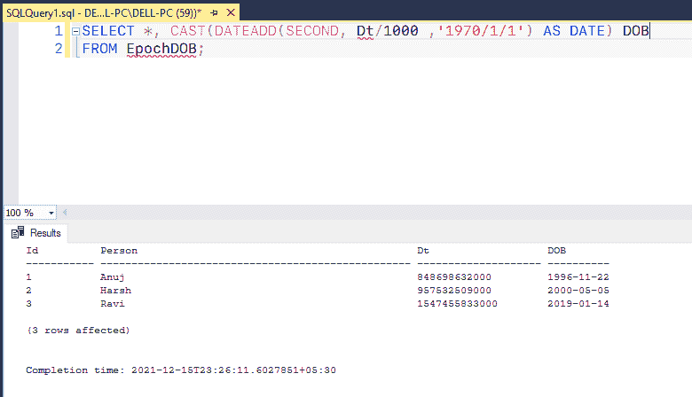

# 如何在 SQL 中将历元时间转换为日期？

> 原文:[https://www . geeksforgeeks . org/如何将纪元时间转换为 sql 中的日期/](https://www.geeksforgeeks.org/how-to-convert-epoch-time-to-date-in-sql/)

函数的作用是:将一个时间或日期间隔加总到一个指定的日期，然后返回修改后的日期。DATEADD()有以下一些功能:

*   该函数用于将时间或日期间隔与指定日期相加。
*   该功能属于日期功能。
*   该函数接受三个参数，即间隔、数字和日期。
*   该功能还可以在间隔部分包括时间。

这里我们将看到，如何在 SQL Server 中使用 DATEADD()函数将纪元时间转换为日期。为了演示，我们将在名为“极客”的数据库中创建一个 EpochDB 表。

**步骤 1:** 创建数据库

使用下面的 SQL 语句创建一个名为 geeks 的数据库:

```
CREATE DATABASE geeks;
```

**步骤 2:** 使用数据库

使用下面的 SQL 语句将数据库上下文切换到极客:

```
USE geeks;
```

**步骤 3:** 表格定义

我们的极客数据库中有以下 EpochDB。

```
CREATE TABLE EpochDOB (
Id INT,
Person VARCHAR(50), 
Dt BIGINT 
);
```


**步骤 4:** 向表中添加数据

使用以下语句将数据添加到 EpochDB 表中:

```
INSERT INTO EpochDOB VALUES
(1,'Anuj',848698632000),
(2,'Harsh',957532509000),
(3,'Ravi',1547455833000);
```


**步骤 5:** 要验证表格的内容，请使用以下语句

```
SELECT * FROM EpochDOB;
```


**步骤 6:** 结果

因为我们的 Epoch 时间是以毫秒为单位指定的，所以我们可以将其转换为秒。要将毫秒转换为秒，首先，将毫秒数除以 1000。稍后，我们使用 DATEADD()来添加自纪元以来的秒数，即 1970 年 1 月 1 日，并强制转换结果以检索自纪元以来的日期。

```
SELECT *, CAST(DATEADD(SECOND, Dt/1000
 ,'1970/1/1') AS DATE) DOBDate
FROM EpochDOB;
```

