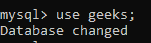
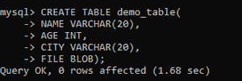
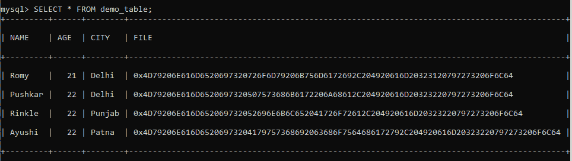
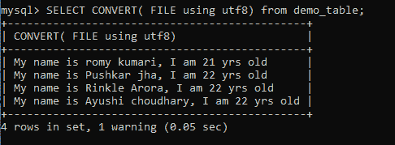
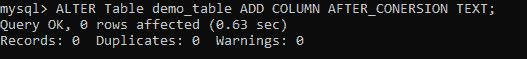
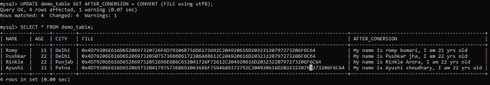
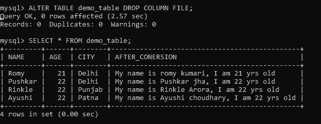

# 如何在 MySQL 中将 BLOB 转换为文本？

> 原文:[https://www . geesforgeks . org/如何从 blob 转换为 mysql 中的文本/](https://www.geeksforgeeks.org/how-to-convert-from-blob-to-text-in-mysql/)

在本文中，我们将在 MySQL 中看到 BLOB 到 TEXT 的转换。

**BLOB:** 代表二进制大对象。它是 MySQL 中的一种数据类型，可以以二进制格式在数据库中存储文件或图像。它有四种类型，即 TINYBLOB、BLOB、MEDIUMBLOB 和 LONGBLOB。这四种类型都很相似，它们之间唯一的区别是它们可以容纳的数据量。

顾名思义，在这四种类型中，LONGBLOB 可以容纳最大数量的数据，TINYBLOB 可以容纳最少数量的数据。

MySQL 中的文本数据类型用于在数据库中存储长文本字符串。它就像 VARCHAR。为了将 BLOB 转换为 TEXT，我们将使用 convert 语句。

**语法:**

```
CONVERT( column_name using utf8);
```

utf8 是编码 Unicode 字符的方式。建议在创建网页和数据库时使用 ut8。为了进行演示，请遵循以下步骤:

**步骤 1:** 创建数据库

我们可以使用以下命令创建一个名为 geeks 的数据库。

**查询:**

```
CREATE DATABASE geeks;
```


**步骤 2:** 使用数据库

使用下面的 SQL 语句将数据库上下文切换到极客:

**查询:**

```
USE geeks;
```



**步骤 3:** 表格定义

我们的极客数据库中有演示表。

**查询:**

```
 CREATE TABLE demo_table(
   NAME VARCHAR(20),
   AGE INT,
  CITY VARCHAR(20),
   FILE BLOB);
```



**步骤 4:** 将数据插入表格

**查询:**

```
 INSERT INTO demo_table VALUES ('Romy', 21, 
 'Delhi', 'My name is romy kumari,
 I am 21 yrs old'),
('Pushkar', 22, 'Delhi', 
'My name is Pushkar jha,
 I am 22 yrs old'),
 ('Rinkle', 22, 'Punjab',
  'My name is Rinkle Arora,
  I am 22 yrs old'),
('Ayushi', 22, 'Patna', 'My name is
 Ayushi choudhary, I am 22 yrs old');
```

**第五步:**查看内容

执行以下查询查看表格的内容

**查询:**

```
SELECT * FROM demo_table;
```

**输出:**



我们可以看到 FILE 列的内容是编码格式的。

**第 6 步:**从 BLOB 到 TEXT 的转换。

**查询:**

```
SELECT convert(File using utf8)
from demo_table;
```



如果要将 BLOB 数据类型列更新为 TEXT 数据类型列。请遵循以下步骤:

*   更改表格并添加一个数据类型为 TEXT 的列。
*   将 BLOB 数据转换为 TEXT 日期后，向该列添加内容。
*   删除 BLOB 列。

**第一步**:添加列

**语法**:

```
ALTER Table demo_table ADD 
COLUMN AFTER_CONERSION TEXT;
```



**步骤 2:** 向列中添加内容

```
 UPDATE demo_table SET AFTER_CONERSION 
 = CONVERT (FILE using utf8);
```



**步骤 3:** 删除 BLOB 列

```
 ALTER TABLE demo_table 
 DROP COLUMN FILE;
```

