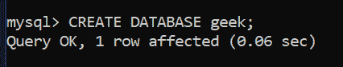
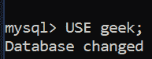
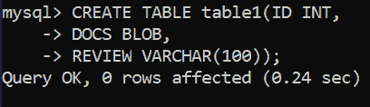
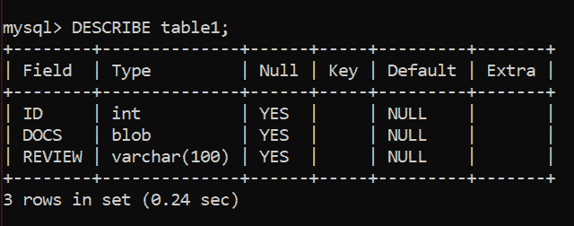
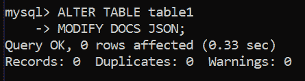
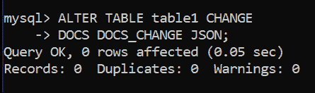
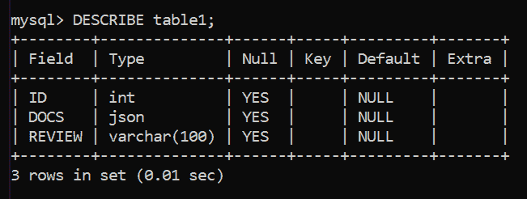
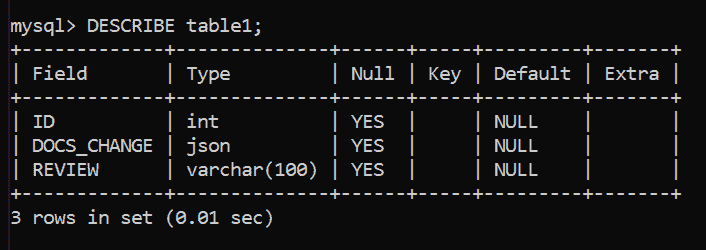

# 如何将 MySQL 表字段类型从 BLOB 转换为 JSON？

> 原文:[https://www . geesforgeks . org/how-convert-MySQL-table-field-type-from-blob-to-JSON/](https://www.geeksforgeeks.org/how-to-convert-mysql-table-field-type-from-blob-to-json/)

在本文中，我们将学习一个 MySQL 查询，将表中 BLOB 数据类型的字段转换为 JSON 数据类型。为了执行这个查询，我们需要修改表，然后修改字段的定义。我们首先需要使用 [ALTER TABLE](https://www.geeksforgeeks.org/sql-alter-add-drop-modify/) 命令开始对表进行更改。

**ALTER TABLE** : ALTER TABLE 是用于添加、删除或修改现有表格中的字段的命令。它还用于在现有表上添加和删除各种约束。我们有两个改变表格的命令，[修改](https://www.geeksforgeeks.org/sql-alter-add-drop-modify/)和[改变](https://www.geeksforgeeks.org/sql-alter-add-drop-modify/)。

**步骤 1:** 数据库创建

数据库的创建是通过使用 MySQL 中的 CREATE DATABASE 命令来完成的。

**查询:**

```sql
CREATE DATABASE geek;
```



**步骤 2:** 将正在使用的数据库更改为我们创建的数据库。

要在多个数据库中使用一个特定的数据库，或者指定我们对其数据感兴趣的数据库，我们在 MySQL 中使用 use 命令。

**查询:**

```sql
USE geek;
```



**步骤 3:** MySQL 表创建

我们将在 MySQL 中创建一个表，其中一个字段具有 BLOB 值。请注意，您可以在一个表中使用多个字段。

**查询:**

```sql
CREATE TABLE table1(ID INT,
DOCS BLOB,
REVIEW VARCHAR(100));
```



**步骤 4:** 显示表格的结构

我们将使用 description table 命令来交叉检查我们的表是否创建了一个带有 BLOB 数据类型的字段。

**查询:**

```sql
DESCRIBE table1;
```

**输出:**



**步骤 5:** 将字段数据类型从 BLOB 更改为 JSON。文档字段将被更改，因为它属于 BLOB 数据类型。

**方法 1:** 使用修改命令

要更改字段定义，请使用 MODIFY 和 ALTER 命令。

**查询:**

```sql
ALTER TABLE table1
MODIFY DOCS JSON;
```



**方法 2:** 使用变更

CHANGE 命令的语法不同。在 CHANGE 关键字之后，我们命名必须更改的字段，然后指定字段的新定义，其中包括更改的字段的名称。这里我们把 DOCS 的名字改成 DOCS_CHANGE。

**查询:**

```sql
ALTER TABLE table1 CHANGE  
DOCS DOCS_CHANGE JSON;
```



**第 6 步:**使用 description 命令查看对每个命令所做的更改:MODIFY 和 CHANGE。

```sql
DESCRIBE table1;
```

**输出:**使用 MODIFY 后的结果



**输出:**使用变更后的结果

