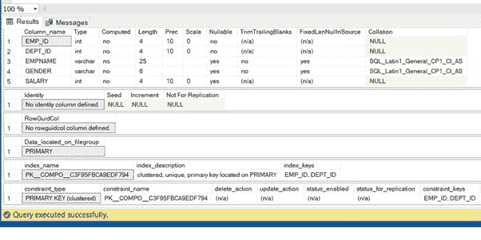
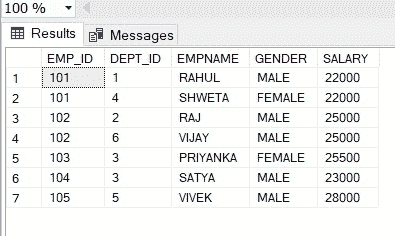
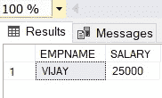

# 如何在 SQL Server 中创建复合主键？

> 原文:[https://www . geesforgeks . org/如何创建 SQL server 中的复合主键/](https://www.geeksforgeeks.org/how-to-create-a-composite-primary-key-in-sql-server/)

在本文中，我们将学习什么是[复合主键](https://www.geeksforgeeks.org/composite-key-in-sql/)以及如何创建复合主键。正如我们所知，主键是选择来唯一标识表中行的候选键。“与”主键不允许空值。

### **复合主键**

当两列或多列在一起时，识别一个表中的唯一行，称为复合[主键](https://www.geeksforgeeks.org/primary-key-constraint-in-sql/)。复合键是给定表的多个属性或列的组合。它可以是候选键或主键。

为了更好地理解，我们将借助于一个示例来实现，首先，我们将创建一个数据库名称将示例数据库。在数据库中，我们将创建一个组件。

**步骤 1:** 创建数据库

对于数据库创建，我们将在 SQL 平台中使用查询。

**查询:**

```sql
Create database sample
```

**步骤 2:** 使用数据库

为了使用数据库，我们将在 SQL 平台中使用另一个查询，如 Mysql。

**查询:**

```sql
Use Sample 
```

**步骤 3:** 使用复合主表创建表

我们将使用下面的查询来创建一个复合键。

**查询:**

```sql
CREATE TABLE COMPO
(
EMP_ID INT,
DEPT_ID INT,
EMPNAME VARCHAR(25),
GENDER VARCHAR(6),
SALARY INT -->              
//This statement will create a
//composite Primary Key from
  PRIMARY KEY (EMP_ID,DEPT_ID)
  with the help of Column EMP_ID and DEPT_ID
);
```

**第四步:**创建完表后，我们可以借助下面的查询来调整表的视图和元数据。它将返回模式、列、数据类型、大小和约束。

**查询:**

```sql
EXEC sp_help COMPO;
```

**输出:**



**步骤 5:** 表中的插入数据。

我们将使用下面的 SQL 查询在创建的表中插入数据。

**查询:**

```sql
INSERT INTO COMPO
VALUES (101,001,'RAHUL','MALE',22000),
(102,002,'RAJ','MALE',25000),
(103,003,'PRIYANKA','FEMALE',25500),
(102,003,'VIJAY','MALE',25000),
(101,004,'SHWETA','FEMALE',22000),
(104,003,'SATYA','MALE',23000),
(105,005,'VIVEK','MALE',28000); 
```

**步骤 6:** 验证插入的数据

在表中插入数据后，我们可以调整或确认哪些数据必须正确插入或不正确插入。借助下面的查询。

**查询:**

```sql
SELECT * FROM  COMPO
```

**输出:**



**第 7 步:**我们知道主键有一个唯一的值，但是在上表中，EMP_ID 有一个重复值。因为它是单独的(EMP_ID)不是主键，所以它可以包含重复的值。同样，DEPT_ID 也有重复的值，因为它也不是主键。但是在上面的记录中，EMP_ID 和 DEPT_ID 并不重复。因为它是复合主键。这里(EMP_ID + DEPT_ID)是唯一标识上表中给定行的。

**为了从 COMPO** 、**中找到唯一值，我们将如下执行。**

**查询:**

```sql
SELECT EMPNAME,SALARY FROM COMPO WHERE EMP_ID= 102 AND DEPT_ID =6; 
```

**输出:**

