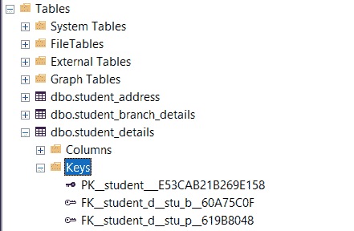

# 如何在 SQL 中创建一个多外键的表？

> 原文:[https://www . geeksforgeeks . org/如何创建具有多个 sql 外键的表/](https://www.geeksforgeeks.org/how-to-create-a-table-with-multiple-foreign-keys-in-sql/)

当一个表中的非主属性列引用主键，并且与表中的主属性列具有相同的列时，称为[外键。](https://www.geeksforgeeks.org/foreign-key-constraint-in-sql/)它奠定了两个表之间的关系，这主要有助于表的规范化。根据需要，一个表可以有多个外键。

在本文中，让我们看看如何在 MSSQL 中创建一个具有多个外键的表。

**语法:**

```sql
column_name(non_prime) data_type REFERENCES table_name(column_name(prime)
```

**步骤 1:** 创建数据库

我们使用下面的命令创建一个名为 GeeksforGeeks 的数据库:

**查询:**

```sql
CREATE DATABASE GeeksforGeeks
```


**步骤 2:** 使用数据库

要使用 GeeksforGeeks 数据库，请使用以下命令:

**查询:**

```sql
USE GeeksforGeeks
```


**步骤 3:** 创建 3 个表格。表 student_details 包含两个外键，这两个外键引用了表 student_branch_details 和 student_address。

**查询:**

```sql
CREATE TABLE student_details(
  stu_id VARCHAR(8) NOT NULL PRIMARY KEY,
  stu_name VARCHAR(20),
  stu_branch VARCHAR(20) FOREIGN KEY REFERENCES student_branch_details(stu_branch),
  stu_pin_code VARCHAR(6) FOREIGN KEY REFERENCES student_address(stu_pin_code)
  );
CREATE TABLE student_branch_details(
  stu_branch VARCHAR(20) PRIMARY KEY,
  subjects INT,
  credits INT
);
CREATE TABLE student_address(
  stu_pin_code VARCHAR(6) PRIMARY KEY,
  stu_state VARCHAR(20),
  student_city VARCHAR(20)
);
```

**输出:**


键的数量和类型可以在用户界面左侧的对象资源管理器的表部分进行检查。



**步骤 4:** 将数据插入表中

使用以下 SQL 查询将行插入学生分支详细信息和学生地址表:

**查询:**

```sql
INSERT INTO student_branch_details VALUES
  ('E.C.E',46,170),
  ('E.E.E',47,178),
  ('C.S.E',44,160)

INSERT INTO student_address VALUES
  ('555555', 'xyz','abc'),
  ('666666', 'yyy','aaa'),
  ('777777','zzz','bbb'),
  ('888888','www','ccc'),
  ('999999','vvv','ddd')
```


在学生详细信息中插入行

**查询:**

```sql
INSERT INTO student_details VALUES
('1940001','PRATHAM','E.C.E','555555'),
('1940002','ASHOK','C.S.E','666666'),
('1940003','PAVAN KUMAR','C.S.E','777777'),
('1940004','SANTHOSH','E.C.E','888888'),
('1940005','THAMAN','E.C.E','999999'),
('1940006','HARSH','E.E.E','888888')
```


**步骤 5:** 验证插入的数据

使用以下 SQL 查询在插入行后查看表学生详细信息、学生分支详细信息和学生地址:

**查询:**

```sql
SELECT * FROM student_details
SELECT * FROM student_branch_details
SELECT * FROM student_address
```

**输出:**

