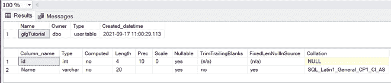

# 如何在 SQL 中创建和调用存储过程？

> 原文:[https://www . geesforgeks . org/如何创建和调用 sql 中的存储过程/](https://www.geeksforgeeks.org/how-to-create-and-call-a-stored-procedure-in-sql/)

通过这篇文章，我们将学习如何在 SQL 中创建和调用存储过程。在本文中，我们将使用 MSSQL 作为我们的数据库服务器。

### 什么是存储过程？

存储过程是一个预先编写的 SQL 查询，可以多次调用，并且运行方式相同。就像我们可以在 SQL 数据库中创建一个用于插入、选择、更新的存储过程。我们还可以将参数传递给存储过程。因此，我们将首先创建一个数据库:

**步骤 1:** 创建数据库

**查询:**

```
CREATE DATABASE GFG
```

**步骤 2:** 使用数据库

**查询:**

```
USE GFG
```

**步骤 3:** 创建表格

**查询:**

```
CREATE TABLE gfgTutorial(
id integer,
Name varchar(20)
)
```

**第 4 步:**描述表格

**查询:**

```
sp_help 'dbo.gfgTutorial'
```

**输出:**



已创建表架构

**第五步:**在表格中插入一些数据

**查询:**

```
INSERT INTO [dbo].[gfgTutorial]
           ([id]
           ,[Name])
     VALUES
           (1, 'Devesh')
GO

INSERT INTO [dbo].[gfgTutorial]
           ([id]
           ,[Name])
     VALUES
           (2, 'Geeks')
GO

INSERT INTO [dbo].[gfgTutorial]
           ([id]
           ,[Name])
     VALUES
           (3, 'For')
GO

INSERT INTO [dbo].[gfgTutorial]
           ([id]
           ,[Name])
     VALUES
           (4, 'Geeks')
GO

INSERT INTO [dbo].[gfgTutorial]E
           ([id]
           ,[Name])
     VALUES
           (5, 'GFG')
GO
```

**步骤 6** :创建一个存储过程，用于从表中选择所有行

**查询:**

```
CREATE PROCEDURE select_all_data
AS
SELECT * FROM gfgTutorial
GO;
```

**输出:**


已成功创建存储过程

**执行存储过程**选择所有数据

**查询:**

```
EXEC select_all_data
```

**输出:**


执行存储过程以选择所有数据

**现在我们已经看到了如何创建一个基本存储过程现在让我们看看如何创建参数化存储过程**

**步骤 1:** 创建一个参数化存储过程，在表中插入数据

**查询:**

```
CREATE PROCEDURE insertData
@Name varchar(30), @id varchar(30)
AS
INSERT INTO gfgTutorial VALUES(@id, @Name)
GO
```

**步骤 2:** 执行存储过程

**查询:**

```
EXEC insertData @Name = 'Inserted Name', @id = 6
```


数据插入成功

检查数据是否插入。


数据由存储过程插入。