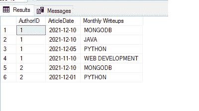

# 如何在 SQL Server 中创建日、周、月报表？

> 原文:[https://www . geesforgeks . org/如何创建 SQL server 中的每日、每周和每月报告/](https://www.geeksforgeeks.org/how-to-create-daily-weekly-and-monthly-report-in-sql-server/)

SQL Server 是一个通用数据库，也是全世界使用最多的数据库。在本文中，让我们看看如何从 SQL Server 获取每日、每周和每月报告。

让我们从创建数据库和示例细节开始

**步骤 1:** 数据库创建

命令来创建数据库。这里的 GEEKSFORGEEKS 是数据库的名字。

**查询:**

```sql
CREATE DATABASE GEEKSFORGEEKS;
```

**步骤 2:** 激活数据库

**查询:**

```sql
USE GEEKSFORGEEKS;
```

**输出:**


**步骤 3:** 表格创建

**查询:**

```sql
CREATE TABLE [dbo].[ArticleDetails](
    [ArticleID] [int] IDENTITY(1,1) NOT NULL,
    [AuthorID] [int],
    [ArticleDate] [date] NULL,
    [NARRATION] [varchar](25) NULL
) ON [PRIMARY]
GO
```

**步骤 4:** 将数据插入表中

**查询:**

```sql
INSERT INTO ArticleDetails (AuthorID,ArticleDate,
NARRATION) VALUES (1,'2021-12-10','MONGODB')
INSERT INTO ArticleDetails (AuthorID,ArticleDate,
NARRATION) VALUES (1,'2021-12-10','JAVA')
INSERT INTO ArticleDetails (AuthorID,ArticleDate,
NARRATION) VALUES (1,'2021-12-05','PYTHON')
INSERT INTO ArticleDetails (AuthorID,ArticleDate,
NARRATION) VALUES (1,'2021-11-10','WEB DEVELOPMENT')
INSERT INTO ArticleDetails (AuthorID,ArticleDate,
NARRATION) VALUES (1,'2021-11-08','DATABASE')
INSERT INTO ArticleDetails (AuthorID,ArticleDate,
NARRATION) VALUES (2,'2021-12-10','MONGODB')
INSERT INTO ArticleDetails (AuthorID,ArticleDate,
NARRATION) VALUES (2,'2021-12-01','PYTHON')
```

**第五步:**我们先查询样本数据。

**查询:**

```sql
SELECT  * FROM ArticleDetails;
```

**输出:**


**第 6 步:**获取每日发表/创作的文章数据。

**查询:**

```sql
SELECT GETDATE() AS CURRENTDATE
SELECT CONVERT(nvarchar(10),
GETDATE(),101) AS FORMATTEDCURRENTDATE
```


**查询:**

```sql
SELECT AuthorID,ArticleDate,NARRATION AS
 'Daily' FROM ArticleDetails
WHERE ArticleDate = CONVERT(nvarchar(10),
GETDATE(),101);
```


**查询:**

```sql
-- To get the count of articles created/published
 by the author on daily basis
SELECT AuthorID, COUNT(AuthorID) AS 
'Daily Writeups' FROM ArticleDetails
WHERE ArticleDate = CONVERT(nvarchar(10),
GETDATE(),101) GROUP BY AuthorID
```


这里我们检查“文章日期”列与当前日期值是否匹配。CurrentDate 可以通过' GETDATE()'函数获得。使用转换，我们对照“文章日期”值进行检查。

**第七步:**获取每周发布/创建的文章数据的方式:

**查询:**

```sql
-- To get weekly
-- As we need to get the data between 7 days 
from current date, we are using BETWEEN clause

-- start date should be 7 days earlier 
from currentdate and hence it is provided in the below way

SELECT AuthorID,ArticleDate,NARRATION AS
 'Weekly' FROM ArticleDetails
WHERE ArticleDate BETWEEN DATEADD(d,-7,
CONVERT(nvarchar(10),GETDATE(),101)) 
AND CONVERT(nvarchar(10),GETDATE(),101)
```


每周分组数据可以通过以下方式获得。

**查询:**

```sql
SELECT AuthorID, COUNT(AuthorID) AS 
'Weekly Writeups' FROM ArticleDetails
WHERE ArticleDate BETWEEN DATEADD(d,-7,
CONVERT(nvarchar(10),GETDATE(),101)) 
AND CONVERT(nvarchar(10),GETDATE(),101)
GROUP BY AuthorID
```


**第八步:**获取按月发布/创建的文章数据。这里我们用的是 BETWEEN 子句。开始日期应该比当前日期早 30 天，因此按以下方式提供。

**查询:**

```sql
SELECT AuthorID,ArticleDate,NARRATION AS 
'Monthly Writeups' FROM ArticleDetails
WHERE ArticleDate BETWEEN DATEADD(d,-30,
CONVERT(nvarchar(10),GETDATE(),101)) 
AND CONVERT(nvarchar(10),GETDATE(),101)
```



每月分组数据:

**查询:**

```sql
SELECT AuthorID, COUNT(AuthorID) AS 
'Monthly Writeups' FROM ArticleDetails
WHERE ArticleDate BETWEEN DATEADD(d,-30,
CONVERT(nvarchar(10),GETDATE(),101)) 
AND CONVERT(nvarchar(10),GETDATE(),101)
GROUP BY AuthorID
```


通过以上方式，我们可以得到每日/每周/每月的数据。