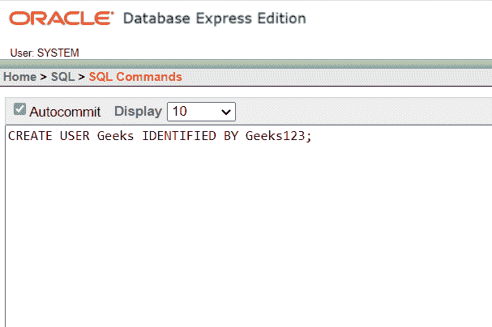
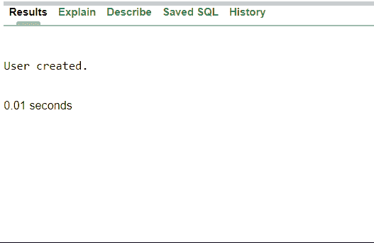
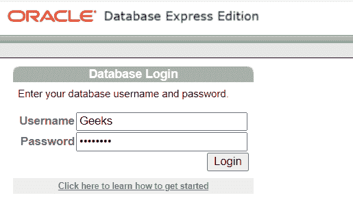
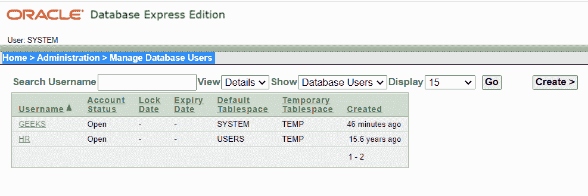
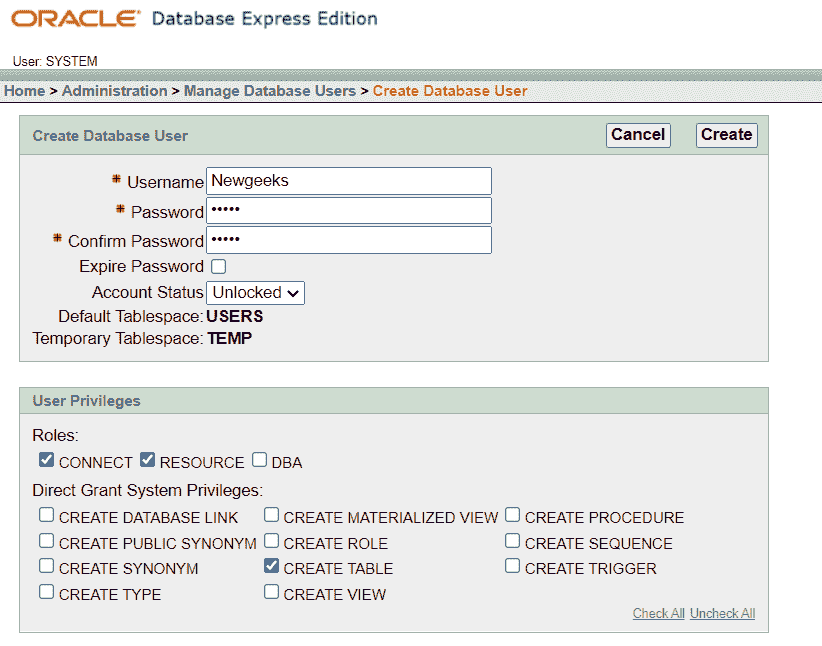
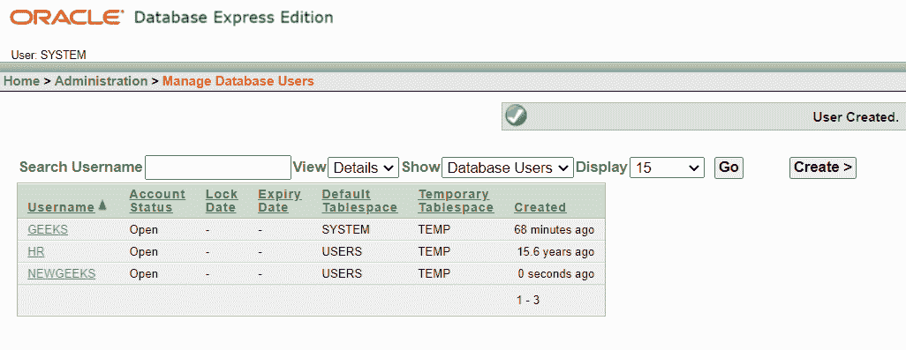

# 如何在 Oracle 数据库中创建用户？

> 原文:[https://www . geesforgeks . org/如何在 oracle 数据库中创建用户/](https://www.geeksforgeeks.org/how-to-create-user-in-oracle-database/)

在甲骨文有不同类型的用户帐户系统，系统，人力资源和更多。默认情况下，该用户帐户由 oracle 创建。如果你想创建自己的用户，那么你可以通过两种不同的方法来创建。

### **通过使用创建用户命令:**

**第一步。**通过用户名和密码正常登录数据库。

**第二步。**使用创建用户命令，根据需要指定用户名、密码。

**语法:**

```sql
CREATE USER user_name IDENTIFIED BY password ;
```



这里“极客”是用户名，“极客 123”是该用户名的密码。create 和 user 都是关键字，后跟 username。

新用户“极客”被创建，并由密码“极客 123”标识。

**输出:**



**第三步。**您可以通过简单地登录来检查数据库中是否创建了用户，如图所示。在这里，我们使用新的用户名和密码成功登录。现在，您可以使用 grant 命令向新用户授予角色和权限。



### **使用数据库管理设置:**

**第一步。**登录您的甲骨文数据库。

**第二步。**转到管理选项，然后转到数据库用户选项现在数据库用户出现，如图所示。



**第三步。**点击右侧的创建选项。如您所见，创建数据库用户窗口现在创建新用户并为该用户设置密码。



**第四步。**键入您想要的用户名和该用户名的密码。确认密码，如果您希望密码在一段时间后过期，那么您可以更改它，以便您可以选中“过期密码”框。您还可以根据隐私设置帐户状态锁定/解锁，并根据用户授予角色和权限。

**第五步。**完成后点击创建选项。现在，您会收到一条确认消息，用户已在您的数据库中创建，您还可以看到新用户“新极客”已添加到列表中，如图所示。

