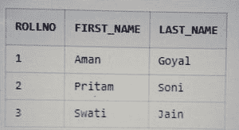

# 如何在 Teradata 中创建易失表？

> 原文:[https://www . geeksforgeeks . org/如何创建易失性表 in teradata/](https://www.geeksforgeeks.org/how-to-create-volatile-table-in-teradata/)

易变表与简单表相同，但差别很小，即它们本质上是易变的。

与简单的表一样，易失性表也是由用户形成的，并且只能在用户登录之前使用。一旦用户注销或断开连接，Teradata 管理器就会自动从会话中删除该表。

Teradata 管理器删除该表后，插入易失性表中的数据和定义将被自动擦除。

## 如何使用易变表？

假设您是 Teradata 数据库的用户，并且正在使用该数据库，那么您必须在同一个数据库中形成两个表。第一个选项是您必须在同一个数据库中创建简单的表，并在使用后删除它们。

第二个选项是您可以创建易失性表，在您从数据库注销后，Teradata 数据库会自动删除这些表的数据和定义，这将是更明智的方法。

对于可变表语法，我们将遵循下面的语法。

**语法:**

```sql
CREATE [SET | MULTISET] VOLATILE TABLE TABEL_NAME 
(
COLUMN1 DATATYPE;
COLUMN2 DATATYPE;
.
.
.
COLUMN_N datatype)
<INDEX_DEFINITION>
ON COMMIT [DELETE|PRESERVE] ROWS;

```

**示例:**

以下示例将创建一个名为“geek”的可变表。

```sql
CREATE VOLATILE TABLE GEEK
(
ROLLNO INT,
FIRST_NAME VARCHAR(15),
LAST_NAME VARCHAR(15)
)
PRIMARY INDEX (ROLLNO)
ON COMMIT PRESERVE ROWS;

```

在这里，您可以清楚地看到最后一行写为 ON COMMIT PRESERVE ROWS，这一行将在您插入数据后保存数据。

默认值为“提交时删除行”。

**易失性表中的数据插入:**

让我们在 volatile 表中插入一些数据。

```sql
INSERT INTO GEEK VALUES (1,'Aman','Goyal');
INSERT INTO GEEK VALUES (2,'Pritam','Soni');
INSERT INTO GEEK VALUES (3,'Swati','Jain');

```

**从易失性表中选择数据:**

我们将运行 ***选择语句*** 进入挥发表。

```sql
SELECT * FROM GEEK ORDER BY ROLLNO;
```

**输出:**



最后，如果我们断开与当前会话的连接，并重新登录后，再次运行相同的 select 语句，我们会发现表 student 在数据库中不再存在。

### 重新记录后的输出:

```sql
SELECT * FROM GEEK ORDER BY ROLLNO;
*** Failure 3807 Object 'GEEK' does not exist.
Statement# 1, Info =0
*** Total elapsed time was 1 second
```