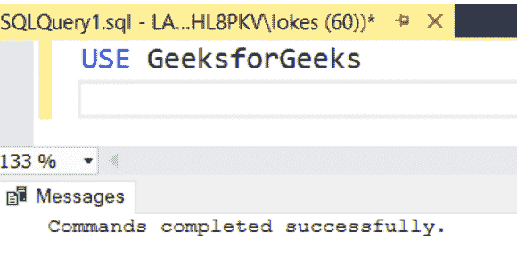
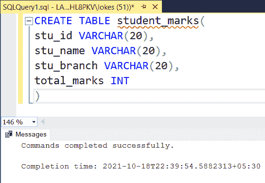
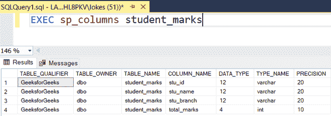
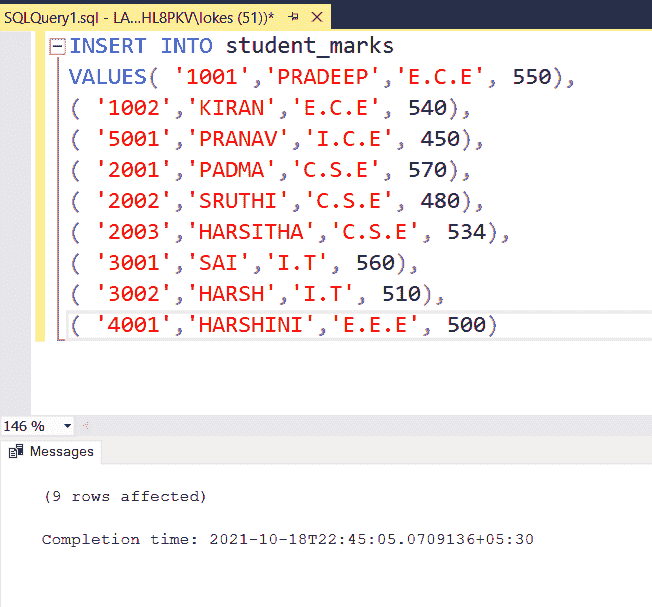
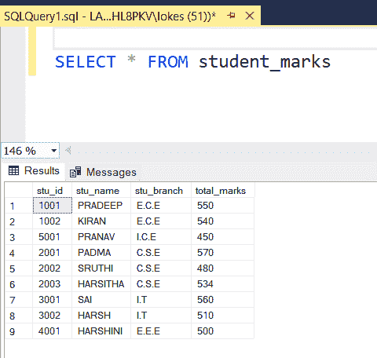
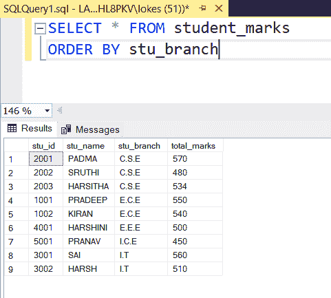
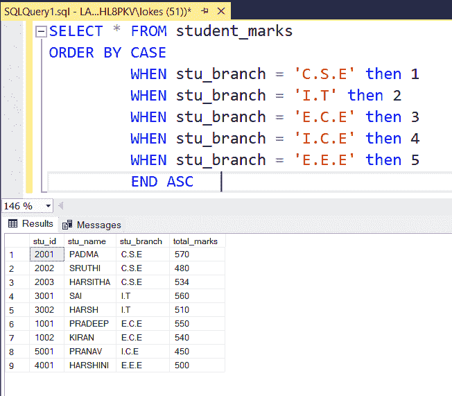

# 如何在 SQL ORDER BY 子句中自定义排序？

> 原文:[https://www . geesforgeks . org/如何自定义 SQL order by 子句/](https://www.geeksforgeeks.org/how-to-custom-sort-in-sql-order-by-clause/)

默认情况下 [SQL ORDER BY](https://www.geeksforgeeks.org/sql-order-by/) 排序，该列按升序排序，但是当需要降序排序时 [ORDER BY DESC](https://www.geeksforgeeks.org/sql-order-by/) 可以使用。如果我们需要自定义排序，那么我们需要使用 [CASE 语句](https://www.geeksforgeeks.org/sql-case-statement/)，在这里我们必须提到优先级来对列进行排序。

在本文中，让我们看看如何通过使用 MSSQL 作为服务器，使用顺序在表中自定义排序。

**语法:**

```
SELECT * FROM table_name
ORDER BY CASE 
     WHEN column_field = "value1" THEN priority1
     WHEN column_field = "value2" THEN priority2
     WHEN column_field = "value3" THEN priority3
     .
     ELSE priorityn 
     END ASC
```

**步骤 1:** 我们正在创建一个数据库。为此，使用下面的命令创建一个名为 GeeksforGeeks 的数据库。

**查询:**

```
CREATE DATABASE GeeksforGeeks;
```


**步骤 2:** 要使用 GeeksforGeeks 数据库，请使用以下命令。

**查询:**

```
USE GeeksforGeeks
```



**步骤 3:** 现在我们正在创建一个表。使用以下 SQL 查询创建一个包含 4 列的 student_marks 表。

**查询:**

```
CREATE TABLE student_marks(
stu_id VARCHAR(20),
stu_name VARCHAR(20),
stu_branch VARCHAR(20),
total_marks INT
)
```



**第 4 步:**查看表格的描述。

**查询:**

```
EXEC sp_columns student_marks
```



**步骤 5:** 向表中插入行的查询。使用以下 SQL 查询将行插入到 student_marks 表中。

**查询:**

```
INSERT INTO student_marks
VALUES( '1001','PRADEEP','E.C.E', 550),
( '1002','KIRAN','E.C.E', 540),
( '5001','PRANAV','I.C.E', 450),
( '2001','PADMA','C.S.E', 570),
( '2002','SRUTHI','C.S.E', 480),
( '2003','HARSITHA','C.S.E', 534),
( '3001','SAI','I.T', 560),
( '3002','HARSH','I.T', 510),
( '4001','HARSHINI','E.E.E', 500) 
```



**步骤 6:** 查看插入的数据

**查询:**

```
SELECT * FROM student_marks
```



*   根据销售订单、销售订单、销售订单、销售订单、销售订单的分支顺序进行自定义排序的查询也显示了使用排序依据的默认排序之间的差异。

**默认排序依据:**

```
SELECT * FROM student_marks
ORDER BY stu_branch 
```

**输出:**



**自定义排序依据:**

```
SELECT * FROM student_marks
ORDER BY CASE
         WHEN stu_branch = 'C.S.E' then 1
         WHEN stu_branch = 'I.T' then 2 
         WHEN stu_branch = 'E.C.E' then 3
         WHEN stu_branch = 'I.C.E' then 4
         WHEN stu_branch = 'E.E.E' then 5
         END ASC  
```

**输出:**

