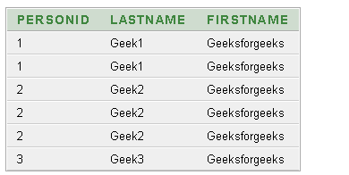
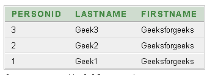
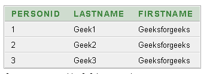

# 如何删除 Oracle 数据库中的重复记录？

> 原文:[https://www . geesforgeks . org/如何删除 oracle 数据库中的重复记录/](https://www.geeksforgeeks.org/how-to-delete-duplicate-records-in-oracle-database/)

要删除重复的记录，我们需要首先找到所有不同的记录。在重复记录中，除了 **row_id** 之外，所有数据都是相同的，因为 row_id 是记录占用的物理地址。因此，我们找到不同的行 id，其中每个列中的数据都是不同的，然后删除上面查询中没有的所有 row_id 行。

这里我们将看到，如何在 Oracle 中删除重复记录。出于演示的目的，我们将创建一个表格演示。

### **创建数据库:**

首先，我们创建一个表并在其中填充数据，使用以下方法复制一些记录:

**查询:**

```
CREATE TABLE Demo( PersonID int, LastName varchar(255), FirstName varchar(255));
INSERT INTO Demo VALUES (1, 'Geek1', 'Geeksforgeeks');
INSERT INTO Demo VALUES (2, 'Geek2', 'Geeksforgeeks');
INSERT INTO Demo VALUES (3, 'Geek3', 'Geeksforgeeks');
INSERT INTO Demo VALUES (1, 'Geek1', 'Geeksforgeeks');
INSERT INTO Demo VALUES (2, 'Geek2', 'Geeksforgeeks');
INSERT INTO Demo VALUES (2, 'Geek2', 'Geeksforgeeks');
```

**输出:**



现在，我们将使用以下命令找到所有没有重复行的不同记录:

**查询:**

```
SELECT * FROM Demo 
WHERE rowid IN 
( SELECT MAX(rowid)  
FROM Demo
GROUP BY PersonID, LastName, FirstName);
```

**输出:**



现在。使用以下命令删除不在上述查询中的所有 rowid 为的行:

**查询:**

```
DELETE Demo  
WHERE rowid NOT IN 
  (SELECT MAX(rowid)  
FROM Demo
GROUP BY PersonID, LastName, FirstName);
```

**输出:**

删除重复项的最终表格如下:

