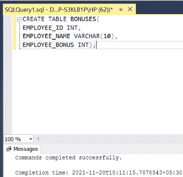
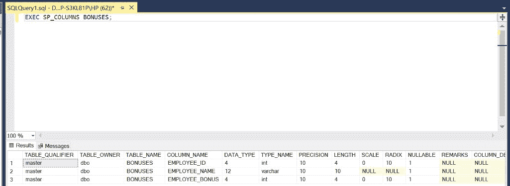
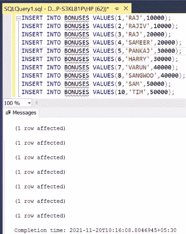
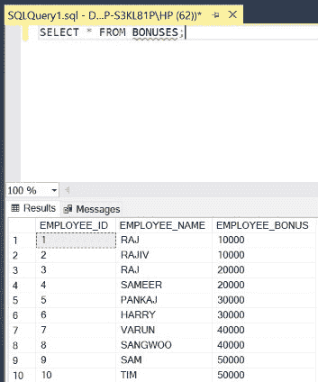
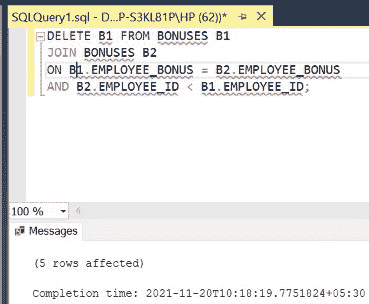
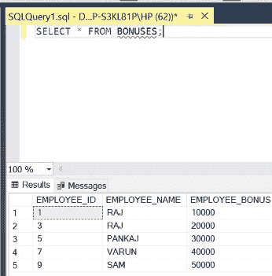
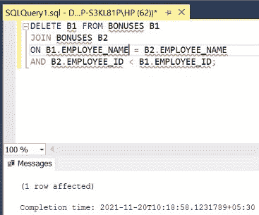
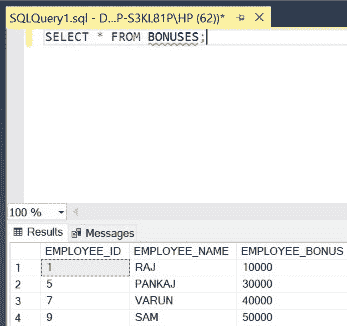

# 如何在 SQL 中仅基于表的一列消除重复值？

> 原文:[https://www . geesforgeks . org/如何消除重复值-基于 sql 中只有一列的表/](https://www.geeksforgeeks.org/how-to-eliminate-duplicate-values-based-on-only-one-column-of-the-table-in-sql/)

在 SQL 中，有些行在一列中包含重复的条目。要删除这样的行，我们需要使用 **DELETE** 关键字以及表与自身的自连接。下图也是如此。在本文中，我们将使用微软的 SQL Server 作为我们的数据库。

**步骤 1:** 创建数据库。为此，使用下面的命令创建一个名为 GeeksForGeeks 的数据库。

**查询:**

```
CREATE DATABASE GeeksForGeeks
```

**输出:**


**步骤 2:** 使用 GeeksForGeeks 数据库。为此，请使用以下命令。

**查询:**

```
USE GeeksForGeeks
```

**输出:**


**步骤 3:** 在数据库 GeeksForGeeks 中创建一个奖金表。该表有 3 列，即 EMPLOYEE _ ID、EMPLOYEE _ NAME 和 EMPLOYEE _ BONUS，包含员工的 ID、员工的姓名和他/她的奖金。

**查询:**

```
CREATE TABLE BONUSES(
EMPLOYEE_ID INT,
EMPLOYEE_NAME VARCHAR(10),
EMPLOYEE_BONUS INT);
```

**输出:**



**第 4 步:**描述奖金表的结构。

**查询:**

```
EXEC SP_COLUMNS BONUSES;
```

**输出:**



**第 5 步:**在奖金表中插入 10 行。

**查询:**

```
INSERT INTO BONUSES VALUES(1,'RAJ',10000);
INSERT INTO BONUSES VALUES(2,'RAJIV',10000);
INSERT INTO BONUSES VALUES(3,'RAJ',20000);
INSERT INTO BONUSES VALUES(4,'SAMEER',20000);
INSERT INTO BONUSES VALUES(5,'PANKAJ',30000);
INSERT INTO BONUSES VALUES(6,'HARRY',30000);
INSERT INTO BONUSES VALUES(7,'VAUN',40000);
INSERT INTO BONUSES VALUES(8,'SANGWOO',40000);
INSERT INTO BONUSES VALUES(9,'SAM',50000);
INSERT INTO BONUSES VALUES(10,'TIM',50000);
```

**输出:**



**第 6 步:**显示奖金表的所有行。

**查询:**

```
SELECT * FROM BONUSES;
```

**输出:**



**步骤 7:** 从表**奖金**中删除在**员工 _ 奖金**栏中有重复条目的行。为了实现这一点，我们使用 **DELETE** 功能，通过自连接(在表的两个别名上使用 **JOIN** 功能，即 **B1** 和 **B2** )将表与其自身连接起来，并将 EMPLOYEE_BONUS 列的条目与 **EMPLOYEE_ID** 列的不同条目进行比较，因为 ID 对于每个员工都是唯一的。

**语法:**

```
DELETE T1 FROM TABLE_NAME T1
JOIN TABLE_NAME T2
ON T1.COLUMN_NAME1 = T2.COLUMN_NAME1
AND T2.COLUMN_NAME2 < T1.COLUMN_NAME2;
```

**查询:**

```
DELETE B1 FROM BONUSES B1
JOIN BONUSES B2
ON B1.EMPLOYEE_BONUS = B2.EMPLOYEE_BONUS
AND B2.EMPLOYEE_ID < B1.EMPLOYEE_ID;
```

**输出:**



**第 8 步:**显示更新后的**奖金**表的所有行。

**查询:**

```
SELECT * FROM BONUSES;
```

**注意**–在**员工奖金**栏中没有重复的行条目。

**输出:**



**步骤 9:** 从表**奖金**中删除在**员工姓名**栏中有重复条目的行。

**查询:**

```
DELETE B1 FROM BONUSES B1
JOIN BONUSES B2
ON B1.EMPLOYEE_NAME = B2.EMPLOYEE_NAME
AND B2.EMPLOYEE_ID < B1.EMPLOYEE_ID;
```

**输出:**



**第 10 步:**显示更新后的**奖金**表的所有行。

**查询:**

```
SELECT * FROM BONUSES;
```

**注意:**在**员工姓名**栏中没有重复的行条目。

**输出:**

