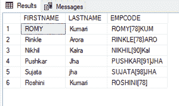
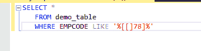
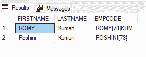
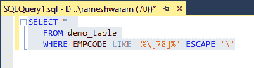

# 如何在 SQL Server 中转义 LIKE 子句中的方括号？

> 原文:[https://www . geeksforgeeks . org/如何转义-SQL server 中的类方括号子句/](https://www.geeksforgeeks.org/how-to-escape-square-brackets-in-a-like-clause-in-sql-server/)

这里我们将看到，如何在 LIKE 子句中摆脱方括号。SQL 中用于模式匹配的 LIKE 子句使用像% ^、[]等通配符运算符。如果我们试图使用带有方括号的字符串的 [LIKE 子句](https://www.geeksforgeeks.org/sql-like/)来过滤记录，我们将不会得到预期的结果。

**例如:**

对于表中的字符串值 Romy[R]kumari。如果我们尝试将 LIKE 'Romy[R]% '应用于 select 语句，它将不会返回任何内容。

**说明:**

方括号[]是 SQL 中 LIKE 子句使用的通配符运算符之一。用于匹配指定[范围](https://www.geeksforgeeks.org/sql-query-to-match-any-part-of-string/)内的任意单个字符，如([b-h])或 set ([ghijk])。

我们可以使用两种方法来摆脱方括号:

*   使用多一个方括号退出
*   使用转义字符转义

**步骤 1:** 创建数据库

可以使用 CREATE 命令创建数据库。

**查询:**

```
CREATE DATABASE geeks;
```

**步骤 2:** 使用数据库

使用下面的 SQL 语句将数据库上下文切换到极客:

**查询:**

```
USE geeks;
```

**步骤 3:** 表格定义

我们的极客数据库中有以下演示表。

**查询:**

```
CREATE TABLE demo_table(
FIRSTNAME VARCHAR(20), LASTNAME VARCHAR(20),
EMPCODE VARCHAR(20));
```

**步骤 4:** 将数据插入表中

**查询:**

```
INSERT INTO demo_table VALUES
('ROMY', 'Kumari', 'ROMY[78]KUM'),
('Rinkle', 'Arora', 'RINKLE[78}ARO'),
('Nikhil', 'Kalra','NIKHIL[90]Kal'),
('Pushkar', 'Jha', 'PUSHKAR[91]JHA'),
('Sujata', 'jha', 'SUJATA[98]JHA'),
('Roshini', 'Kumari','ROSHINI[78]');
```

**步骤 5:** 对于视图，表格数据

**查询:**

```
SELECT * FROM demo_table;
```

**输出:**



### **方法 1** :使用额外的支架

**语法:**

**用于匹配‘ROMY[78]’**

```
SELECT *  
  FROM table_name 
  WHERE column_name LIKE 'ROMY[[]78]%'
```

**查询:**匹配具有[78]的 EMPCODE

```
SELECT *  
  FROM demo_table  
  WHERE EMPCODE LIKE '%[[]78]%'
```



**输出:**



### **方法 2:** 使用转义字符

在这个方法中，我们必须在 LIKE 子句之后用[**【ESCAPE】**](https://www.geeksforgeeks.org/sql-like/)关键字指定字符。

**语法:**

**用于匹配‘ROMY[78]’**

```
SELECT *  
  FROM table_name  
  WHERE column_name LIKE 'ROMY\[78]%' ESCAPE '\';
```

**查询:**

```
SELECT *  
  FROM demo_table
  WHERE EMPCODE LIKE '%\[78]%' ESCAPE '\';
```



**输出:**

