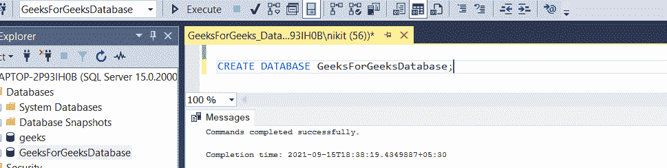

# 如何在 SQL Select 中排除有一定值的记录？

> 原文:[https://www . geeksforgeeks . org/如何排除带有 sql-select 中某些值的记录/](https://www.geeksforgeeks.org/how-to-exclude-records-with-certain-values-in-sql-select/)

在本文中，我们将了解如何从表中排除一些具有特定值的记录。为了演示，我们将在名为“ **GeeksForGeeksDatabase** 的数据库中创建一个参与者表。

### 步骤 1:创建数据库

使用下面的 SQL 语句创建一个名为**的数据库。**

**查询:**

```sql
CREATE DATABASE GeeksForGeeksDatabase;
```



### 步骤 2:使用数据库

使用下面的 SQL 语句将数据库上下文切换到 **GeeksForGeeksDatabase** 。

**查询:**

```sql
USE GeeksForGeeksDatabase;
```


### 步骤 3:表格定义

**查询:**

```sql
CREATE TABLE Geeks(
GeekID INTEGER PRIMARY KEY,
GeekName VARCHAR(255) NOT NULL,
GeekRank INTEGER NOT NULL,
GeekSchool VARCHAR(255) NOT NULL
);
```


### 第四步:在表格中插入一些数据

**查询:**

```sql
INSERT INTO Geeks VALUES (101, 'Nix',2 ,'Code Valley School');
INSERT INTO Geeks VALUES (102, 'Rutz',4 ,'Blue Chip School');
INSERT INTO Geeks VALUES (103, 'Shrey',1 ,'GCOEA School');
INSERT INTO Geeks VALUES (104, 'Ankx',3 ,'Round Robin Play School');
INSERT INTO Geeks VALUES (105, 'Ridz',7 ,'Dream School');
INSERT INTO Geeks VALUES (106, 'Mayo',6 ,'Silver Shining School');
INSERT INTO Geeks VALUES (107, 'Bugs',5 ,'Twinkle Star Convent');
```


您可以使用下面的语句查看创建的表的内容:

**查询:**

```sql
SELECT * FROM Geeks;
```


现在让我们看看如何根据某些条件从表中排除一些记录。

有很多方法可以做到这一点，让我们一个一个地看例子:

**查询:**

查询特定学校(即蓝筹股学校)的学生。不显示条件不为真的记录。

注意:如果我们没有在这里使用 NOT，那么结果将是相反的。

```sql
SELECT * FROM Geeks WHERE NOT GeekSchool = 'Blue Chip School';
```

此查询将输出除给定学校学生以外的所有学生:


我们还可以通过提供用“与”或运算符分隔的条件来排除更多的记录。

注意:我们也可以使用！操作员

**查询:**

```sql
SELECT * FROM Geeks WHERE NOT GeekID > 104;
```

现在看看“非”是如何工作的。在这里的例子中，我们提供了条件，当条件为真时，跟在“非”后面意味着查询将选择提供的条件不为真的所有行。


在上面的输出中，满足 GeekID > 104 的条件，并且由于不是，所有小于 104 的行都被选择。

注意:我们也可以使用！操作员

**查询:**

```sql
SELECT * FROM Geeks WHERE GeekID NOT IN (104,101,102,107);
```

在这个查询中，我们排除了那些极客标识不在提供的列表中的记录(行)(即极客标识不应该是 104，101，102，107)

因此，结果数据将包含不包括所提供的极客 id 的记录。


因此，我们可以对表的任何列应用任何条件，并排除那些使用非运算符的条件。

**查询:**

我们还可以在 in 运算符中提供子查询，还可以使用 WHERE 子句包含一个或多个条件:

```sql
SELECT * FROM Geeks WHERE GeekRank NOT IN (SELECT GeekRank FROM Geeks WHERE GeekRank >= 4);
```


结果表选择所有不满足 GeekRank >=4 条件的行，因此选择等级高于 4 的所有 geeks。我们也可以将许多条件结合在一起，从而得到不同的结果。