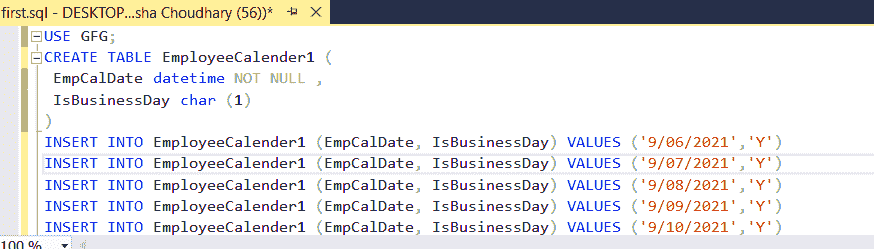
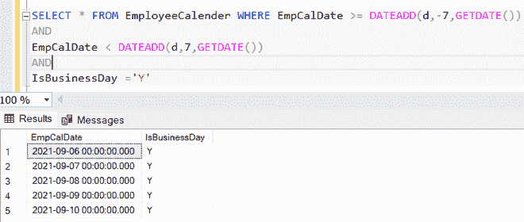

# 如何在 SQL Server 查询中排除周末？

> 原文:[https://www . geeksforgeeks . org/如何排除周末天数-SQL server-query/](https://www.geeksforgeeks.org/how-to-exclude-weekend-days-in-a-sql-server-query/)

通过这篇文章，我们将了解如何在 SQL server 查询中排除周末。对于这个任务，我们使用 [DATEADD ( )](https://www.geeksforgeeks.org/dateadd-function-in-sql-server/) MS.SQL server 函数。SQL Server 中的这个函数用于总结到指定日期的时间或日期间隔，然后返回修改后的日期。

**语法:**

```sql
DATEADD(interval, number, date)
```

因此，我们将首先创建一个数据库:

#### 步骤 1:创建数据库:

**查询:**

```sql
CREATE DATABASE GFG
```

#### 步骤 2:使用数据库

```sql
USE GFG
```

#### 第三步:创建表格

在数据库中创建一个表(雇员贷方)来存储数据。

```sql
CREATE TABLE EmployeeCalender (
 EmpCalDate datetime NOT NULL ,
 IsBusinessDay char (1)
)
```

#### 第 4 步:将数据插入表格

**查询:**

```sql
/* Data Inserted for a full week dates*/

INSERT INTO EmployeeCalender (EmpCalDate, IsBusinessDay) VALUES ('9/06/2021','Y')
INSERT INTO EmployeeCalender (EmpCalDate, IsBusinessDay) VALUES ('9/07/2021','Y')
INSERT INTO EmployeeCalender (EmpCalDate, IsBusinessDay) VALUES ('9/08/2021','Y')
INSERT INTO EmployeeCalender (EmpCalDate, IsBusinessDay) VALUES ('9/09/2021','Y')
INSERT INTO EmployeeCalender (EmpCalDate, IsBusinessDay) VALUES ('9/10/2021','Y')
INSERT INTO EmployeeCalender (EmpCalDate, IsBusinessDay) VALUES ('9/11/2021','N')
INSERT INTO EmployeeCalender (EmpCalDate, IsBusinessDay) VALUES ('9/12/2021','N')
```



#### 第五步:现在我们将编写 SQL 查询，它将获得除非工作日之外的所有工作日。

**查询:**

```sql
SELECT * FROM EmployeeCalender WHERE EmpCalDate >= DATEADD(d,-7,GETDATE())
AND
EmpCalDate < DATEADD(d,7,GETDATE())
AND
IsBusinessDay ='Y'
```



不包括周末的日期输出