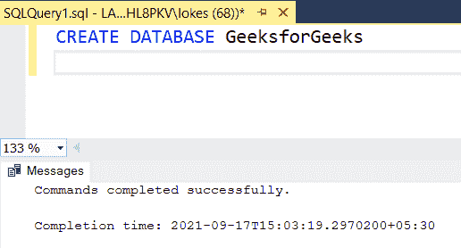
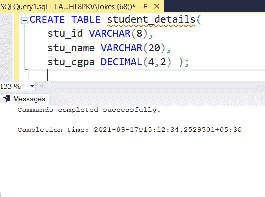
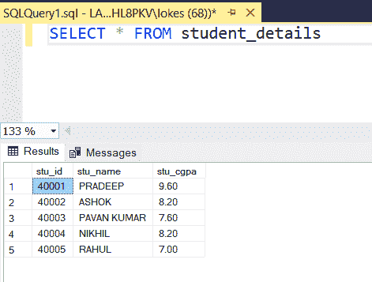

# 如何在 SQL Developer 中执行 SQL Server 存储过程？

> 原文:[https://www . geesforgeks . org/如何执行-SQL-server-SQL 中的存储过程-开发人员/](https://www.geeksforgeeks.org/how-to-execute-sql-server-stored-procedure-in-sql-developer/)

存储过程是我们重复使用同一个查询时需要的一组语句。当需要多次使用大型查询时，我们可以一次创建一个存储过程，并在任何需要的地方执行该过程，而不是再次编写整个查询。

在本文中，让我们看看如何在 MSSQL 中执行 SQL Server 存储过程。

**语法:**用于创建存储过程

```sql
CREATE PROCEDURE (or CREATE PROC) proc_name
AS
BEGIN
  QUERY
END
```

**步骤 1:** 我们正在创建一个数据库。为此，使用下面的命令创建一个名为 GeeksforGeeks 的数据库。

**查询:**

```sql
CREATE DATABASE GeeksforGeeks;
```

**输出:**



**步骤 2:** 要使用 GeeksforGeeks 数据库，请使用以下命令。

**查询:**

```sql
USE GeeksforGeeks
```

**输出:**


**步骤 3:** 现在我们创建一个表。使用以下 SQL 查询创建一个包含 3 列的 student_details 表。

**查询:**

```sql
CREATE TABLE student_details(
   stu_id VARCHAR(8),
   stu_name VARCHAR(20),
   stu_cgpa DECIMAL(4,2) );
```

**输出:**



**第 4 步:**向表中插入行的查询。使用以下 SQL 查询将行插入 student_details 表。

**查询:**

```sql
INSERT INTO student_details VALUES('40001','PRADEEP',9.6);
INSERT INTO student_details VALUES('40002','ASHOK',8.2);
INSERT INTO student_details VALUES('40003','PAVAN KUMAR',7.6);
INSERT INTO student_details VALUES('40004','NIKHIL',8.2);
INSERT INTO student_details VALUES('40005','RAHUL',7.0);
```

**输出:**


**步骤 5:** 查看插入的数据

**查询:**

```sql
SELECT * FROM student_details;
```

**输出:**



*   查询以创建存储过程来查看表:

**查询:**

```sql
CREATE PROCEDURE view_details
AS
BEGIN 
  SELECT * FROM student_details;
END
```

**输出:**


为了执行存储过程，我们使用以下语法:

**语法:**

```sql
 EXEC proc_name
 or
 EXECUTE proc_name
 or 
 proc_name
```

**查询:**

```sql
EXECUTE view_details
```

**输出:**


*   查询以创建一个存储过程，该存储过程将参数作为 stu_id 并显示该 id 的 cgpa。

**查询:**

```sql
CREATE PROCEDURE get_student_cg_details
@stu_id VARCHAR(20)
AS
BEGIN  
 SELECT stu_id, stu_cgpa FROM student_details
 WHERE stu_id= @stu_id
END
```

**输出:**


**查询:**

```sql
EXECUTE get_student_cg_details '40002'
```

**输出:**

