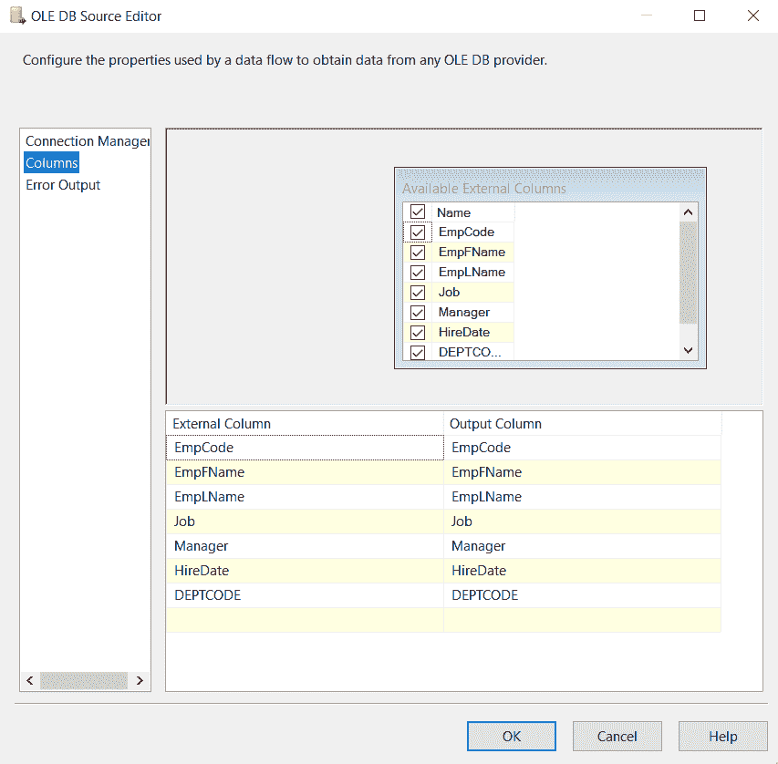

# 如何在 SSIS 将数据从 SQL Server 导出到平面文件？

> 原文:[https://www . geeksforgeeks . org/如何将数据从 SQL server 导出到 ssis 中的平面文件/](https://www.geeksforgeeks.org/how-to-export-data-from-sql-server-to-flat-file-in-ssis/)

在本文中，我们将学习如何在 SSIS 将数据从 SQL Server 导出到平面文件。为此，我们将创建一个包来从 SQL server 数据库中选择数据，并将 SQL Server 表数据导出到本地驱动器中的平面文件。

### 先决条件:

*   确保安装了 Visual Studio 2019。
*   确保安装了 SQL Server 管理工作室。
*   创建一个表，并在 SQL server 中插入一些数据，如下所示。

### 创建表格和添加数据:

使用以下查询创建名为“员工”的示例表:

```
CREATE TABLE EMPLOYEE
(
EmpCode   INT,
EmpFName  VARCHAR(15),
EmpLName  VARCHAR(15),
Job     VARCHAR(45),
Manager   CHAR(4),
HireDate  DATE,
Salary   INT,
Commission INT,
DEPTCODE  INT
);
```

现在，您可以使用下面的查询将数据添加到上面创建的雇员表中:

```
INSERT INTO EMPLOYEE
VALUES (1, 'ROB', 'STARK', 'SOFTWARE ENGINEER', 7902, '2012-12-17',20),
  (2, 'JON', 'SNOW', 'SALESMAN', 7698, '2014-02-20', 30),  
  (3, 'SANSA', 'STARK', 'MANAGER', 7839, '2011-04-02', 20),
  (4, 'CATEYLN', 'STARK', 'SALESMAN', 7698, '2010-09-28', 30),
  (5, 'ARYA', 'STARK', 'MANAGER', 7839, '2013-06-09', 10),
  (6, 'PAUL', 'SMITH', 'ANALYST', 7566, '2015-12-09',20),
  (7, 'ALFRED', 'KINSLEY', 'PRESIDENT', 7566, '2017-11-17',10),
  (8, 'ARNOLD', 'TIMOTHY', 'SALESMAN', 7698, '2019-09-08',30),
  (9, 'RAMIN', 'ASGHAR', 'SOFTWARE ENGINEER', 7788, '2020-01-12',20),
  (10, 'LUCY', 'FULLER', 'TECHNICAL LEAD', 7698, '2018-12-03', 20),
  (11, 'STEVE', 'FAULKNER', 'ANAYLYST', 7566, '2012-12-03',10),
  (12, 'KAREN', 'ROGERS', 'SOFTWARE ENGINEER', 7782, '2010-01-23',20),
  (13, 'BRUCE', 'LEE', 'SALESMAN', 7698, '2001-02-22',30),
  (14, 'NEIL', 'SWAN', 'MANAGER', 7839, '2005-05-01',30),
  (15, 'ATHENA', 'WILLIAMS', 'ANALYST', 7839, '2003-06-21',50),
  (16, 'MATHEW', 'HUETTE', 'ANALYST', 7839, '2006-07-01', 50);
```

现在让我们进入重要的部分。

## 创建 SSIS 包:

按照以下步骤创建 SSIS 包:

**步骤 1:** 将数据流任务从工具箱拖放到控制流区域。给它加上一个你选择的名字。


**步骤 2:** 双击数据流任务。这将把我们重定向到一个名为“数据流”的新窗口，其目的是将数据从源加载到目标。从工具箱菜单中拖放 OLEDB 源和平面文件目标。


### 为源添加配置:

按照以下步骤配置源:

*   双击 OLEDB 源，将弹出一个菜单。在连接管理器中输入数据库服务器名称，然后选择包含数据的表。


*   选择以下选项后，我们可以转到列选项。我们可以确保列是否被正确加载，请单击下面的“确定”选项。



*   如下所示，连接 OLEDB 源和平面文件目标。


### 为目标添加配置:

按照以下步骤配置目标:

*   双击平面文件目标，将弹出一个菜单。如下所示选择:


*   在路径中创建一个文本文件，以查看已处理的数据。现在在窗口中配置文本文件的路径。


*   验证映射选项，确保它与下面的选项相同，然后单击确定继续。


**步骤 3:** 我们现在可以使用主菜单中的运行选项运行包。当我们按下开始按钮时，包将开始运行，您可以查看您的 SSIS 包的状态。

 

**步骤 4:** 验证文本文件中的输出。单击我们之前创建的文本文件，您可以查看以下数据。


### **应用:**

这可以有广泛的应用，例如:

*   用于档案过程的自动化。
*   借助 SQL 作业将报告发送到电子邮件。