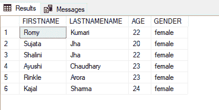
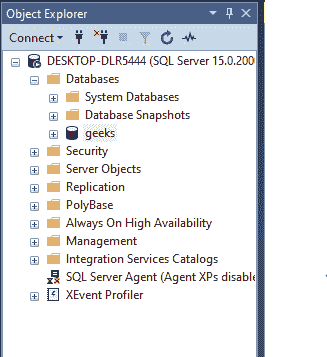
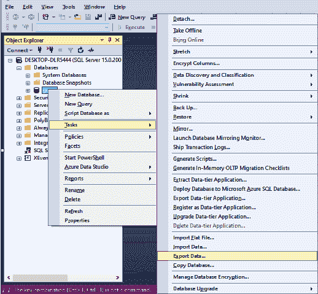
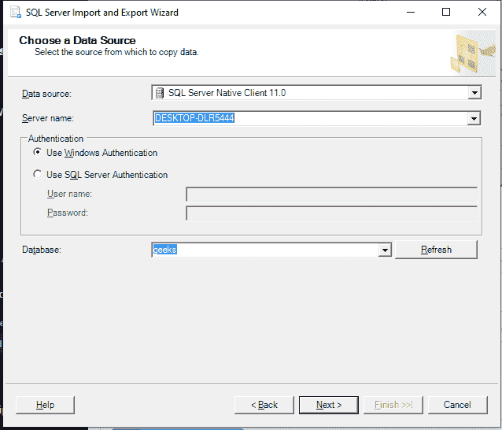
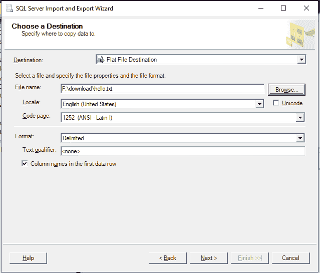
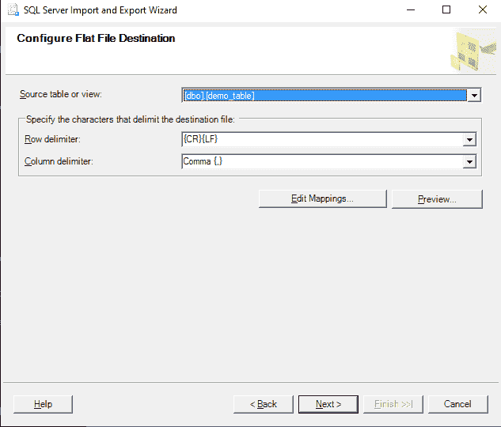
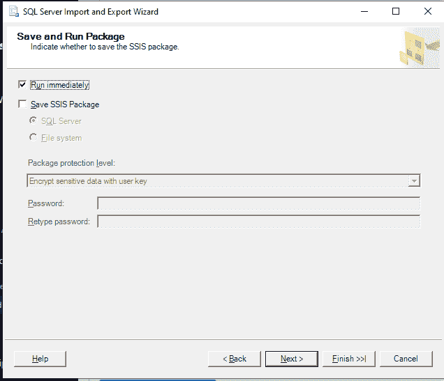
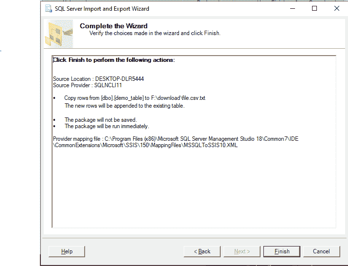
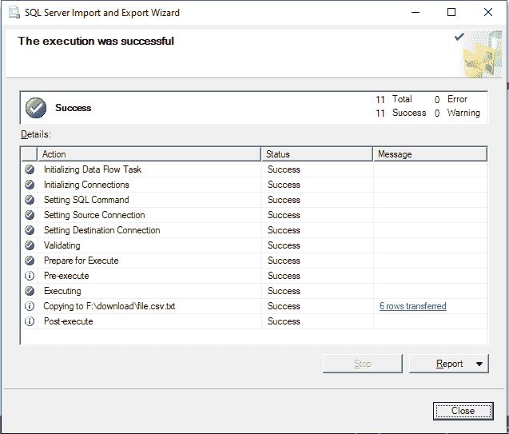
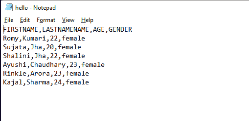

# 如何将 SQL Server 数据导出到 CSV 文件？

> 原文:[https://www . geesforgeks . org/how-export-SQL-server-data-to-a-CSV-file/](https://www.geeksforgeeks.org/how-to-export-sql-server-data-to-a-csv-file/)

这里我们将看到，如何使用 SQL Server 管理工作室(SSMS)的“导入和导出向导”将 SQL Server 数据导出到 CSV 文件。

CSV(逗号分隔值):它是一个由纯文本数据组成的文件，其中数据用逗号(，)分隔。它也被称为**逗号分隔文件**，因为逗号充当 CSV 文件的分隔符。

**步骤 1:** 创建数据库

使用下面的 SQL 语句创建一个名为 geeks 的数据库。

**查询:**

```
CREATE DATABASE geeks;
```

**步骤 2:** 使用数据库

使用下面的 SQL 语句将数据库上下文切换到极客。

**查询:**

```
USE geeks;
```

**步骤 3:** 表格定义

我们的极客数据库中有以下演示表。

**查询:**

```
CREATE TABLE demo_table
(FIRSTNAME VARCHAR(20),
LASTNAMENAME VARCHAR(20),
AGE INT,GENDER VARCHAR(20));
```

**步骤 4:** 将数据插入表格

**查询:**

```
INSERT INTO demo_table VALUES
('Romy', 'Kumari', 22, 'female'),
('Sujata', 'Jha', 20, 'female'),
('Shalini', 'Jha', 22, 'female'),
('Ayushi', 'Chaudhary', 23, 'female'),
('Rinkle', 'Arora', 23, 'female'),
('Kajal', 'Sharma' ,24, 'female');
```

**第五步:**查看表格内容

使用以下命令查看 demo_table 的内容:

**查询:**

```
SELECT * FROM demo_table;
```

**输出:**



**现在我们看到将 SQL Server 数据导出到 CSV 文件的步骤。**

**步骤 1:** 从菜单栏中的查看选项打开对象资源管理器。

它出现在屏幕的左侧。



我们可以在数据库文件夹中看到“极客”数据库。

**第二步:**右键点击极客数据库，点击**任务- >导出数据。**



**第三步:**导入导出向导打开，填写服务器名称、数据库等详细信息。然后点击下一步。



**第四步**:选择‘平面文件目的地’作为目的地，选择文件路径。可以选择任何文本文件作为目标文件。我们选择了 hello.txt 作为目标文件来保存 SQL Server 数据。然后单击下一步



**第五步:**选择表名，选择逗号作为分隔符。然后单击下一步继续。



**步骤 6:** 在保存和运行包窗口中不需要更改。单击下一步。



**步骤 7:** 在“完成”向导窗口中，检查导出过程中设置的所有设置。单击“完成”开始将 SQL 数据库导出到 CSV。



**步骤 8:** 下面的窗口显示成功执行



**步骤 9:** 检查目的文件，在这种情况下是“hello”。



我们可以看到内容和 demo_table 的内容一样，用逗号隔开。