# 如何将 SQL Server 数据导出为文本文件格式？

> 原文:[https://www . geesforgeks . org/how-export-SQL-server-data-a-text-file-format/](https://www.geeksforgeeks.org/how-to-export-sql-server-data-to-a-text-file-format/)

在本文中，我们将看到如何使用三种不同的技术将 SQL Server 数据导出到平面文件。在我们继续之前，让我们设置我们的数据库。

**步骤 1:** 创建数据库

**查询:**

```sql
CREATE DATABASE geeks;
```

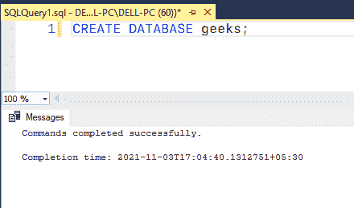

**步骤 2:** 选择新创建的数据库

```sql
USE geeks;
```

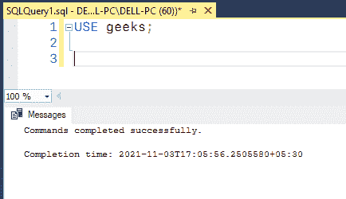

**步骤 3:** 表格定义

极客数据库中有以下**品牌。**

****查询:****

```sql
CREATE TABLE brands(
brand_id INT PRIMARY KEY,  
brand_name VARCHAR(30) NOT NULL);
```

**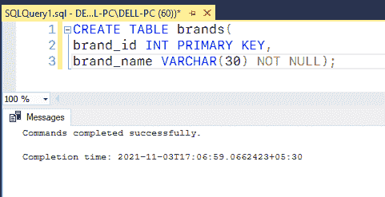**

****步骤 4:** 插入记录**

****查询:****

```sql
INSERT INTO brands VALUES
(1, 'Electra'),
(2, 'Haro'),
(3, 'Heller'),
(4, 'Pure Cycles'),
(5, 'Ritchey'),
(6, 'Strider'),
(7, 'Sun Bicycles'),
(8, 'Surly'),
(9, 'Trek');
```

****输出:****

**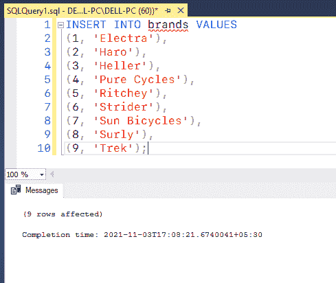**

### ****方法 1:通过 SSMS** 将结果保存到文件中**

****第一步:**首先来看看我们品牌的表。**

****查询:****

```sql
SELECT * FROM brands;
```

**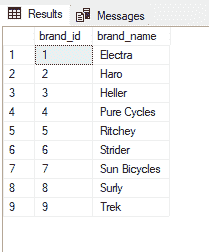**

****第二步:**将查询写在需要保存输出的编辑器上。如果您想将结果保存在平面文件中，您可以在 SSMS 这样做。右键单击编辑器>结果到>结果到文件:**

****查询:****

```sql
Select TOP (1000) [brand_id],[brand_name]
from [sample].[production].[brands];
```

**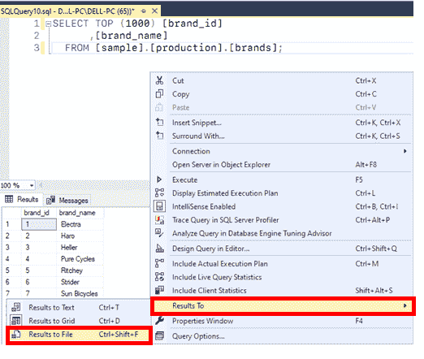**

****第三步:**执行查询。将显示指定名称和路径的选项。将类型更改为“所有文件”，并使用保存。txt 扩展名:**

**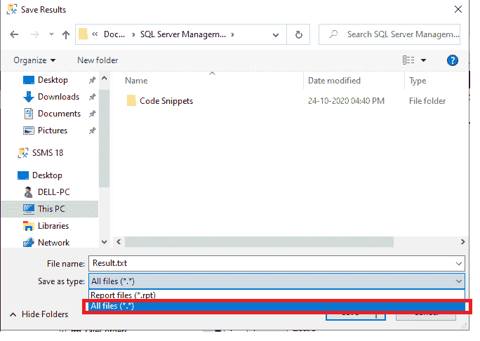**

****第四步:** Result.txt 文件如下图:**

**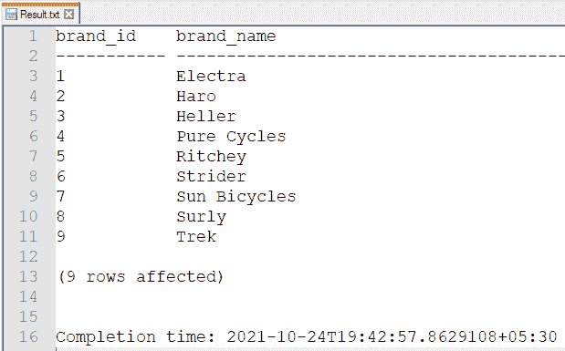**

### ****方法 2:在 SSMS 使用导入/导出向导****

****步骤 1:** 当我们右键单击 SSMS 的一个数据库时。可以导入或导出数据。导航至任务>导出数据:**

**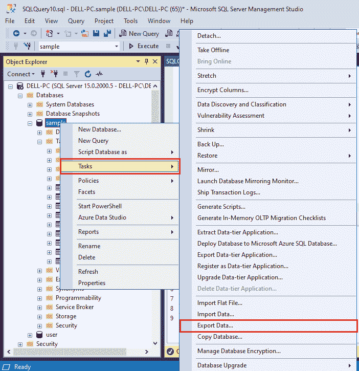**

****步骤 2:** 将启动 SQL Server 导入和导出向导。我们将从 SQL Server 导出到平面文件。选择 SQL Server 本机客户端 11.0 作为数据源:**

**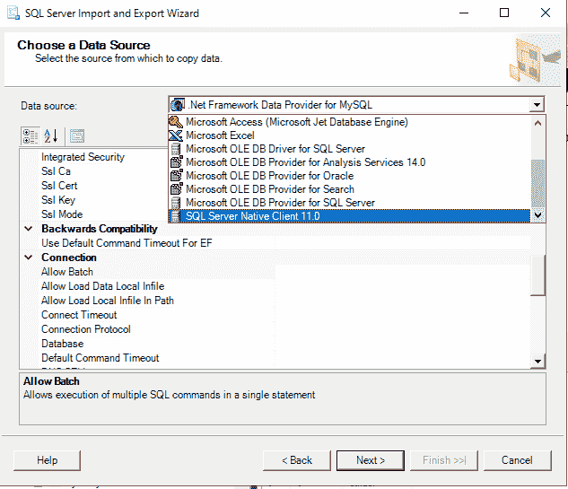**

**如有必要，请指定服务器名称和连接信息:**

**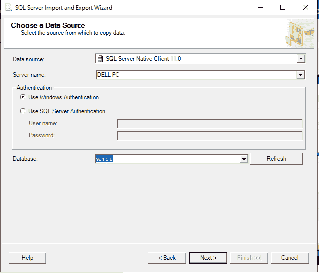**

****步骤 3:** 从目标下拉菜单中选择平面文件目标，点击浏览设置文件名和路径:**

**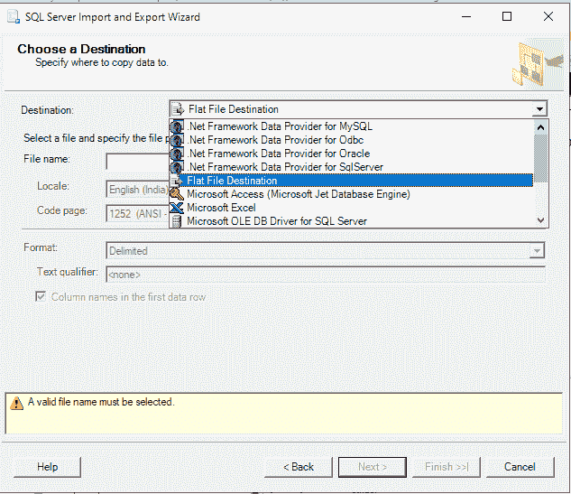**

****步骤 4:** 在我们的例子中，平面文件名是 Result.txt:**

**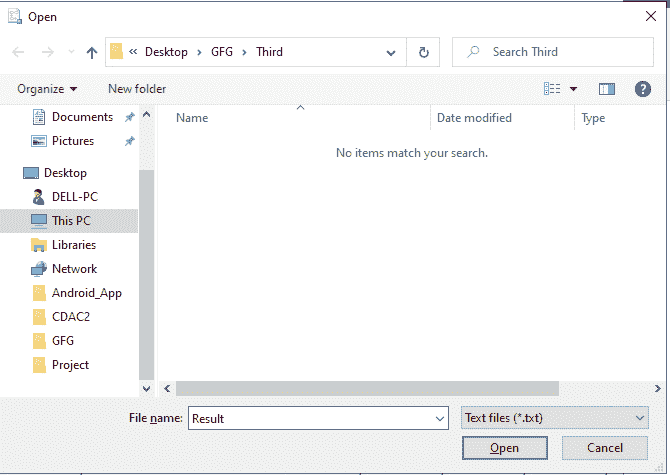**

****步骤 5:** 一旦我们确定了文件名和路径，请按照以下步骤操作:**

**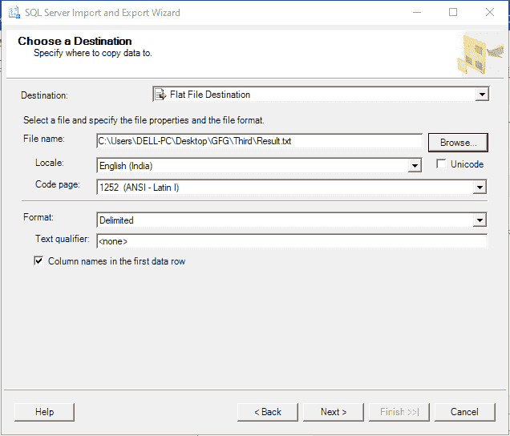**

****步骤 6:** 选择“从一个或多个表或视图复制数据”或选择第二个选项来指定我们自己的查询:**

**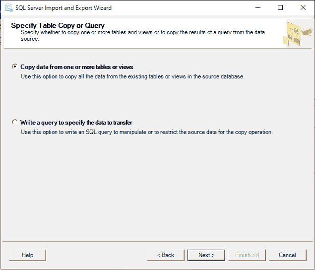**

****步骤 7:** 要立即导出数据，请选择立即运行:**

**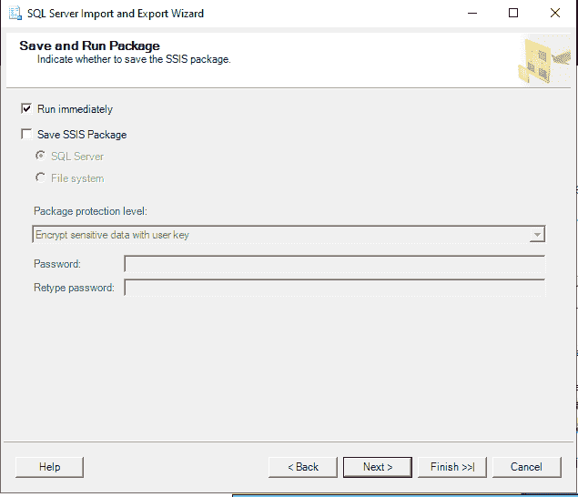**

****第 8 步:**result . txt 文件将包含输出:**

**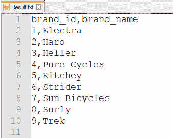**

### ****方法 3: SQLCMD 实用程序****

**SQL Server 命令行工具是 SQLCMD。该工具允许您将结果存储在文件中。当利用批处理文件来自动化流程时，这个选项就派上了用场。**

****第 1 步:**下面是我们的 SaveOutputToText.sql 文件的样子:**

****查询:****

```sql
SELECT TOP (1000) [brand_id]
      ,[brand_name]
  FROM [sample].[production].[brands];
```

****步骤 2:** 在终端上使用以下命令将任何查询的结果保存到文件中:**

****查询:****

```sql
sqlcmd -i SaveOutputToText.sql -o Result.txt
```

****步骤 3:**result . txt 文件包含输出:**

**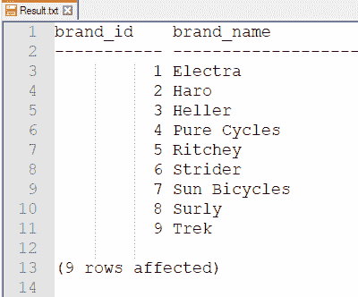**