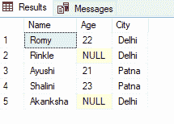
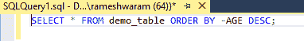
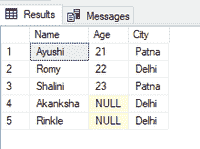
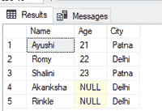

# 在 SQL 中升序排序时，如何将空值过滤到最后？

> 原文:[https://www . geeksforgeeks . org/如何过滤空值到最后一次排序-sql 升序/](https://www.geeksforgeeks.org/how-to-filter-null-values-to-last-while-sorting-ascending-in-sql/)

在本文中，我们将看到如何在 SQL 中升序排序时使 null 排在最后。SQL 将空值视为小于 0，因此在按升序排序时，空值总是首先出现。

我们可以通过两种方法最终得到空值。

### **方法一:使用减运算符**

此方法仅适用于数字和日期值。[列名前的减号(-)运算符](https://www.geeksforgeeks.org/sql-minus-operator/)使值按相反的顺序排序。减运算符对空值没有影响。

**语法:**

```
SELECT column_name FROM table_name ORDER BY -column_name DESC;
```

这里，如果我们加上 [DESC 关键字](https://www.geeksforgeeks.org/order-by-in-ms-sql-server/)，所有的值都按照降序排序，最后保留空值，减运算符不改变空值的位置，非值按照逆序排序(升序)。

**步骤 1:** 创建数据库

使用下面的 SQL 语句创建一个名为 geeks 的数据库。

**查询:**

```
CREATE DATABASE geeks;
```

**步骤 2:** 使用数据库

使用下面的 SQL 语句将数据库上下文切换到极客。

**查询:**

```
USE geeks;
```

**步骤 3:** 表格定义

我们的极客数据库中有以下演示表。

**查询:**

```
CREATE TABLE demo_table(
Name VARCHAR(20),
Age int,
City VARCHAR(20));
```

**步骤 4:** 将数据插入表格

```
INSERT INTO demo_table VALUES('Romy', 22,'Delhi'),
('Rinkle', NULL, 'Delhi'),
('Ayushi', 21, 'Patna'),
('Shalini', 23, 'Patna'),
('Akanksha', NULL, 'Delhi');
```

**第五步:**查看表格的数据

使用以下命令查看 demo_table 的内容:

**查询:**

```
SELECT * FROM demo_table;
```

**输出:**



**第 6 步:**对年龄列进行排序，使[空值](https://www.geeksforgeeks.org/sql-null-values/)出现在最后

**查询:**

```
SELECT * FROM demo_table ORDER BY -AGE DESC;
```



**输出:**



### **方法二:使用聚结()功能**

**聚结():**该函数返回列表中的第一个非空值。

我们将使用 demo_table 进行演示。

**语法:**

```
SELECT * FROM table_name ORDER BY COALESCE(column_name, (select max(column_name) from table_name)+1);
```

在这个查询中，聚结使列的空值返回列的(1+最大值)，因此使它成为按升序排序时最后返回的最大值。

**查询:**

```
SELECT * FROM demo_table ORDER BY COALESCE(AGE, (select max(AGE) from demo_table)+1);
```

**输出:**

