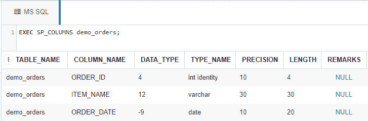
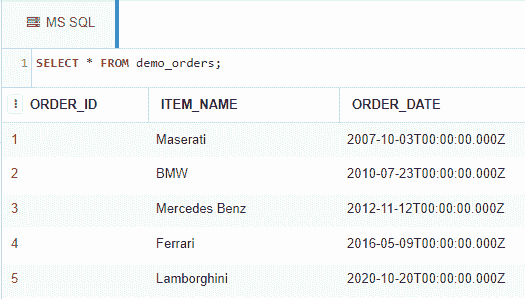
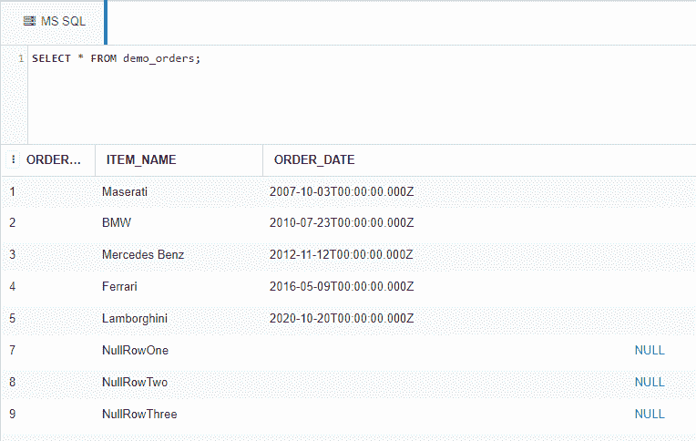
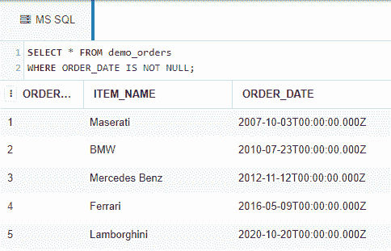

# 如何在 SQL 中过滤列中没有空值的行？

> 原文:[https://www . geesforgeks . org/如何过滤 sql 中无空列的行/](https://www.geeksforgeeks.org/how-to-filter-rows-without-null-in-a-column-in-sql/)

在这里，我们将看到，如何在使用 IS NOT null 运算符的 SQL 查询的帮助下，在 MS SQL Server 的数据库表的一列中过滤没有 NULL 的行。

为了演示，我们将在名为“极客”的数据库中创建一个 *demo_orders* 表。

### **创建数据库:**

使用下面的 SQL 语句创建一个名为 geeks 的数据库:

```sql
CREATE DATABASE geeks;
```

### **使用数据库:**

使用下面的 SQL 语句将数据库上下文切换到极客:

```sql
USE geeks;
```

### **表定义:**

我们的*极客*数据库中有以下演示表。

```sql
CREATE TABLE demo_orders(
 ORDER_ID INT IDENTITY(1,1) PRIMARY KEY, --IDENTITY(1,1) is same as AUTO_INCREMENT in MySQL.
                                              --Starts from 1 and increases by 1 with each inserted row.
 ITEM_NAME VARCHAR(30) NOT NULL,
 ORDER_DATE DATE
);
```

您可以使用下面的语句来查询创建的表的描述:

```sql
EXEC SP_COLUMNS demo_orders;
```



### **向表中添加数据:**

使用以下语句将数据添加到*演示订单*表中:

```sql
INSERT INTO demo_orders --no need to mention columns explicitly as we
                        --are inserting into all columns and ID gets 
                         --automatically incremented.
VALUES
('Maserati', '2007-10-03'),
('BMW', '2010-07-23'),
('Mercedes Benz', '2012-11-12'),
('Ferrari', '2016-05-09'),
('Lamborghini', '2020-10-20');
```

要验证表格的内容，请使用以下语句:

```sql
SELECT * FROM demo_orders;
```



现在让我们在 *order_date* 列中插入一些没有值(或空值)的行。

```sql
INSERT INTO demo_orders(ITEM_NAME)
VALUES
('NullRowOne'),
('NullRowTwo'),
('NullRowThree');
```

新插入数据后的表格如下:



以下是筛选指定列中没有空值的行的语法。

```sql
Syntax:
SELECT * FROM <table_name>
WHERE <column_name> IS NOT NULL;
```

**示例:**

```sql
SELECT * FROM demo_orders
WHERE ORDER_DATE IS NOT NULL;
--Will output the rows consisting of non null *order_date* values.
```

**输出:**

