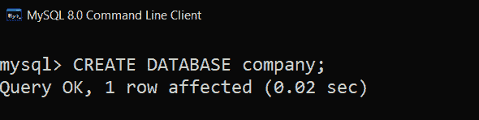
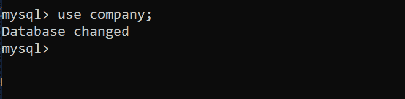
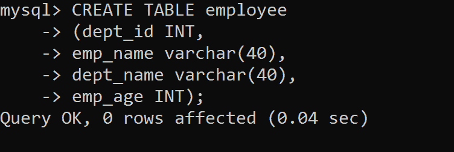
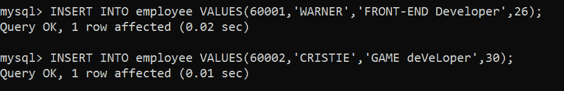
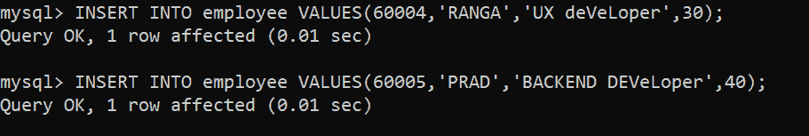
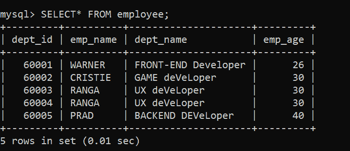
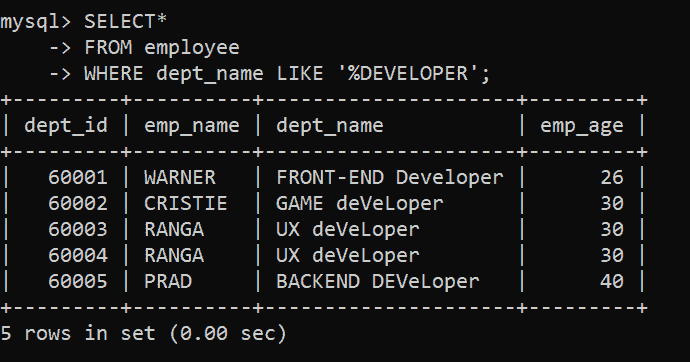
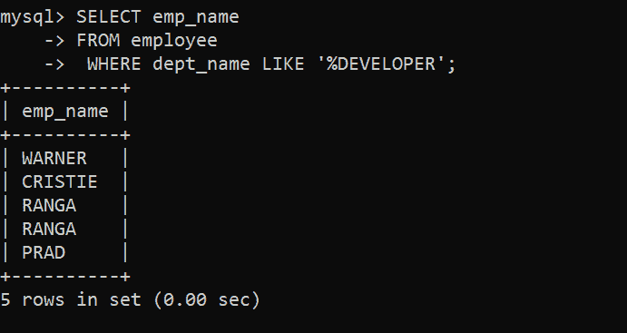

# 如何在 SQL 中查找包含特定单词的所有员工记录，不区分大小写

> 原文:[https://www . geesforgeks . org/如何找到所有员工记录-包含特定单词-不区分大小写-sql/](https://www.geeksforgeeks.org/how-to-find-all-employee-records-containing-a-specific-word-regardless-case-sensitive-in-sql/)

在本文中，我们将介绍如何在 [SQL](https://www.geeksforgeeks.org/sql-tutorial/) 中查找包含特定单词的所有员工记录，而不考虑大小写，并将逐步讨论。

**简介:**
我们将讨论，如何找到包含特定单词的所有员工记录，而不考虑大小写。我们创建数据库雇员，并逐步检查以下查询。考虑到这个表，我们发现开发人员的所有员工记录都不区分大小写，如下所示。

<figure class="table">T30

| 部门 id | 电磁脉冲名称 | 部门名称 | 电磁脉冲年龄 |
| --- | --- | --- | --- |
| Sixty thousand and one | 报警器 | 前端开发人员 | T26】26 |
| Sixty thousand and two | 开发者 | 30 |
| Sixty thousand and five | 马 | 后端开发者 | 40 |

</figure>

**步骤-1:创建数据库–**
使用以下 SQL 查询创建数据库，如下所示。

```sql
syntax:
CREATE DATABASE database_name;
```

**输出:**



**第 2 步:使用数据库–**
使用数据库公司如下。

```sql
syntax:
USE database_name;
```

**输出:**



**步骤-3:添加表–**
将表员工添加到数据库公司，如下所示。

```sql
syntax:
CREATE TABLE table_name
( column_name1 data_type1 ,
column_name2 data_type2 ,
column_name3 data_type3 ,
.
.
column_nameN data_typeN , );     
```

**步骤-4:创建表–**
创建一个表员工，其列(dept_id、emp_name、dept_name、emp_age)进入数据库公司，如下所示。

**输出:**



**步骤-5:通过 description 查询验证列和数据类型–**
列及其数据类型，如下所示。

```sql
syntax:
DESCRIBE table_name;
```

**输出:**


**第 6 步:向表中插入行–**
使用如下 SQL 查询向表员工中插入行。

```sql
syntax:
INSERT INTO table_name  VALUES(column1_data,column2_data,......columnN_data);
```

**输出:**

 

**步骤-7:验证插入的数据–**
使用如下选择查询检查数据库中的插入数据。

```sql
syntax:
SELECT * FROM table_name;
```

**输出:**



**例子:**
为了更好的理解，让我们也借助例子来理解这个概念。

**示例-1 :**
如表中所示，developer 一词不区分大小写，但是应该检索所有与 developer 相关的员工记录，因此对此的查询如下。

**语法:**

```sql
SELECT*
FROM table_name
WHERE column_name LIKE 'PATTERN';
```

**选择数据查询–**

```sql
SELECT* 
FROM employee
WHERE dept_name LIKE '%DEVELOPER';
```

**输出:**
在此表中，获取了一个以开发人员为部门名称的员工的所有记录，不考虑案例。



**示例-2 :**
查询获取所有员工姓名，开发者为 dept_name，不区分大小写，如下。

**输出:**
在这个例子中，一个开发人员的所有员工的名字都是在不考虑案例的情况下获得的。

