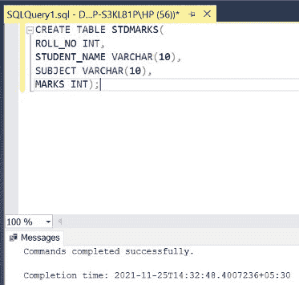
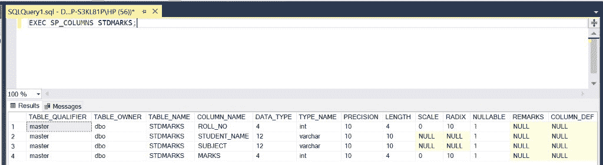
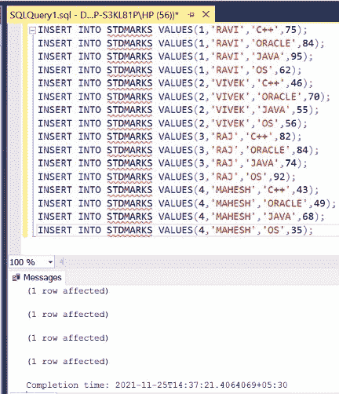
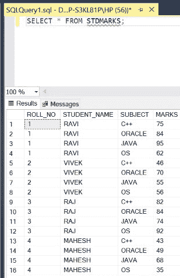
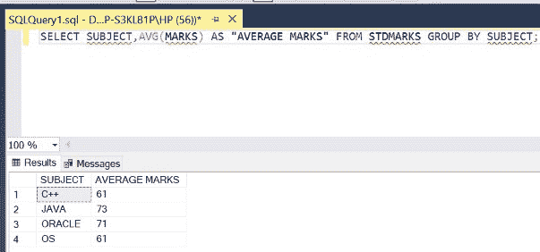

# 如何在 SQL 中找到各科目的平均分？

> 原文:[https://www . geesforgeks . org/如何找到 sql 中每个主题的平均分数/](https://www.geeksforgeeks.org/how-to-find-average-marks-of-each-subject-in-sql/)

在 SQL 中，有时我们需要根据表中的另一列找到一列的平均值，例如找到一个班的学生按学科的平均分数。这涉及到使用 [**GROUP BY**](https://www.geeksforgeeks.org/sql-group-by/) 子句以及 [**AGGREGATE**](https://www.geeksforgeeks.org/aggregate-functions-in-sql/#:~:text=In%20database%20management%20an%20aggregate,value%20of%20more%20significant%20meaning.) 函数，类似于 [**AVG** 。](https://www.geeksforgeeks.org/sql-functions-aggregate-scalar-functions/)同样的情况在下面的文章中描述。为此，我们使用一种特定的查询，如下面的演示所示。在本文中，我们将使用微软的 SQL Server 作为我们的数据库。

**步骤 1:** 创建数据库。为此，使用下面的命令创建一个名为 GeeksForGeeks 的数据库。

**查询:**

```sql
CREATE DATABASE GeeksForGeeks
```

**输出:**


**步骤 2:** 使用 GeeksForGeeks 数据库。为此，请使用以下命令。

**查询:**

```sql
USE GeeksForGeeks
```

**输出:**


**步骤 3:** 在数据库 GeeksForGeeks 中创建一个 STDMARKS 表。该表有 4 栏，即卷号、学生姓名、科目和分数，包含学生的卷号和姓名以及学生在各自科目中的科目名称和分数。

**查询:**

```sql
CREATE TABLE STDMARKS(
ROLL_NO INT,
STUDENT_NAME VARCHAR(10),
SUBJECT VARCHAR(10),
MARKS INT);
```

**输出:**



**第四步:**描述表格 STDMARKS 的结构。

**查询:**

```sql
EXEC SP_COLUMNS STDMARKS;
```

**输出:**



**第 5 步:**在 STDMARKS 表中插入 16 行。

**查询:**

```sql
INSERT INTO STDMARKS VALUES(1,'RAVI','C++',75);
INSERT INTO STDMARKS VALUES(1,'RAVI','ORACLE',84);
INSERT INTO STDMARKS VALUES(1,'RAVI','JAVA',95);
INSERT INTO STDMARKS VALUES(1,'RAVI','OS',62);
INSERT INTO STDMARKS VALUES(2,'VIVEK','C++',46);
INSERT INTO STDMARKS VALUES(2,'VIVEK','ORACLE',70);
INSERT INTO STDMARKS VALUES(2,'VIVEK','JAVA',55);
INSERT INTO STDMARKS VALUES(2,'VIVEK','OS',56);
INSERT INTO STDMARKS VALUES(3,'RAJ','C++',82);
INSERT INTO STDMARKS VALUES(3,'RAJ','ORACLE',84);
INSERT INTO STDMARKS VALUES(3,'RAJ','JAVA',74);
INSERT INTO STDMARKS VALUES(3,'RAJ','OS',92);
INSERT INTO STDMARKS VALUES(4,'MAHESH','C++',43);
INSERT INTO STDMARKS VALUES(4,'MAHESH','ORACLE',49);
INSERT INTO STDMARKS VALUES(4,'MAHESH','JAVA',68);
INSERT INTO STDMARKS VALUES(4,'MAHESH','OS',35);
```

**输出:**



**第 6 步:**显示 STDMARKS 表的所有行。

**查询:**

```sql
SELECT * FROM STDMARKS;
```

**输出:**



**第 7 步:**显示**科目**以及学生在该科目中从表**标准分数**中获得的平均分数。为了根据另一列获得一列的聚合值，我们需要使用 **GROUP BY** 子句以及聚合函数，如 **AVG** 。 **GROUP BY** 子句后面提到的列是我们输出的基础。以这种方式获得学科平均分数。

**语法:**

```sql
SELECT COLUMN_NAME1,AVG(COLUMN_NAME2) 
AS ALIAS FROM TABLE_NAME GROUP BY COLUMN_NAME1;
```

**查询:**

```sql
SELECT SUBJECT,AVG(MARKS) AS "AVERAGE MARKS"
FROM STDMARKS GROUP BY SUBJECT;
```

**输出:**

