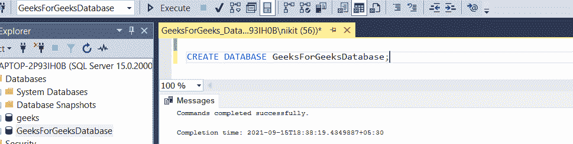
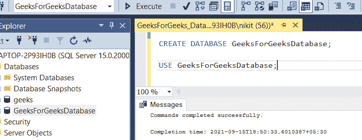
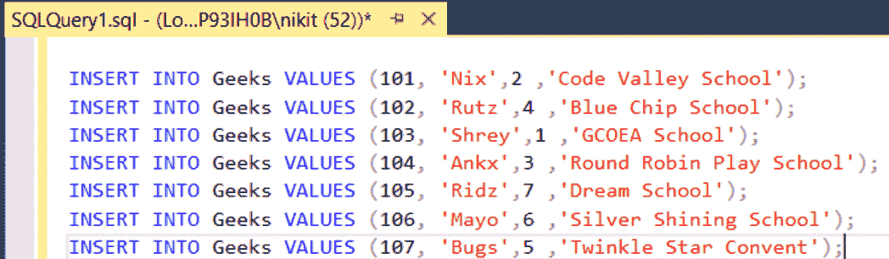
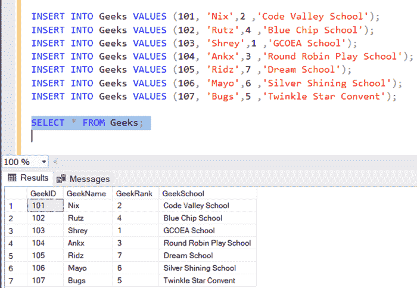
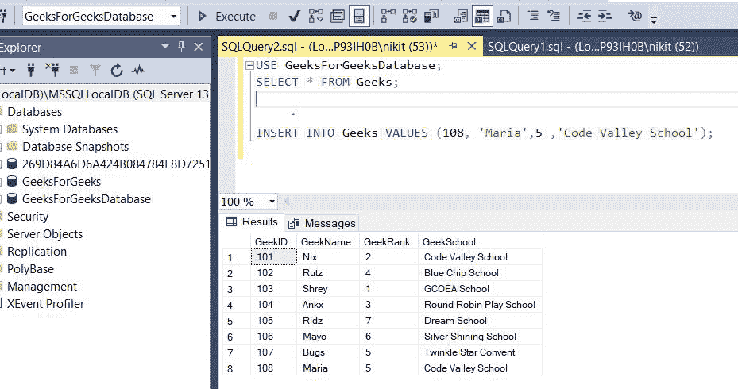
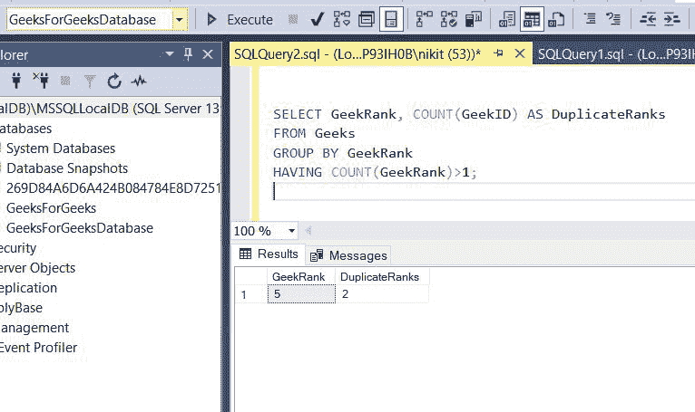

# 如何在 SQL 中找到满足一定条件的重复记录？

> 原文:[https://www . geeksforgeeks . org/如何在 sql 中找到符合特定条件的重复记录/](https://www.geeksforgeeks.org/how-to-find-duplicate-records-that-meet-certain-conditions-in-sql/)

在本文中，我们将了解如何在 SQL 中找到满足特定条件的重复记录。使用 GROUP BY 和 HAVING 子句，我们可以在表数据中显示重复项。SQL 中的 GROUP BY 语句用于在一些函数的帮助下将相同的数据排列成组。即，如果特定的列在不同的行中具有相同的值，那么它将把这些行排列成一组。

出于演示的目的，我们将在名为“ **GeeksForGeeksDatabase** 的数据库中创建一个参与者表。

**步骤 1:** 创建数据库

使用下面的 SQL 语句创建一个名为**的数据库。**

**查询:**

```sql
CREATE DATABASE GeeksForGeeksDatabase;
```



**步骤 2:** 使用数据库

使用下面的 SQL 语句将数据库上下文切换到 **GeeksForGeeksDatabase** 。

**查询:**

```sql
USE GeeksForGeeksDatabase;
```



**步骤 3:** 表格定义

**查询:**

```sql
CREATE TABLE Geeks(
GeekID INTEGER PRIMARY KEY,
GeekName VARCHAR(255) NOT NULL,
GeekRank INTEGER NOT NULL,
GeekSchool VARCHAR(255) NOT NULL
);
```


#### 查询:

```sql
INSERT INTO Geeks VALUES (101, 'Nix',2 ,'Code Valley School');
INSERT INTO Geeks VALUES (102, 'Rutz',4 ,'Blue Chip School');
INSERT INTO Geeks VALUES (103, 'Shrey',1 ,'GCOEA School');
INSERT INTO Geeks VALUES (104, 'Ankx',3 ,'Round Robin Play School');
INSERT INTO Geeks VALUES (105, 'Ridz',7 ,'Dream School');
INSERT INTO Geeks VALUES (106, 'Mayo',6 ,'Silver Shining School');
INSERT INTO Geeks VALUES (107, 'Bugs',5 ,'Twinkle Star Convent');
```



**第 4 步:**要查看创建的表的内容，我们使用下面给出的查询:

**查询:**

```sql
SELECT * FROM Geeks;
```

**输出:**



极客表上面有正常记录，没有重复值。

**第五步:**我们来想象一下这样一种情况:由于某些原因，极客的表中出现了一个 bug，插入的副本很少。理想情况下，每一行都应该有一个唯一的**极客等级**值，但是现在在我们的表中插入了具有重复等级的重复极客。

**查询:**

```sql
INSERT INTO Geeks VALUES (108, 'Maria', 5 ,'Code Valley School');
```



在上面新更新的表格中，我们可以看到有 2 条记录的极客等级都是 5。**极客 107** 和**极客 108** 的等级相同，都是 5。现在，我们需要使用 SQL Query 找到这种重复。

### **使用 GROUP BY 和 HAVING 子句:**

从表中查找重复记录的一种方法是 GROUP BY 语句。SQL 中的 GROUP BY 语句用于在一些函数的帮助下将相同的数据排列成组。即，如果特定的列在不同的行中具有相同的值，那么它将把这些行排列成一组。

**查询查找重复:**

查询查找具有相同极客等级的重复记录:

**查询:**

```sql
SELECT GeekRank, COUNT(GeekID) AS DuplicateRanks
FROM Geeks
GROUP BY GeekRank
HAVING COUNT(GeekRank)>1;
```

使用 GROUP BY 和 HAVING 子句，我们可以在表数据中显示重复项。通过“ **GROUP BY GeekRank** ”的意思是，将只有该特定列(即 GeekRank)具有相同值的所有行放在一个组中。我们使用“ **HAVING COUNT(极客等级)>1′**来选择输出中极客等级超过 1 的列。这里使用了 SQL 的 COUNT()函数来计算重复的行。在这里，我们将我们的新专栏命名为“T4”复制器“T5”，它计算重复的等级。

**输出:**



#### 解释:

如我们所见，具有重复极客等级的行被分组在同一个极客等级下，它们对应的计数是重复行的极客等级的计数。极客 ID 107 和极客 ID 108 具有相同的排名 5。因此，在上面的输出中，我们可以看到极客等级为 5(因为第 5 个等级被发现是重复的)，并且由于两个极客标识具有相同的极客等级 5，因此重复记录的计数为 2。找到重复行后，您可以选择使用 DELETE 语句删除这些重复行。