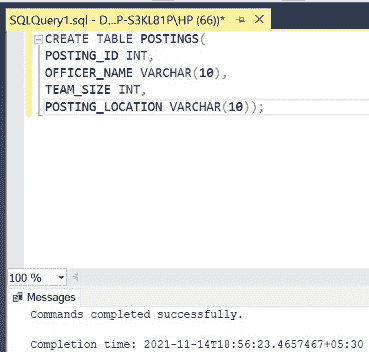
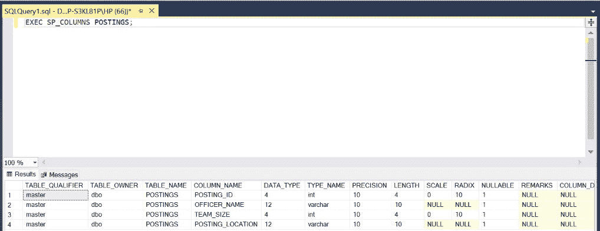
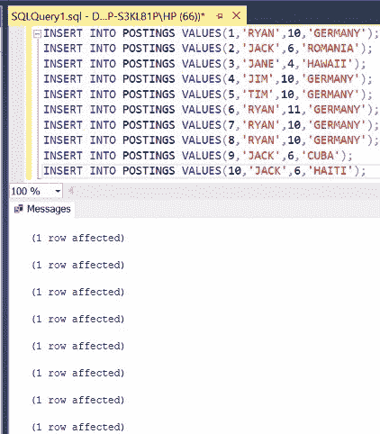
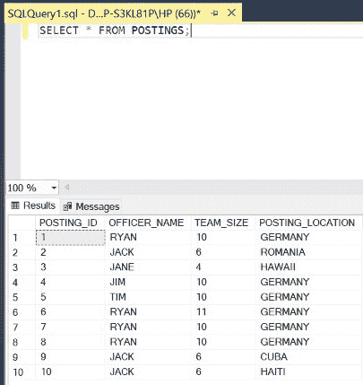
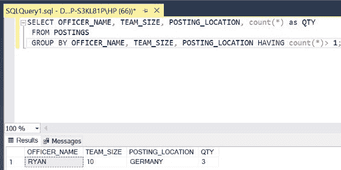
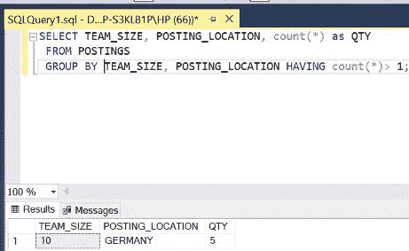
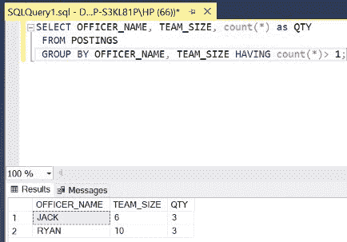

# 如何在 SQL 中跨多列查找重复值？

> 原文:[https://www . geesforgeks . org/如何在 sql 中跨多列查找重复值/](https://www.geeksforgeeks.org/how-to-find-duplicates-values-across-multiple-columns-in-sql/)

在 SQL 中，有时我们需要在单个查询中跨表中的多列查找重复条目。我们将使用[分组依据](https://www.geeksforgeeks.org/sql-group-by/)和[计数](https://www.geeksforgeeks.org/sql-count-avg-and-sum/)关键词来实现这一点。为此，我们使用一种特定的查询，如下面的演示所示。在本文中，我们将使用微软的 SQL Server 作为我们的数据库和选择关键字。

**步骤 1:** 创建数据库。为此，使用下面的命令创建一个名为 GeeksForGeeks 的数据库。

**查询:**

```
CREATE DATABASE GeeksForGeeks
```

**输出:**


**步骤 2:** 使用 GeeksForGeeks 数据库。为此，请使用以下命令。

**查询:**

```
USE GeeksForGeeks
```

**输出:**


**步骤 3:** 在数据库极客博客中创建一个帖子表。该表有 4 列，即发帖人身份、官员姓名、团队规模和发帖地点，包含身份、官员姓名、团队规模和驻外机构在不同国家的发帖地点。

**查询:**

```
CREATE TABLE POSTINGS(
POSTING_ID INT,
OFFICER_NAME VARCHAR(10),
TEAM_SIZE INT,
POSTING_LOCATION VARCHAR(10));
```

**输出:**



**第 4 步:**描述过账表的结构。

**查询:**

```
EXEC SP_COLUMNS POSTINGS;
```

**输出:**



**第 5 步:**在过账表中插入 5 行。

**查询:**

```
INSERT INTO POSTINGS VALUES(1,'RYAN',10,'GERMANY');
INSERT INTO POSTINGS VALUES(2,'JACK',6,'ROMANIA');
INSERT INTO POSTINGS VALUES(3,'JANE',4,'HAWAII');
INSERT INTO POSTINGS VALUES(4,'JIM',10,'GERMANY');
INSERT INTO POSTINGS VALUES(5,'TIM',10,'GERMANY');
INSERT INTO POSTINGS VALUES(6,'RYAN',11,'GERMANY');
INSERT INTO POSTINGS VALUES(7,'RYAN',10,'GERMANY');
INSERT INTO POSTINGS VALUES(8,'RYAN',10,'GERMANY');
INSERT INTO POSTINGS VALUES(9,'JACK',6,'CUBA');
INSERT INTO POSTINGS VALUES(10,'JACK',6,'HAITI');
```

**输出:**



**第 6 步:**显示过账表的所有行。

**查询:**

```
SELECT * FROM POSTINGS;
```

**输出:**



**第 7 步:**在表**发帖**中的**官员 _ 姓名**、**团队 _ 大小**和**发帖 _ 位置**三列中查找重复。要实现，我们需要按这三列对记录进行分组，并显示计数大于 1 的记录，即具有匹配值的记录。使用关键字**分组依据**和**计数**。

**语法:**

```
SELECT COLUMN_NAME1, COLUMN_NAME2, 
COLUMN_NAME3, COUNT(*) AS ALIAS
FROM TABLE_NAME
GROUP BY COLUMN_NAME1, COLUMN_NAME2,
COLUMN_NAME3 HAVING COUNT(*)>1;
```

**查询:**

```
SELECT OFFICER_NAME, TEAM_SIZE,
POSTING_LOCATION, COUNT(*) AS QTY
FROM POSTINGS
GROUP BY OFFICER_NAME, TEAM_SIZE,
POSTING_LOCATION HAVING COUNT(*)>1;
```

**输出:**



**第 8 步:**在 2(多)列中查找重复项，即在表**发帖**中的**团队 _ 大小**和**发帖 _ 位置**中。

**查询:**

```
SELECT TEAM_SIZE, POSTING_LOCATION, 
COUNT(*) AS QTY
FROM POSTINGS
GROUP BY TEAM_SIZE, POSTING_LOCATION
 HAVING COUNT(*)>1;
```

**输出:**



**第 9 步:**在 2(多)列中查找重复项，即在表**发帖**中的**官员 _ 姓名**和**团队 _ 大小**中。

**查询:**

```
SELECT OFFICER_NAME, TEAM_SIZE, 
COUNT(*) AS QTY
FROM POSTINGS
GROUP BY OFFICER_NAME, 
TEAM_SIZE HAVING COUNT(*)>1;
```

**输出:**

