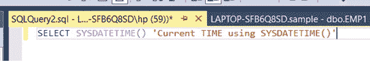

# 如何在 SQL 中获取当前日期和时间？

> 原文:[https://www . geesforgeks . org/如何获取 sql 中的当前日期和时间/](https://www.geeksforgeeks.org/how-to-get-current-date-and-time-in-sql/)

在本文中，我们将展示如何在 SQL 中获取当前日期和时间。每当我们需要插入和获取当前日期和时间时。所以在 SQL 中查找当前日期和时间有一些预定义的功能。我们将在这里实现一些方法。借助以下功能。

### **GET DATE() :**

GETDATE()函数主要用于查找当前日期。它将返回 DATETIME 数据类型。这意味着它将返回当前日期和当前时间。

**查询:**

```
Select GetDate() AS 'CurrentDATETime';
```


**输出:**


**CURRENT_TIMESTAMP:**

它还用于查找当前时间戳，即当前日期和时间。CURRENT_TIMESTAMP 函数的用法与 GETDATE()函数的用法相同 CURRENT_TIMESTAMP 返回的结果与 **GETDATE()相同。**

**查询:**

```
Select CURRENT_TIMESTAMP AS "CURRENTTIMESTAMP"; 
```


**输出:**


**sysdate()**:

函数还用于获取运行 SQL Server 实例的系统的当前时间。与 GETDATE()函数相比，SYSDATETIME()函数提供了更高的小数秒精度。我们可以从 SYSDATETIME()函数返回的日期和时间值中获取时间部分，如下所示:

**查询:**

```
SELECT SYSDATETIME() 'Current TIME using SYSDATETIME()'
```



**输出:**


### **从**中单独提取时间部分**当前日期从系统日期:**

我们可以从 GETDATE()或 CURRENT_TIMESTAMP()中提取时间部分。

**查询:**

```
SELECT CONVERT(VARCHAR(8), GETDATE(),108)'hh:mi:ss'
```


**输出:**

