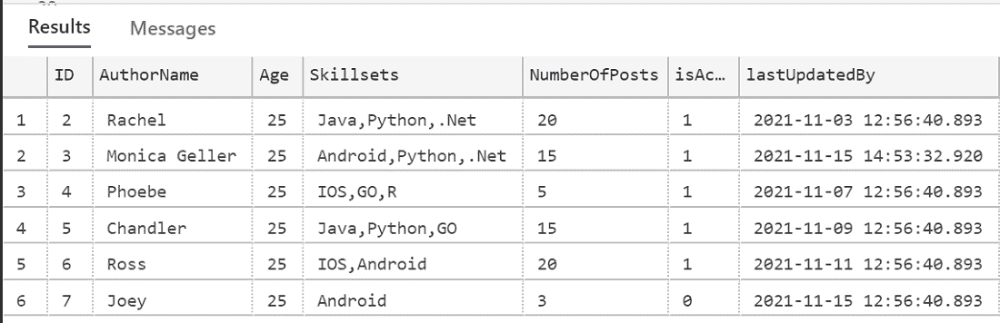

# 如何在 SQL 中获取最新更新的记录？

> 原文:[https://www . geesforgeks . org/如何获取最新更新的 sql 记录/](https://www.geeksforgeeks.org/how-to-get-latest-updated-records-in-sql/)

SQL Server 是一个通用的数据库，它是许多软件行业中使用最多的关系数据库。在本文中，我们将看到如何在 SQL 中获取最新的更新记录。

**步骤 1:** 数据库创建

命令来创建数据库。这里的 GEEKSFORGEEKS 是数据库的名字。

**查询:**

```sql
CREATE DATABASE GEEKSFORGEEKS;
```

**步骤 2:** 利用创建数据库。

```sql
USE GEEKSFORGEEKS;
```

**输出:**


*   为了获得最新更新的记录，我们应该在任何表中都有一个带有“时间戳”列的列，如“上次更新”，当新插入一条记录时，它应该获得该列的当前时间戳值。这将有助于创建记录
*   同时，我们应该有一个触发器来更新“上次更新”列的值，这将使用最新的时间戳更新记录。

**步骤 3:** 表格创建

```sql
CREATE TABLE [dbo].[AuthorsNew](
    [ID] [int] IDENTITY(1,1) NOT NULL,
    [AuthorName] [nvarchar](20) NULL,
    [Age] [int] NULL,
    [Skillsets] [nvarchar](max) NULL,
    [NumberOfPosts] [int] NULL,
    [isActiveAuthor] [bit] NULL,
    [lastUpdatedBy] DATETIME 
);
```

**步骤 4:** 在表中插入记录

```sql
INSERT INTO AuthorsNew (AuthorName,Age,Skillsets,
NumberOfPosts,isActiveAuthor,lastUpdatedBy)
VALUES ('Rachel',25,'Java,Python,.Net',
20,1,'2021-11-12:56:40');

INSERT INTO AuthorsNew (AuthorName,Age,Skillsets,
NumberOfPosts,isActiveAuthor,lastUpdatedBy)
VALUES ('Monica Geller',25,'Android,Python,.Net'
,15,1,'2021-11-15 14:53:32');

INSERT INTO AuthorsNew (AuthorName,Age,Skillsets,
NumberOfPosts,isActiveAuthor,lastUpdatedBy)
VALUES ('Phoebe',25,'IOS,GO,R',5,1,
'2021-11-07 12:56:40');

INSERT INTO AuthorsNew (AuthorName,Age,Skillsets,
NumberOfPosts,isActiveAuthor,lastUpdatedBy)
VALUES ('Chandler',25,'Java,Python,GO',15,1,
'2021-11-09 12:56:40');

INSERT INTO AuthorsNew (AuthorName,Age,Skillsets,
NumberOfPosts,isActiveAuthor,lastUpdatedBy)
VALUES ('Ross',25,'IOS,Android',20,1,
'2021-11-11 12:56:40');

INSERT INTO AuthorsNew (AuthorName,Age,Skillsets,
NumberOfPosts,isActiveAuthor,lastUpdatedBy)
VALUES ('Joey',25,'Android',3,0,'2021-11-15 
12:56:40');

INSERT INTO AuthorsNew (AuthorName,Age,Skillsets,
NumberOfPosts,isActiveAuthor,lastUpdatedBy)
VALUES ('Monica Geller',25,'Android,Python,.Net',
15,1,'2021-11-15 14:53:32');
```

**第 5 步:**从 AuthorsNew 表中获取数据。

**查询:**

```sql
SELECT * FROM AuthorsNew;
```

**输出:**



“LastUpdatedBy”列在数据被插入/更新的时间有数据。首先，从日期时间中单独获取日期部分。

**查询:**

```sql
SELECT CONVERT(VARCHAR(10), 
lastUpdatedBy, 111)
 from AuthorsNew;
```

**获取最新记录:**

**示例 1:** 使用 TOP

**查询:**

```sql
SELECT TOP 1 * FROM AuthorsNew ORDER BY 
CONVERT(VARCHAR(10), lastUpdatedBy, 111) DESC
```

**输出:**


**示例 2:** 使用 MAX

**查询:**

```sql
SELECT * FROM AuthorsNew WHERE 
CONVERT(VARCHAR(10), lastUpdatedBy, 111) =
(SELECT MAX(CONVERT(VARCHAR(10), 
lastUpdatedBy, 111)) FROM AuthorsNew )
```

**输出:**


**示例 3:** 使用日期添加功能

为了得到前一天、前一周、前一个月等。，数据，我们可以使用 DATEADD 函数。

**语法:**

```sql
SELECT column_name, ... FROM table_name
WHERE date_column >= DATEADD
day,-<n days>, GETDATE())
```

*   函数的作用是:从当前日期中减去 n 天。这里的“天”指定天数
*   将获得的结果与日期列进行比较以获得结果。

假设为了获得我们的表在当前日期或 1 或 2 天之前的数据，我们可以执行以下操作。即最近 2 天的数据可以通过下面的查询获得。

**查询:**

```sql
SELECT * FROM AuthorsNew WHERE 
CONVERT(VARCHAR(10), lastUpdatedBy, 
111) >= DATEADD(day,-2, GETDATE());
```

**输出:**


同样的 DATEADD()函数也有助于获取过去一个月的数据。

**语法:**

```sql
SELECT column_name, ... FROM table_name
WHERE date_column >= DATEADD
(MONTH,-<n months>, GETDATE())
```

也就是说，我们需要把 MONTH 放进去，得到过去 6 个月的数据，而不是“天”。

**要获取 SQL Server 中的最后一条更新记录:**我们可以编写触发器(它会自动触发)，即每当某行发生更改(更新)时，“lastupdatedby”列值应该会根据当前时间戳进行更新。

```sql
--Trigger that fires automatically
 whenever a update is done in a row
CREATE TRIGGER trigger_change_lastupdatedby
ON dbo.AuthorsNew
AFTER UPDATE
AS
UPDATE dbo.AuthorsNew
SET lastUpdatedBy = CURRENT_TIMESTAMP
WHERE id IN (SELECT DISTINCT id FROM INSERTED);
```

**输出:**


现在对 ID = 3 执行更新

**查询:**

```sql
UPDATE AuthorsNew SET AuthorName = 
'Monica Ross Geller' WHERE ID = 3;
--We can see that 'lastupdatedby'
 column also got changed because 
 of the trigger availability.
```


**输出:**


同样，通过这种方式，我们可以修改记录，并且在任何时间点，我们都可以通过应用上述查询集来获得最新的记录。

**示例 4:使用 IDENT_CURRENT()**

IDENT_CURRENT()函数接受表名(AuthorsNew)，并返回为 AuthorsNew 表生成的最后一个标识值。通过使用这个工具，我们可以找到最后插入的记录。

**查询:**

```sql
SELECT * FROM dbo.AuthorsNew WHERE [id] = 
(SELECT IDENT_CURRENT('dbo.AuthorsNew'));
```

**输出:**


在上面的示例中，我们已经看到了如何获取截至今天、上周、上个月的最新记录，以及示例表的最新插入/更新记录。