# 如何使用 SQL 对数据进行分组和聚合？

> 原文:[https://www . geesforgeks . org/如何使用 sql 对数据进行分组和聚合/](https://www.geeksforgeeks.org/how-to-group-and-aggregate-data-using-sql/)

数据库表中可能有许多列，因此有时在这些列中查找相同类型的数据会变得困难和耗时。GROUP BY 语句对表的列中出现的相同行进行分组。 [GROUP BY](https://www.geeksforgeeks.org/sql-group-by/) 语句结合 SQL [聚合函数](https://www.geeksforgeeks.org/aggregate-functions-in-sql/) (COUNT()、MAX()、MIN()、SUM()、AVG()等。)帮助我们高效地分析数据。

现在，让我们用一个例子来理解这一点。

在开始之前，我们必须记住几个要点-

*   所有未列为分组依据参数的数据都需要应用聚合函数。

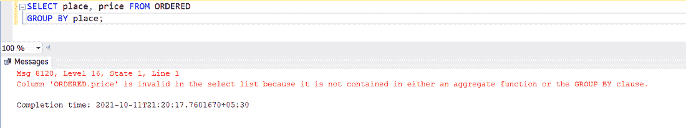

*   如果您运行这个 SQL 命令，那么您将看到一个错误，因为数据库不知道如何处理这个状态。每组只有一个城市，但有许多州。如果没有任何聚合函数，它们都不能作为值输出。
*   我们不能在 GROUP BY 子句后使用 [WHERE](https://www.geeksforgeeks.org/sql-where-clause/) 子句。在这种情况下，我们使用 [HAVING](https://www.geeksforgeeks.org/having-vs-where-clause-in-sql/) 子句。

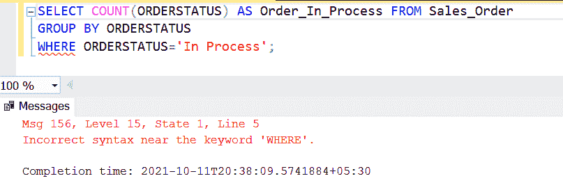

*   要以特定顺序(升序或降序)显示记录，我们可以使用 [ORDER BY](https://www.geeksforgeeks.org/sql-order-by/) 子句。但是使用它不是必须的。

**语法:**

```
SELECT column1, column2..., 
Aggregate(column3, column4,..) 
FROM Table_name WHERE Condition...
//OPTION-1 (depending on the condition) 
GROUP BY column1,column2,.. HAVING Condition...
//OPTION-2 (depending on the condition) 
ORDER BY column1,column2,.. DESC(if required); 
```

这里我们使用微软的 SQL Server 来执行查询。

**步骤 1:** 创建数据库

为此，使用以下命令创建名为 *Sales 的数据库。*

**查询:**

```
CREATE DATABASE Sales;   
```

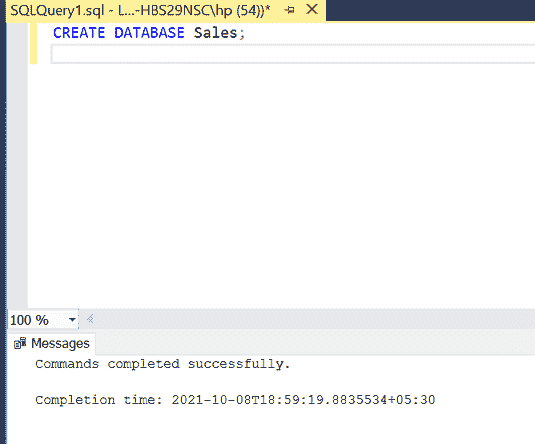

**步骤 2:** 使用数据库

使用以下 SQL 语句将数据库上下文切换到销售:

**查询:**

```
USE Sales;
```

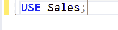

**步骤 3:** 表格定义

我们将在销售数据库中使用下面的销售订单表。

**查询:**

```
Create Table Sales_Order
(ORDERNO VARCHAR(20) Primary Key, 
ClientNo VARCHAR(20),
Orderdate DATE,
SALESMANNO VARCHAR(20),
Oredrstatus VARCHAR(30)0;
```

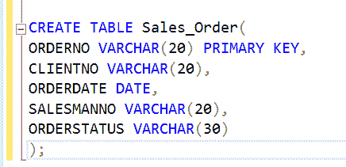

您可以使用下面的语句来查询创建的表的描述:

**查询:**

```
EXEC SP_COLUMNS Sales_Order;
```

**输出:**

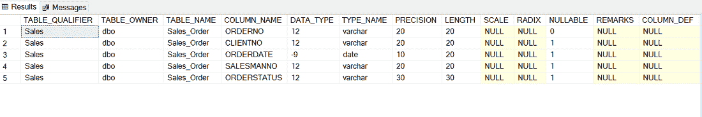

**步骤 4:** 向表中添加数据

使用以下语句向*销售订单*表添加数据:

**查询:**

```
INSERT INTO Sales_Order VALUES
('O19001', 'C00001', '2007-10-03', 'S00001', 'In Process'); 
INSERT INTO Sales_Order VALUES('O19002', 'C00002', '2007-11-01', 'S00002', 'Cancelled');
INSERT INTO Sales_Order VALUES('O19003', 'C00003', '2007-9-05', 'S00003', 'Fulfilled');
INSERT INTO Sales_Order VALUES('O19004', 'C00004', '2007-6-06', 'S00004', 'Fulfilled'); 
INSERT INTO Sales_Order VALUES('O19005', 'C00005', '2007-8-02', 'S00005', 'Cancelled');
INSERT INTO Sales_Order VALUES('O19006', 'C00006', '2007-8-01', 'S00006', 'In Process'); 
```

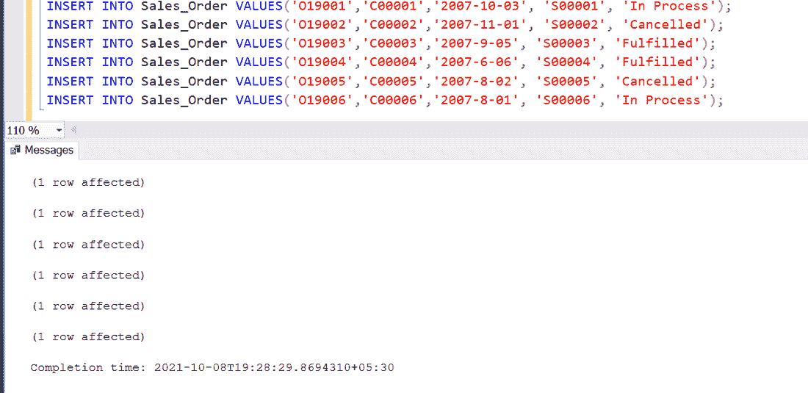

**步骤 5:** 查看插入的数据

**查询:**

```
SELECT * FROM Sales_Order; 
```

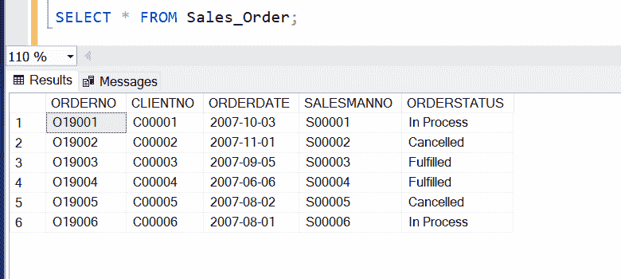

**步骤 6:** 假设，我们想找出订单为*进行中的客户的客户号。*

为此，我们将使用 *COUNT()* 函数:

**查询:**

```
SELECT CLIENTNO, COUNT(ORDERSTATUS)
AS Order_In_Process
from Sales_Order WHERE 
ORDERSTATUS='In Process' GROUP BY CLIENTNO; 
```

在您的机器上运行此命令并查看输出。

**输出:**

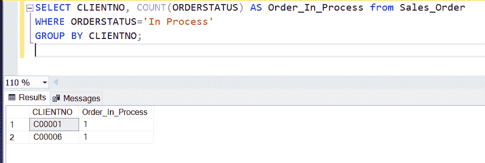

因此，从这个输出中，我们可以很容易地看出 *C00001* 和 *C00006* 有 *1* 订单仍然*进行中*。

**例 2:**

现在，按照与之前相同的步骤，自行创建另一个名为 *ORDERED* 的表。你可以给数据库取任何你想要的名字。该表的描述如下:

**查询:**

```
Create Table Ordered place VARCHAR(30), product VARCHAR(30), price DECIMAL);
```

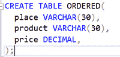

现在以下列方式插入数据:

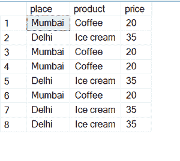

有序表

这次我们想知道两地赚的钱总数。

为此，我们将使用 *SUM()* 函数:

**查询:**

```
SELECT place, SUM(price) FROM ORDERED GROUP BY place; 
```

**输出:**

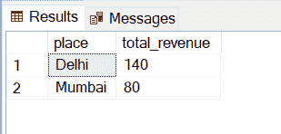

现在，仅仅通过查看输出，我们就可以知道我们从哪个地方赚了更多的钱，而不是通过每一行。

您可以尝试使用 AVG()函数、最小()函数、最大()函数和分组依据函数来进行不同类型的查询。