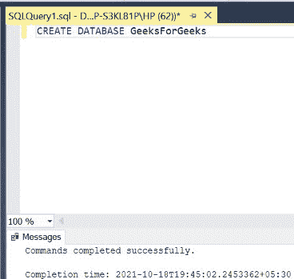

# 如何在 SQL 查询中忽略 0(零)值？

> 原文:[https://www . geesforgeks . org/如何忽略-0zero-values-in-sql-query/](https://www.geeksforgeeks.org/how-to-ignore-0zero-values-in-sql-query/)

在 SQL 中，很多时候我们需要显示一个表中的所有行，其中具有 0(零)作为条目/值的条目被忽略。这是通过 SQL 中的 REPLACE 命令实现的。在本文中，我们将讨论如何忽略 0(零)并用 SQL 中的空白替换它们。在本文中，我们将使用微软的 SQL Server 作为我们的数据库。

**第 1 步**:创建数据库。为此，使用下面的命令创建一个名为 GeeksForGeeks 的数据库。

**查询:**

```sql
CREATE DATABASE GeeksForGeeks
```

**输出:**



**步骤 2:** 使用 GeeksForGeeks 数据库。为此，请使用以下命令。

**查询:**

```sql
USE GeeksForGeeks
```

**输出:**


**第 3 步:**在数据库 GeeksForGeeks 中创建一个 MARKS 表。该表有 4 栏，即身份证、工程、数学和 PHYS，包含学生身份证和各科成绩。

**查询:**

```sql
CREATE TABLE MARKS(
ID INT,
ENG INT,
MATHS INT,
PHYS INT);
```

**输出:**


**第 4 步:**在 MARKS 表中插入 5 行，并输入一些 0(零)值作为主题标记，以演示如何忽略此类条目。

**查询:**

```sql
INSERT INTO MARKS VALUES(1,99,0,89);
INSERT INTO MARKS VALUES(2,0,65,78);
INSERT INTO MARKS VALUES(3,83,85,0);
INSERT INTO MARKS VALUES(4,0,77,0);
INSERT INTO MARKS VALUES(5,97,45,54);
```

**输出:**


**第 5 步:**显示 MARKS 表的所有行，包括 0(零)值。

**查询:**

```sql
SELECT * FROM MARKS;
```

**输出:**


**步骤 6:** 显示 MARKS 表的所有行，忽略 0(零)值。这是通过 [REPLACE](https://www.geeksforgeeks.org/replace-string-in-sql-server/) 命令实现的，该命令将所有 0 替换为空白。

**语法:**

```sql
REPLACE(Column_name, value_to_be_replaced, new_value)
```

要对多个列执行此操作，请放置一个逗号，然后编写多个替换命令。

**查询:**

```sql
SELECT ID, REPLACE(ENG,0,'') "ENG", REPLACE(MATHS,0,'') "MATHS", REPLACE(PHYS,0,'') "PHYS" FROM MARKS;
```

**输出:**

