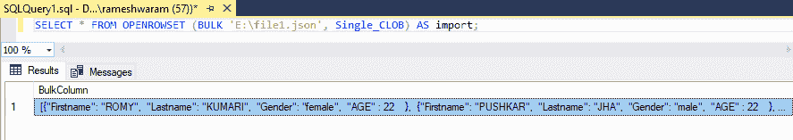

# 如何将 JSON 数据导入 SQL Server？

> 原文:[https://www . geesforgeks . org/how-import-JSON-data-in-SQL-server/](https://www.geeksforgeeks.org/how-to-import-json-data-into-sql-server/)

JSON 指的是 Javascript 对象符号。这是一种流行的文本数据格式，用于在现代网络和移动应用程序中交换数据。它基于 Javascript 编程语言的一个子集。它用于在日志文件或 NoSQL 中存储随机数据。

它还使我们能够将 NoSQL 和相关概念集成到同一个数据库中。

### **JSON 数据优势:**

*   轻量级数据交换格式
*   易于人类阅读和书写。
*   易于机器解析和生成。

### **使用内置函数和运算符的 JSON 数据:**

*   我们可以解析 JSON 文本并读取或修改值。
*   将 JSON 对象转换为表格格式。
*   我们可以对转换后的 JSON 对象运行任何 Transact-SQL 查询。
*   将 Transact-SQL 查询的结果转换回 JSON 格式。

<figure class="table">

| **功能** | **描述** |
| --- | --- |
| 伊杰森 | 它测试字符串是否包含 JSON 数据 |
| JSON_VALUE | 它从 JSON 字符串中提取标量值。 |
| JSON_QUERY | 它从 JSON 字符串中提取一个对象或数组。 |
| JSON_MODIFY | 它改变 JSON 字符串中的一个值。 |

</figure>

现在，为了在 SQL 服务器中导入 JSON 数据，我们将使用 OPENROWSET(BULL)。

**步骤 1:使用 OPENROWSET(BULK)**

它是一个表值函数，可以从任何文件中读取数据..它返回一个包含文件所有内容的单列表。它可以将文件的全部内容作为文本值加载。(这个单个大值被称为单字符大对象或 SINGLE_CLOB。)

**语法:**

```sql
SELECT * FROM OPENROWSET (BULK 'file_path', SINGLE_CLOB) as correlation_name;
```

它读取文件的内容，并在 BulkColumn 中返回。必须指定相关名称。我们有一个名为“file1.json”的 JSON 文件。JSON 文件的内容:

**查询:**

```sql
[{"Firstname": "ROMY", "Lastname": "KUMARI", "Gender": "female", "AGE" : 22 },
{"Firstname": "PUSHKAR", "Lastname": "JHA", "Gender": "male", "AGE" : 22 },
{"Firstname": "SHALINI", "Lastname": "JHA", "Gender": "female", "AGE" : 21 },
{"Firstname": "SAMBHAVI", "Lastname": "JHA", "Gender": "female", "AGE" : 18 } ]
```

**第二步:将 file1.json 导入到 SQL server**

**查询:**

```sql
SELECT * FROM OPENROWSET (BULK 'E:\file1.json', Single_CLOB) AS import;
```

**输出:**



整个内容作为一列返回。

**第三步:转换 JSON 数据**

*   声明一个变量。
*   将 Bulkcolumn 的数据存储在变量中。
*   使用 OPENJSON()函数将变量的 JSON 输出转换为表格格式。
*   WITH 子句以及列定义(键应该用作列名)。

**查询:**

```sql
Declare @JSON varchar(max)
SELECT @JSON=BulkColumn
FROM OPENROWSET (BULK 'E:\file1.json', SINGLE_CLOB) import
SELECT * FROM OPENJSON (@JSON)
WITH  (
   [Firstname] varchar(20),  
   [Lastname] varchar(20),  
   [Gender] varchar(20),  
   [AGE] int );
```


**输出:**

