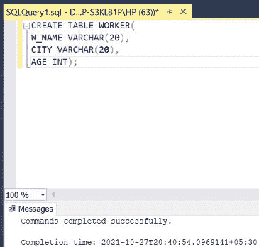
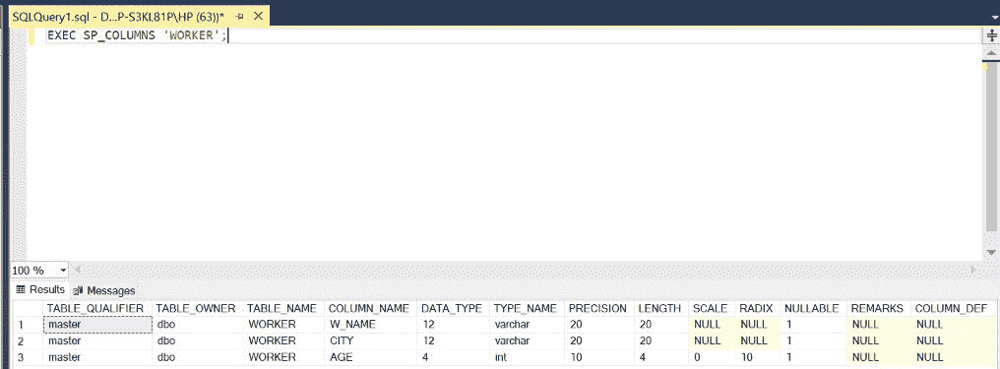
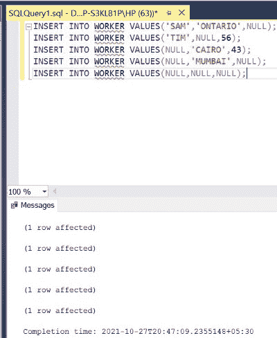
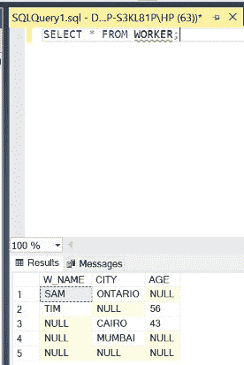

# 如何在 SQL 中插入空值的行？

> 原文:[https://www . geesforgeks . org/如何在 sql 中插入空值行/](https://www.geeksforgeeks.org/how-to-insert-rows-with-null-values-in-sql/)

在 SQL 中，由于缺少数据，我们有时需要在表中插入带有空值的行。这里，关键字[**【NULL】**](https://www.geeksforgeeks.org/sql-null-values/)(无引号)用来表示无数据。空值有几个要点:

*   空值不同于零值。
*   空值用于表示缺失的值，但它通常有三种不同的解释之一:
    *   值未知(值存在但未知)
    *   值不可用(存在但被有意保留)
    *   属性不适用(对此元组未定义)
*   通常不可能确定哪个意思是有意的。因此，SQL 没有区分空值的不同含义。

**语法:**

```
INSERT INTO TABLE_NAME values
(COLUMN_VALUE,NULL,........);
```

**步骤 1:** 创建数据库。为此，使用下面的命令创建一个名为 GeeksForGeeks 的数据库。

**查询:**

```
CREATE DATABASE GeeksForGeeks
```

**输出:**


**步骤 2:** 使用 GeeksForGeeks 数据库。为此，请使用以下命令。

**查询:**

```
USE GeeksForGeeks
```

**输出:**


**步骤 3:** 在数据库 GeeksForGeeks 中创建一个 WORKER 表。该表有 4 列，即学生身份、学生姓名、学生标准、英语、数学和物理，包含学生身份、学生姓名、标准和各科成绩。

**查询:**

```
CREATE TABLE WORKER(
W_NAME VARCHAR(20),
CITY VARCHAR(20),
AGE INT);
```

**输出:**



**第 4 步:**显示 WORKER 表的结构。

**查询:**

```
EXEC SP_COLUMNS 'WORKER';
```

**输出:**



**第 5 步:**在 WORKER 表中插入 10 行。

**查询:**

```
INSERT INTO WORKER VALUES('SAM','ONTARIO',NULL);
INSERT INTO WORKER VALUES('TIM',NULL,56);
INSERT INTO WORKER VALUES(NULL,'CAIRO',43);
INSERT INTO WORKER VALUES(NULL,'MUMBAI',NULL);
INSERT INTO WORKER VALUES(NULL,NULL,NULL);
```

**输出:**



**步骤 6:** 显示 WORKER 表的所有行，包括 0(零)值。

**查询:**

```
SELECT * FROM WORKER;
```

**输出:**



因此，通过这种方式，我们可以将空值插入到表中。