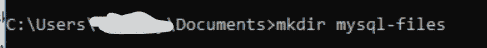
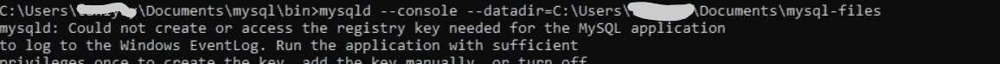
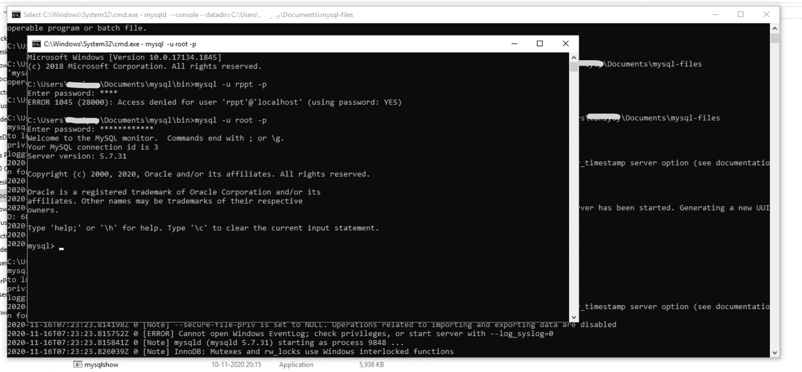
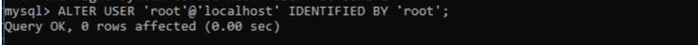

# 如何在 Windows 上安装 MySQL？

> 原文:[https://www . geesforgeks . org/how-install-MySQL-in-window/](https://www.geeksforgeeks.org/how-to-install-mysql-in-windows/)

**先决条件:**

*   从下面给定的目录下载存档 zip 文件。
    [下载目录](https://downloads.mysql.com/archives/installer/)
*   解压文件。
*   用“mysql”将其重命名(以便于在后面的步骤中使用该文件夹)。

之后，要为 MySQL 设置路径，您必须遵循以下步骤。

**步骤-1:创建新目录–**
在 cmd 提示符下为数据创建新目录。当您使用数据库时，您需要一个目录，您的所有文件都将保存在这个目录中。创建一个名为“mysql-files”的目录(你也可以选择任何其他名称)来保存你所有的作品。

使用以下步骤在 cmd 提示符下为数据创建一个新目录。

```
"Search" button ⇒ Enter "cmd" ⇒ Click on "Command Prompt" 
```

这里，在 Documents 文件夹中创建一个目录，您可以在打开命令提示符后使用命令，如下所示。

*   光盘文档(将进入文件夹)

    ```
    C:Users\Uesrname>cd Documents
    ```

*   now you can create a directory with the keyword mkdir.

    ```
    mkdir mysql-files
    ```

    

**步骤 2:初始化数据库–**

*   开始一个 CMD。
*   转到重命名为 mysql 后保存的路径，然后使用关键字 **cd** 文件名转到 bin 文件夹。

    ```
    C:Users\Uesrname>cd Documents
    C:Users\Uesrname\Documents>cd mysql
    C:Users\Uesrname\Documentsmysql>cd bin
    C:Users\Uesrname\Documents\mysql\bin>

    ```

*   Execute the following command in the cmd path of bin in mysql extracted path(i.e. in the path C:Users\Uesrname\Documents\mysql\bin>).

    ```
    mysqld –console –initialize –basedir=(path of newly created data directory) 
    –datadir=(path of newly created data directory)
    ```

    

*   执行初始化命令后，将生成临时密码。别忘了记下密码。

**步骤-3:添加目录–**
在命令提示符下或在如下相同路径下执行以下命令。

*   Add the newly created data which we named as “mysql-files” in Step1.

    ```
    mysqld --console --datadir=(path of newly created data directory)
    ```

    

**步骤-4:启动服务器–**
现在打开另一个命令提示符，不关闭当前命令提示符(在 MySQL 的 path bin 的另一个 cmd 窗口中)

*   按如下方式执行以下命令。

    ```
    mysql -u root -p
    ```

*   As using it the first time, you need to alter the password (temporary password that you have noted in step-2) when you open the server as follows.

    

**第 5 步:更改用户 root 的密码–**

*   A last step: As using it the first time, you need to alter the password (as you have used temporary password) when you open the server as follows.

    ```
    ALTER USER root@localhost IDENTIFIED 
    BY '<Your password>';
    ```

    

现在，你的 mysql 已经可以使用了。以上步骤是第一次安装使用。
以后每次使用 MySQL 时，可以按照第 3 步和第 4 步操作:

1.  如下执行以下命令。

    ```
    mysqld –console –datadir=(path of newly created data directory)
    ```

2.  (在 mysql 路径 bin 的另一个 cmd 窗口中)
    执行如下命令。

    ```
    mysql -u root -p
    ```