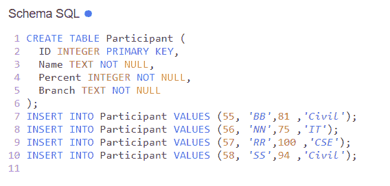
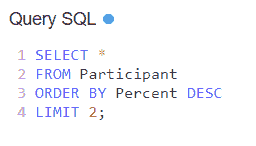
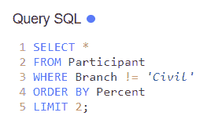

# 如何在 SQL 中限制查询结果？

> 原文:[https://www . geeksforgeeks . org/如何限制查询结果中的 sql/](https://www.geeksforgeeks.org/how-to-limit-query-results-in-sql/)

在本文中，我们将学习如何使用不同的示例来限制 SQL 中的查询结果。MySQL 支持 LIMIT 子句来选择有限数量的记录。如果我们想限制返回大量行的结果的数量，那么我们只需使用 LIMIT 命令。

### **步骤 1:创建数据库**

使用下面的 SQL 语句创建一个名为 geeks 的数据库:

**查询:**

```sql
CREATE DATABASE geeks;
```

### **步骤 2:使用数据库**

使用下面的 SQL 语句将数据库上下文切换到极客:

**查询:**

```sql
USE geeks;
```

### **第三步:表格定义**

**查询:**

```sql
CREATE TABLE Participant (
ID INTEGER PRIMARY KEY,
Name TEXT NOT NULL,
Percent INTEGER NOT NULL,
Branch TEXT NOT NULL
);
```



### **第四步:向表中添加数据**

**查询:**

```sql
INSERT INTO Participant VALUES (55, 'BB',81 ,'Civil');
INSERT INTO Participant VALUES (56, 'NN',75 ,'IT');
INSERT INTO Participant VALUES (57, 'RR',100 ,'CSE');
INSERT INTO Participant VALUES (58, 'SS',94 ,'Civil');
```

我们可以使用下面的语句来查看创建的表的内容:

**查询:**

```sql
SELECT * FROM Participant;
```


现在让我们看看如何使用极限查询。为此，我们在 MySQL 中使用了带有 LIMIT 和 ORDER BY 语句的 SELECT。

**语法:**

```sql
SELECT column1, column2, ...
FROM table_name
[WHERE conditions]
[ORDER BY expression [ ASC | DESC ]]
LIMIT count;
```

在上面的语法中，**其中**条件是可选条件，对于要选择的记录必须为真。 **ORDER BY** 表达式是查询中的可选语句，用于根据关键字(ASC 或 DESC)以升序或降序返回结果。**限制**计数与 SELECT 语句一起使用，以限制结果集中的行数。

让我们使用一些示例查询来理解这一点。

**示例:**

**查询 1:**

```sql
SELECT *
FROM Participant
ORDER BY Percent DESC
LIMIT 2;
```



查询 1

**输出:**

LIMIT 运算符可用于上述情况，在这种情况下，我们需要找到具有最大百分比的前 2 名参与者，并且不想使用任何条件语句。ORDER BY Percent DESC 已经按降序对记录进行了排序，并使用 LIMIT 2 从排序结果中获得了前 2 行。


在上面的例子中，我们也可以使用 WHERE 子句包括一些情况。假设我们不希望结果集中有 Civil 分支，并且希望前 2 名参与者的百分比较低。

我们可以编写如下查询:

**查询 2:**

```sql
SELECT *
FROM Participant
WHERE Branch != 'Civil'
ORDER BY Percent
LIMIT 2;
```



查询 2

**输出:**

上面的查询将根据强加的条件选择所有参与者(即，除民事分支参与者之外的所有参与者都将被选择)，然后结果将按百分比按升序排序(默认情况下，ORDER BY 关键字按升序排序记录)。最后，上面的查询将返回前 2 行。


这就是我们如何在 SQL 中限制表中的记录。我们可以进一步处理 SQL 查询，并根据不同的条件和限制获得结果数据。