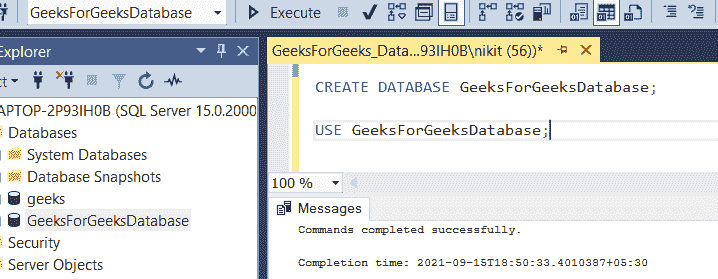

# 如何限制 SQL Server 中的行？

> 原文:[https://www . geesforgeks . org/如何限制 SQL server 中的行数/](https://www.geeksforgeeks.org/how-to-limit-rows-in-a-sql-server/)

在本文中，我们将了解如何使用不同的示例来限制 SQL 中的行。我们将看到如何处理 SQL 查询，并根据不同的条件和限制获得结果数据。

出于演示的目的，我们将在名为“GeeksForGeeksDatabase”的数据库中创建一个参与者表。

### **步骤 1:创建数据库**

使用下面的 SQL 语句创建一个名为 **GeeksForGeeksDatabase 的数据库。**

**查询:**

```sql
CREATE DATABASE GeeksForGeeksDatabase;
```


### **步骤 2:使用数据库**

使用下面的 SQL 语句将数据库上下文切换到极客数据库。

**查询:**

```sql
USE GeeksForGeeksDatabase;
```



### **第三步:表格定义**

**查询:**

```sql
CREATE TABLE Participant (
 ID INTEGER PRIMARY KEY,
 Name TEXT NOT NULL,
 Percentage INTEGER NOT NULL,
 Branch TEXT NOT NULL
);
```


### **第四步:将数据**插入**表格**

**查询:**

```sql
INSERT INTO Participant VALUES (55, 'BB',81 ,'Civil');
INSERT INTO Participant VALUES (56, 'NN',75 ,'IT');
INSERT INTO Participant VALUES (57, 'RR',100 ,'CSE');
INSERT INTO Participant VALUES (58, 'SS',94 ,'Civil');
```

您可以使用下面的语句查看创建的表的内容:

**查询:**

```sql
SELECT * FROM Participant;
```


现在让我们看看如何使用极限查询。为了限制移动台访问的结果数据，我们使用选择顶部语法。LIMIT 语法在 MYSQL 中有效。在微软数据库中，我们使用下面的语法(TOP，类似于 MYSQL 中的 LIMIT)

### **MySQL 中 TOP 和 ORDER BY 语句的 SELECT 语法:**

**<u>查询:</u>**

```sql
SELECT TOP(count) column1, column2, ...,column n 
FROM table_name
[WHERE your conditions]
[ORDER BY expression [ ASC | DESC ]];
```

在上面的语法中，**其中**条件是可选条件，对于要选择的记录必须为真。

**ORDER BY** 表达式是查询中的可选语句，用于根据关键字(ASC 或 DESC)以升序或降序返回结果。这里**计数**是从结果返回的行数。

让我们使用一些示例查询来理解这一点。

**查询 1:**

```sql
SELECT TOP(2) *
FROM Participant
ORDER BY Percentage DESC;
```

**输出:**


使用 TOP 查询，我们发现表数据中的 2 个 toppers 参与者具有最大百分比，并且不想使用任何条件语句。ORDER BY Percent DESC 以降序对记录进行了排序，使用 LIMIT 2，我们获得了排序结果的前 2 行。

在上面的例子中，我们也可以使用 WHERE 子句包括一些情况。假设如果我们不想让 ID 58 参与者出现在结果集中。

我们可以编写如下查询:

**查询 2:**

```sql
SELECT TOP(2) *
FROM Participant
WHERE ID != 58
ORDER BY Percentage;
```

**输出:**

上面的查询将根据强加的条件选择所有参与者(即，将选择除 ID 58 参与者之外的所有参与者)，然后结果将按百分比按升序排序(默认情况下，ORDER BY 关键字按升序排序记录)。最后，前面提到的 TOP(2)查询将返回前 2 行。


这就是我们如何使用 TOP 在 SQL 中限制表中的记录。我们可以进一步处理 SQL 查询，并根据不同的条件和限制获得结果数据。