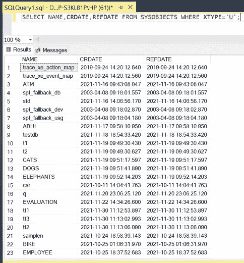

# 如何在 Oracle 数据库中列出模式中的所有表？

> 原文:[https://www . geeksforgeeks . org/如何列出 oracle 数据库中的所有模式表/](https://www.geeksforgeeks.org/how-to-list-all-tables-in-a-schema-in-oracle-database/)

先决条件: [在 MS SQL Server 中创建数据库](https://www.geeksforgeeks.org/create-database-in-ms-sql-server/)

在 Oracle SQL 中，有多种方法可以列出模式中的所有表。下面的文章描述了这些方法。在本文中，我们将使用微软的 SQL Server 作为我们的数据库。

**方法 1:** 该方法列出了用户创建的所有表的所有信息。用户条款通过 **WHERE** 关键字后的表达式指定，即 **XTYPE='U'** ( **U** 代表用户)。

**查询:**

```
SELECT * FROM SYSOBJECTS 
WHERE XTYPE='U';
```

**输出:**


**方法 2:** 该方法仅列出关于用户创建的所有表格的选择性信息。用户条款通过 **WHERE** 关键字后的表达式指定，即 **XTYPE='U'** ( **U** 代表用户)。这里只选择表的名称( **NAME** )、创建日期( **CRDATE** )和最后参考日期( **REFDATE** )。

**查询:**

```
SELECT NAME,CRDATE,REFDATE 
FROM SYSOBJECTS WHERE XTYPE='U';
```

**输出:**



**方法 3:** 该方法列出了所有表格的所有信息。这里，由于我们没有指定 **XTYPE** 到 **USER** ，查询将显示所有的表，而不管它们的创建者是谁。

**查询:**

```
SELECT * FROM SYSOBJECTS;
```

**输出:**


**方法 4:** 该方法仅列出所有表格的选择性信息。这里，由于我们没有指定 **XTYPE** 到 **USER** ，查询将显示所有的表，而不管它们的创建者是谁。这里只选择表的名称( **NAME** )、创建日期( **CRDATE** )和最后参考日期( **REFDATE** )。

**查询:**

```
SELECT NAME,CRDATE,REFDATE
FROM SYSOBJECTS;
```

**输出:**

