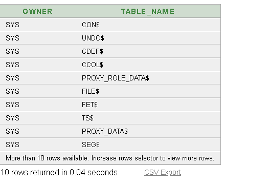
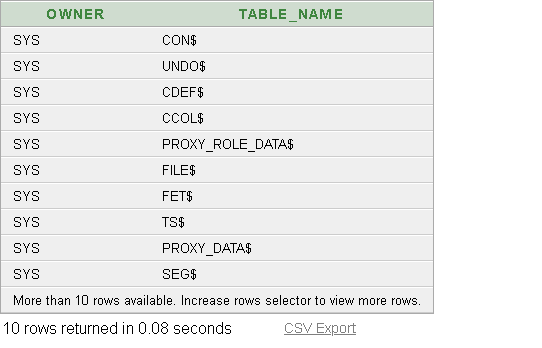
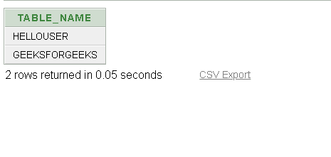

# 如何在 Oracle 中列出所有表？

> 原文:[https://www . geesforgeks . org/如何列出 oracle 中的所有表/](https://www.geeksforgeeks.org/how-to-list-all-tables-in-oracle/)

在本文中，我们将讨论列出 oracle SQL 数据库中所有表的所有方法。

我们有三种类型的表子集可用作标识符，这反过来帮助我们对所需的表名进行排序。以下是 Oracle 数据库中的表标识符类型。

**1。DBA_tables:**

如果用户是系统或有权访问 dba_tables 数据字典视图，则使用下面给出的查询:

**查询:**

```sql
SELECT owner, table_name FROM dba_tables;
```

该查询返回以下包含整个数据库中所有表的表列表。

**输出:**



**2。All_tables:**

如果用户没有访问或查看 dba_tables 的权限，它仍然可以使用下面的 SQL 查询获得它有权访问的所有表的列表。这个 SQL 查询给出了用户及其所有者可以访问的表的列表。

**查询:**

```sql
SELECT owner, table_name FROM all_tables;
```

此查询返回以下表列表，其中包含用户在整个数据库中有权访问的所有表。

**输出:**



**3。用户 _ 表格**

如果用户想要仅由他拥有/创建的所有表的列表，那么使用下面的 SQL 查询来获得表的列表。以下查询不返回所有者的名称，因为它是所有表的用户本身。

**查询:**

```sql
SELECT table_name FROM user_tables;
```

此查询返回以下表列表，其中包含用户在整个数据库中拥有的所有表。

**输出:**

