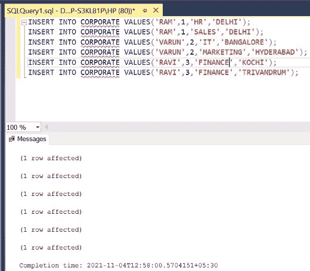

# 如何对同一个表中的多列进行 SQL 联接？

> 原文:[https://www . geesforgeks . org/如何在同一个表中的多列上执行 SQL-join/](https://www.geeksforgeeks.org/how-to-perform-sql-join-on-multiple-columns-in-same-table/)

在 SQL 中，为了提取有价值的数据，我们需要在同一个表中执行自连接。[自连接](https://www.geeksforgeeks.org/self-join-and-cross-join-in-ms-sql-server/)是一个简单的叉积，后面跟一个条件。下面的文章展示了一个相同的例子。在本文中，我们将使用微软的 SQL Server 作为我们的数据库。

**步骤 1:** 创建数据库。为此，使用下面的命令创建一个名为 GeeksForGeeks 的数据库。

**查询:**

```sql
CREATE DATABASE GeeksForGeeks
```

**输出:**


**步骤 2:** 使用 GeeksForGeeks 数据库。为此，请使用以下命令。

**查询:**

```sql
USE GeeksForGeeks
```

**输出:**


**步骤 3:** 在数据库 GeeksForGeeks 中创建一个表 CORPORATE。该表有 4 列，即 E_NAME、E_ID、E_DEPT 和 E_LOC，包含各种员工的姓名、ID、部门和地点。

**查询:**

```sql
CREATE TABLE CORPORATE(
E_NAME VARCHAR(10),
E_ID INT,
E_DEPT VARCHAR(10),
E_LOC VARCHAR(10));
```

**输出:**


**第 4 步:**描述表格 CORPORATE 的结构。

**查询:**

```sql
EXEC SP_COLUMNS CORPORATE;
```

**输出:**


**第 5 步:**在 CORPORATE 表中插入 5 行。

**查询:**

```sql
INSERT INTO CORPORATE VALUES('RAM',1,'HR','DELHI');
INSERT INTO CORPORATE VALUES('RAM',1,'SALES','DELHI');
INSERT INTO CORPORATE VALUES('VARUN',2,'IT','BANGALORE');
INSERT INTO CORPORATE VALUES('VARUN',2,'MARKETING','HYDERABAD');
INSERT INTO CORPORATE VALUES('RAVI',3,'FINANCE','KOCHI');
INSERT INTO CORPORATE VALUES('RAVI',3,'FINANCE','TRIVANDRUM');
```

**输出:**



**第 6 步:**显示公司表的所有行。

**查询:**

```sql
SELECT * FROM CORPORATE;
```

**输出:**


**第 7 步:**检索在至少 2 个部门和至少 2 个地点工作过的所有员工的详细信息。

**注:**使用 [**作为**](https://www.geeksforgeeks.org/sql-select-as/) 对表**公司**与 **C1** 和 **C2** 进行别名，以比较员工的身份证、部门和地点。

**查询:**

```sql
SELECT C1.E_NAME,C1.E_ID,C1.E_DEPT,C1.E_LOC FROM
CORPORATE AS C1,CORPORATE AS C2 WHERE C1.E_ID=C2.E_ID 
AND C1.E_DEPT<>C2.E_DEPT AND C1.E_LOC<>C2.E_LOC;
```

**输出:**


**注意:**这里没有显示 RAM，虽然他在两个不同的部门工作过，因为他的位置是一样的。同样，RAVI 没有展示，尽管他在两个不同的地方工作过，因为他的部门是相同的。

**第 8 步:**要仅显示在至少 2 个部门和至少 2 个地点工作过的员工的姓名，请在 **E_NAME** 列中使用**选择**，并保持该列为 **DISTINCT** 以避免多余的行。

**查询:**

```sql
SELECT DISTINCT(C1.E_NAME) FROM CORPORATE
AS C1,CORPORATE AS C2 WHERE C1.E_ID=C2.E_ID
AND C1.E_DEPT<>C2.E_DEPT AND C1.E_LOC<>C2.E_LOC;
```

**输出:**

