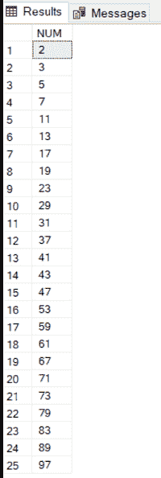

# 如何在 MS SQL Server 中打印质数？

> 原文:[https://www . geesforgeks . org/如何打印 ms-sql-server 中的质数/](https://www.geeksforgeeks.org/how-to-print-prime-numbers-in-ms-sql-server/)

在本文中，我们将使用 MS SQL 打印素数。这里我们将使用 2 while loops 语句来打印素数。

**步骤 1:** 首先我们将声明一个初始值为 2 的变量 I。

**查询:**

```
DECLARE @I INT=2
```

**第二步:**然后我们将声明一个初始值为 0 的变量 PRIME(这将设置 PRIME 的值)。

**查询:**

```
DECLARE @PRIME INT=0
```

**步骤 3:** 表格定义

我们将创建一个保存质数的临时表变量(使用 DECLARE 和 table 关键字)。

**查询:**

```
DECLARE @OUTPUT TABLE (NUM INT)
```

**步骤 4:** 现在我们将使用嵌套 while 循环，就像我们为质数编写程序一样。

**查询:**

```
DECLARE @I INT=2
DECLARE @PRIME INT=0
DECLARE @OUTPUT TABLE (NUM INT)
WHILE @I<=100
BEGIN
    DECLARE @J INT = @I-1
    SET @PRIME=1
    WHILE @J>1
    BEGIN
        IF @I % @J=0
        BEGIN
            SET @PRIME=0
        END
        SET @J=@J-1
    END
    IF @PRIME =1
    BEGIN
        INSERT @OUTPUT VALUES (@I)
    END
    SET @I=@I+1
END
SELECT * FROM @OUTPUT
```

**说明:**

*   在第一个 while 循环中，我们将 I 的初始值声明为 100，这意味着这个循环将为我们提供 2 到 100 之间的素数。
*   现在，我们用初始值 I-1 来声明 J。如上面的代码所示。
*   然后，将插入第二个 while 循环，该循环将一直运行到 J 大于 1。
*   如果语句在那里，条件@I % @J = 0，这意味着当 I/J 的余数为 0 时，PRIME 将被设置为 0，J 的值递减 1。
*   如果在循环结束时 PRIME 设置为 1，那么这个数字将使用下面的代码插入到我们的输出表中。

**查询:**

```
INSERT @OUTPUT VALUES (@I)
```

*   然后另一个循环将为下一个数字开始。

**第五步:**假设我有一个初始值 4，即 I = 4。

*   现在在第二个循环中，J 的初始值为 1，也就是 3。
*   通过 4%3，我们将得到 1，因此 Prime 将像以前一样设置为 1，J 递减 1。
*   现在对于 4%2，我们将得到 0，现在根据我们的条件，PRIME 将被设置为 0。由于 4 的因子比 1 及其本身多，循环将再次开始，递增值为 1，即 5(I+1)。

**输出:**低于 I < =100 的输出，这意味着它将打印从 2 到 100 的质数。

