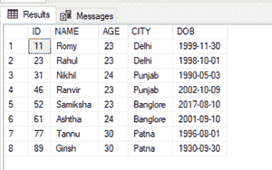
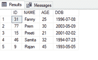
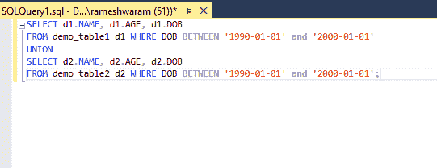
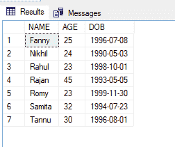

# 如何基于日期从两个 SQL 表中拉取数据？

> 原文:[https://www . geeksforgeeks . org/如何从两个表中提取数据-基于 sql 的日期/](https://www.geeksforgeeks.org/how-to-pull-data-from-two-tables-sql-based-on-date/)

在本文中，我们将看到，如何编写 SQL 查询来根据日期从两个表中提取数据。我们可以通过对表执行 UNION 操作来执行上述功能。UNION 操作追加两个查询的结果，并将结果作为一个集合返回。

使用 UNION 关键字的方法:

*   [联合所有](https://www.geeksforgeeks.org/union-and-union-all-in-ms-sql-server/):包括重复项。
*   [UNION](https://www.geeksforgeeks.org/sql-union-clause/) :排除重复。

**语法:**

```
SELECT * from table1 (query1)
UNION
SELECT * from table2 (query2);
```

在使用 UNION 关键字之前，需要遵循一些规则:

*   查询中列的数量和顺序必须相同。
*   所选字段的数据类型必须相同。

出于演示目的，请执行以下步骤:

**步骤 1:** 创建数据库

我们可以使用以下命令创建一个名为 geeks 的数据库。

**查询:**

```
CREATE DATABASE geeks;
```

**步骤 2:** 使用数据库

使用下面的 SQL 语句将数据库上下文切换到极客:

**查询:**

```
USE geeks;
```

**步骤 3:** 表格定义

在极客的数据库中，我们有两个名为“demo_table1”和“demo_table2”的表。

**查询(demo_table1):**

```
CREATE TABLE demo_table1(
ID int,
NAME VARCHAR(20),
AGE INT,
CITY VARCHAR(20) ,
DOB DATE);
```

**查询(demo_table2):**

```
CREATE TABLE demo_table2(
ID int,
NAME VARCHAR(20),
AGE int,
DOB DATE);
```

**步骤 4:** 将数据插入表格

**查询(demo_table1):**

```
INSERT INTO demo_table1 VALUES
(11,'Romy',23,'Delhi','1999-11-30'),
(23,'Rahul',23,'Delhi','1998-10-01'),
(31,'Nikhil',24,'Punjab','1990-05-03'),
(46,'Ranvir',23,'Punjab','2002-10-09'),
(52,'Samiksha',23,'Banglore','2017-08-10'),
(61,'Ashtha',24,'Banglore','2001-09-10'),
(77,'Tannu',30,'Patna','1996-08-01'),
(89,'Girish',30,'Patna','1930-09-30');
```

**查询(demo_table2):**

```
INSERT INTO demo_table2 VALUES
(31,'Fanny',25, '1996-07-08' ),
(77,'Prem', 30, '2003-05-09'),
(15,'Preeti',21, '2001-02-02'),
(46,'Samita',32, '1994-07-23'),
(09,'Rajan',45, '1993-05-05');
```

**第五步:**查看内容

执行以下查询查看表格的内容

**查询(demo_table1):**

```
SELECT * FROM demo_table1;
```

**输出:**



**查询(demo_table2):**

```
SELECT * FROM demo_table2;
```

**输出:**



**STEP 6** :基于日期从两个表中拉取数据的 SQL 查询。为了进行演示，我们将从 1990-01-01 年到 2000-01-01 年之间的数据提取出 DOB。

**查询:**

```
SELECT d1.NAME, d1.AGE, d1.DOB
FROM demo_table1 d1 WHERE DOB BETWEEN
'1990-01-01' and '2000-01-01'
UNION  
SELECT d2.NAME, d2.AGE, d2.DOB  
FROM demo_table2 d2 WHERE DOB BETWEEN
'1990-01-01' and '2000-01-01';
```

**输出:**

 

我们可以看到，这两个数据中的数据都是根据查询中指定的日期提取的。