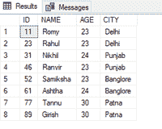
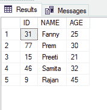
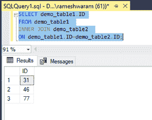
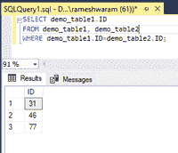

# 如何在 SQL 中查询两个表的重复值？

> 原文:[https://www . geeksforgeeks . org/如何查询两个表以查找 sql 中的重复值/](https://www.geeksforgeeks.org/how-to-querying-two-tables-for-duplicate-values-in-sql/)

在本文中，我们将看到如何编写 SQL 查询来从两个表中获取重复值。

我们可以使用两种方法来执行给定的任务:

1.  使用[内部连接](https://www.geeksforgeeks.org/sql-inner-join/)。
2.  使用 WHERE 子句

现在，按照以下步骤进行演示:

**步骤 1:** 创建数据库

我们可以使用以下命令创建一个名为 geeks 的数据库。

**查询:**

```
CREATE DATABASE geeks;
```

**步骤 2:** 使用数据库

使用下面的 SQL 语句将数据库上下文切换到极客:

**查询:**

```
USE geeks;
```

**步骤 3:** 表格定义

在极客的数据库中，我们有两个名为“demo_table1”和“demo_table2”的表。

**查询(demo_table1):**

```
CREATE TABLE demo_table1(
ID int,
NAME VARCHAR(20),
AGE INT,
CITY VARCHAR(20) );
```

**查询(demo_table2):**

```
CREATE TABLE demo_table2(
ID int,
NAME VARCHAR(20),
AGE int);
```

**步骤 4:** 将数据插入表格

**查询(demo_table1):**

```
INSERT INTO demo_table1 VALUES
(11,'Romy',23,'Delhi'),
(23,'Rahul',23,'Delhi'),
(31,'Nikhil',24,'Punjab'),
(46,'Ranvir',23,'Punjab'),
(52,'Samiksha',23,'Banglore'),
(61,'Ashtha',24,'Banglore'),
(77,'Tannu',30,'Patna'),
(89,'Girish',30,'Patna');
```

**查询(demo_table2):**

```
INSERT INTO demo_table2 VALUES
(31,'Fanny',25 ),
(77,'Prem', 30),
(15,'Preeti',21),
(46,'Samita',32),
(09,'Rajan',45);
```

**第五步:**查看内容

执行以下查询查看表格的内容

**查询(demo_table1):**

```
SELECT * FROM demo_table1;
```

**输出:**



**查询(demo_table2):**

```
SELECT * FROM demo_table2;
```

**输出:**



**步骤 6:** 从两个表中获取重复项的 SQL 查询

**方法 1:**

**INNER JOIN:** 是一个关键字，用于查询两个表，得到两个表中值匹配的记录。

**语法:**

```
SELECT Column_name
FROM table1 INNER JOIN
table2 ON condition;
```

为了演示，我们将编写一个 SQL 查询，从两个表中返回重复的标识值

**查询:**

```
SELECT demo_table1.ID
FROM demo_table1
INNER JOIN demo_table2
ON demo_table1.ID=demo_table2.ID;
```

如果两个表具有相同的列名，表名应该用在像 table_name.column_name 这样的列名之前，以区分两个表的列。

**输出:**



**方法 2:** 通过使用 where 子句比较列值

**语法:**

```
SELECT column_name from table_name WHERE condition;
```

**查询:**

```
SELECT demo_table1.ID
FROM demo_table1, demo_table2
WHERE demo_table1.ID=demo_table2.ID;
```

**输出:**

