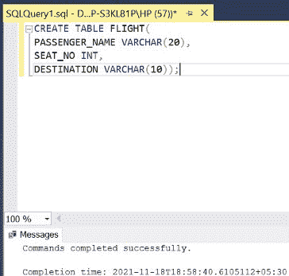

# 如何在 SQL Server 中删除字段前缀？

> 原文:[https://www . geesforgeks . org/如何从 SQL server 字段中删除前缀/](https://www.geeksforgeeks.org/how-to-remove-prefix-from-field-in-sql-server/)

在 SQL 中，某些单词是保留的。这些被称为关键词或[保留](https://www.geeksforgeeks.org/sql-tutorial/)词。这些单词不能用作标识符，即在 SQL 中不能用作列名。但是，这条规则也有例外。在本文中，我们将讨论如何在 SQL 中使用保留字作为列名，以及如何从字段中删除前缀。在本文中，我们将使用微软的 SQL Server 作为我们的数据库。

**步骤 1:** 创建数据库。为此，使用下面的命令创建一个名为 GeeksForGeeks 的数据库

**查询:**

```sql
CREATE DATABASE GeeksForGeeks
```

**输出:**


**步骤 2:** 使用 GeeksForGeeks 数据库。为此，请使用以下命令

**查询:**

```sql
USE GeeksForGeeks
```

**输出:**


**步骤 3:** 在数据库 GeeksForGeeks 中创建一个飞行表。该表有 3 列，即乘客姓名、座位号和目的地，包含乘客的姓名、座位号、工资和目的地。

**查询:**

```sql
CREATE TABLE FLIGHT(
PASSENGER_NAME VARCHAR(20),
SEAT_NO INT,
DESTINATION VARCHAR(10));
```

**输出:**



**第 4 步:**描述飞行表的结构。

**查询:**

```sql
EXEC SP_COLUMNS FLIGHT;
```

**输出:**


**第 5 步:**在飞行表中插入 5 行。

**查询:**

```sql
INSERT INTO FLIGHT VALUES('MR. MR. VINAYAK',11,'DEL');
INSERT INTO FLIGHT VALUES('MR. MR. SINGH',06,'BOM');
INSERT INTO FLIGHT VALUES('MR. MR. KHAN',32,'KOL');
INSERT INTO FLIGHT VALUES('MR. MR. SHARMA',25,'CHD');
INSERT INTO FLIGHT VALUES('MR. MR. KUMAR',16,'LKO');
```

**输出:**


**第 6 步:**显示飞行表的所有行。

**查询:**

```sql
SELECT * FROM FLIGHT;
```

**输出:**


**第 7 步:**从**航班**表中可以明显看出，由于笔误，在**乘客姓名**栏的所有条目的开头增加了一个额外的**先生**。要去掉“ **MR.** ”这个前缀，需要使用 **UPDATE** 、 **SET** 、 **RIGHT** 、 **LEN** 、 **WHERE** 。以下命令使用使用 **RIGHT** 关键字提取的名称子字符串更新以“ **MR.** 开头的列的条目。子字符串从等于前缀长度的索引(长度为“**Mr .**”= 4)开始，到字符串的结尾。

**语法:**

```sql
UPDATE TABLE_NAME
SET COLUMN_NAME = RIGHT(COLUMN_NAME,LEN
COLUMN_NAME)-LENGTH OF PREFIX TO BE REMOVED)
WHERE COLUMN_NAME LIKE 'PREFIX%';
```

**查询:**

```sql
UPDATE FLIGHT
SET PASSENGER_NAME = RIGHT
(PASSENGER_NAME,LEN(PASSENGER_NAME)-4)
WHERE PASSENGER_NAME LIKE 'MR. %';
```

**输出:**


**第 8 步:**显示修正后的飞行表的所有行。

**查询:**

```sql
SELECT * FROM FLIGHT;
```

**输出:**

