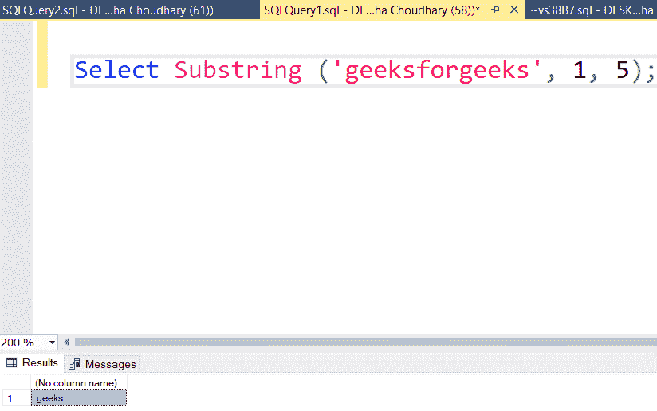
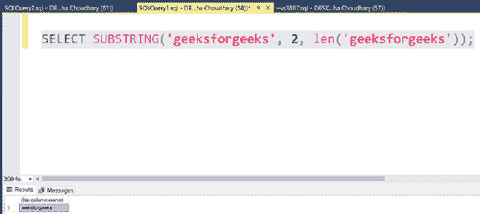
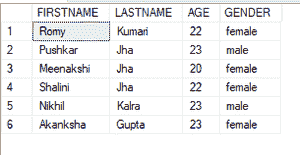
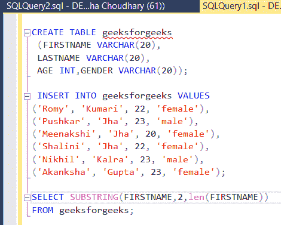
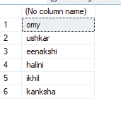
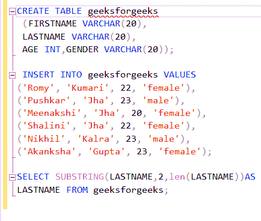
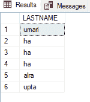

# 如何在 SQL 中删除表中特定列的第一个字符？

> 原文:[https://www . geeksforgeeks . org/如何删除 sql 表中特定列的第一个字符/](https://www.geeksforgeeks.org/how-to-remove-the-first-characters-of-a-specific-column-in-a-table-in-sql/)

这里我们将看到，如何在 SQL 中删除表中特定列的第一个字符。我们可以使用字符串函数来完成这个任务。

[字符串函数](https://www.geeksforgeeks.org/sql-string-functions/)用于对输入字符串执行操作并返回输出字符串。有各种各样的字符串函数，如 LEN(用于 SQL 服务器)、SUBSTR、LTRIM、TRIM 等。为了执行所需的功能，我们需要 SUBSTRING()函数

**SUBSTRING():**

该函数用于从给定位置的字符串中查找子字符串。它需要三个参数:

*   字符串:这是必需的参数。它提供了关于应用函数的字符串的信息。
*   开始:它给出了字符串的开始位置。它也是必需的参数。
*   长度:这是一个可选参数。默认情况下，它采用整个字符串的长度。

**查询:**

```
SELECT SUBSTRING('geeksforgeeks', 1, 5);
```

**输出:**



要删除字段中的第一个字符，我们将使用以下查询:

**语法:**

```
SELECT SUBSTRING(string, 2, length(string));
```

这里，字符串表示字段，2 表示字符串的起始位置，即第二个字符，长度(字符串)表示字符串的长度。

**查询:**

```
SELECT SUBSTRING('geeksforgeeks', 2, len('geeksforgeeks'));
```

**输出:**



为了演示的目的，我们将在名为“极客”的数据库中为极客创建极客表。

**步骤 1:** 创建数据库

使用下面的 SQL 语句创建一个名为 geeks 的数据库。

**查询:**

```
CREATE DATABASE geeks;
```

**步骤 2:** 使用数据库

使用下面的 SQL 语句将数据库上下文切换到极客。

**查询:**

```
USE geeks;
```

**步骤 3:** 表格定义

我们的极客数据库中有以下极客。

**查询:**

```
 CREATE TABLE geeksforgeeks
 (FIRSTNAME VARCHAR(20),
 LASTNAME VARCHAR(20),
 AGE INT,GENDER VARCHAR(20));
```

**步骤 4:** 将数据插入表格

```
INSERT INTO geeksforgeeks VALUES
('Romy', 'Kumari', 22, 'female'),
('Pushkar', 'Jha', 23, 'male'),  
('Meenakshi', 'Jha', 20, 'female'),
('Shalini', 'Jha', 22, 'female'),
('Nikhil', 'Kalra', 23, 'male'),
('Akanksha', 'Gupta', 23, 'female');
```

**第五步:**查看表格内容

使用以下命令查看极客表中极客的内容:

**查询:**

```
SELECT * FROM geeksforgeeks;
```

**输出:**



**第六步:**现在从字段中删除第一个字符，我们将使用极客表中的极客。下面是 SUBSTRING()函数从字段中删除第一个字符的语法。

**语法:**

```
SELECT SUBSTRING(column_name,2,length(column_name))
FROM table_name;
```

从极客表的极客列中删除第一个字符。我们使用下面给出的查询:

**查询:**

```
SELECT SUBSTRING(FIRSTNAME,2,len(FIRSTNAME))
FROM geeksforgeeks;
```



**输出:**



现在删除 LASTNAME 列中的第一个字符。

**查询:**

```
SELECT SUBSTRING(LASTNAME,2,len(LASTNAME))AS
LASTNAME FROM geeksforgeeks;
```



**输出:**

