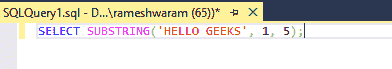

# 如何删除 SQL 中表的最后一个字符？

> 原文:[https://www . geesforgeks . org/如何从 sql 中的表中删除最后一个字符/](https://www.geeksforgeeks.org/how-to-remove-the-last-character-from-a-table-in-sql/)

在这里，我们将看到，如何删除 SQL 表中的最后一个字符。我们可以使用 SUBSTRING()函数来完成这个任务。

**SUBSTRING():** 这个函数用来从给定的位置找到给定字符串的一部分。它需要三个参数:

*   字符串:这是必需的参数。它是要应用函数的字符串。
*   开始:它给出了字符串的开始位置。它也是必需的参数。
*   长度:这是一个可选参数。默认情况下，它采用要返回的子字符串的长度。

**查询:**

```
SELECT SUBSTRING('HELLO GEEKS', 1, 5);
```



**输出:**


要从字段中删除最后一个字符，请传递长度参数，使其比总长度小 1。

出于演示的目的，让我们在名为“极客”的数据库中创建一个 demo_table。

**步骤 1:** 创建数据库

使用下面的 SQL 语句创建一个名为 geeks 的数据库。

**查询:**

```
CREATE DATABASE geeks;
```

**步骤 2:** 使用数据库

使用下面的 SQL 语句将数据库上下文切换到极客。

**查询:**

```
USE geeks;
```

**步骤 3:** 表格定义

我们的极客数据库中有以下演示表。

**查询:**

```
 CREATE TABLE demo_table
(FIRSTNAME VARCHAR(20),
LASTNAME VARCHAR(20),
AGE INT);
```

**第 4 步:**插入数据

**查询:**

```
INSERT INTO demo_table VALUES
('Romy', 'Kumari', 22 ),
('Pushkar', 'Jha', 23),  
('Meenakshi', 'Jha', 20),
('Shalini', 'Jha', 22),
('Nikhil', 'Kalra', 23),
('Akanksha', 'Gupta', 23);
```

**第五步:**查看内容

**查询:**

```
SELECT * FROM demo_table;
```

**输出:**


**第 6 步:**SUBSTRING()函数的使用

*   我们将删除 LASTNAME 列中条目的最后一个字符。

**语法:**

```
SELECT SUBSTRING(column_name,1,LEN(column_name)-1) 
FROM table_name;
```

**查询:**

```
SELECT FIRSTNAME, SUBSTRING(LASTNAME,1,LEN(LASTNAME)-1)
 AS LASTNAME, AGE FROM demo_table;
```


**输出:**


我们可以在图像中看到，LASTNAME 列中的最后一个字符现在被删除了。

*   我们将删除“名字”列中条目的最后一个字符。

**查询:**

```
SELECT SUBSTRING(FIRSTNAME,1,LEN(FIRSTNAME)-1)
 AS FIRSTNAME, LASTNAME, AGE FROM demo_table;
```


**输出:**

